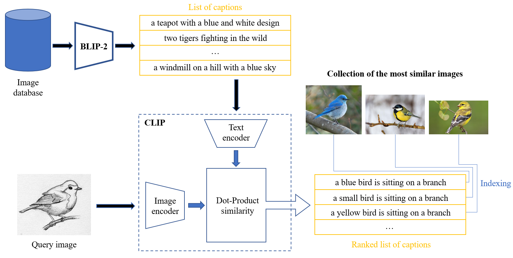
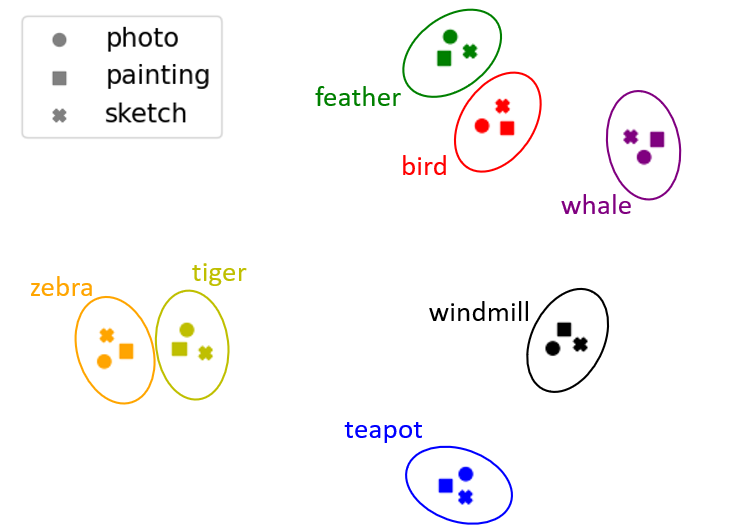
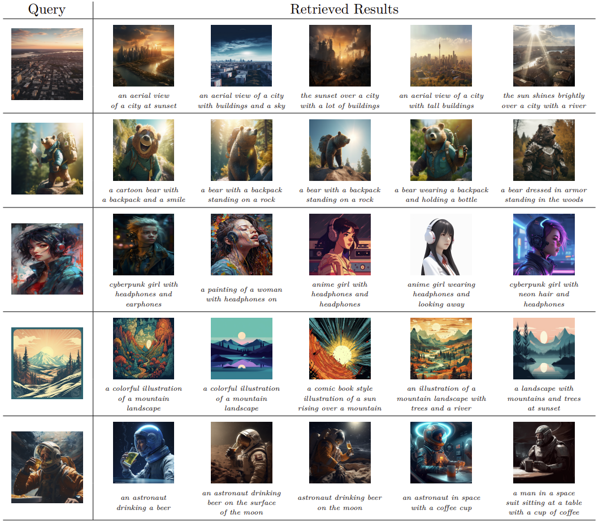

# 针对跨领域图像检索问题，我们采用了一种创新的多模态方法。这种方法巧妙地融合了多种信息模式，以实现更为精准且高效的图像检索效果。

发布时间：2024年03月22日

`Agent` `图像处理` `跨域图像检索`

> A Multimodal Approach for Cross-Domain Image Retrieval

> 随着AI技术的飞跃发展，图像生成器日益受到热捧，革新了数字内容创作的方式，让公众能够轻松创建出数百万张高品质图像，推动研究者们不断挑战生成模型的极限，以产出更加复杂且真实的图像。本文聚焦于跨域图像检索（CDIR）技术，通过评估数据集中图像间的相似程度，为审查海量生成图像提供了一个有力工具。理想的检索系统应具备处理来自照片、绘画等多个领域未曾遇见的复杂图像的能力。为此，我们创新性地提出了一种基于大规模预训练的多模态语言-视觉架构的配文匹配方法，并在DomainNet和Office-Home数据集上进行验证，结果显示其在跨域图像检索领域的性能超越了当前文献中的最新研究成果。为了检验该方法在AI生成图像场景下的实际效果，我们还选取了广泛应用的生成内容平台Midjourney的数据样本进行测试。

> Image generators are gaining vast amount of popularity and have rapidly changed how digital content is created. With the latest AI technology, millions of high quality images are being generated by the public, which are constantly motivating the research community to push the limits of generative models to create more complex and realistic images. This paper focuses on Cross-Domain Image Retrieval (CDIR) which can be used as an additional tool to inspect collections of generated images by determining the level of similarity between images in a dataset. An ideal retrieval system would be able to generalize to unseen complex images from multiple domains (e.g., photos, drawings and paintings). To address this goal, we propose a novel caption-matching approach that leverages multimodal language-vision architectures pre-trained on large datasets. The method is tested on DomainNet and Office-Home datasets and consistently achieves state-of-the-art performance over the latest approaches in the literature for cross-domain image retrieval. In order to verify the effectiveness with AI-generated images, the method was also put to test with a database composed by samples collected from Midjourney, which is a widely used generative platform for content creation.

[Arxiv](https://arxiv.org/abs/2403.15152)