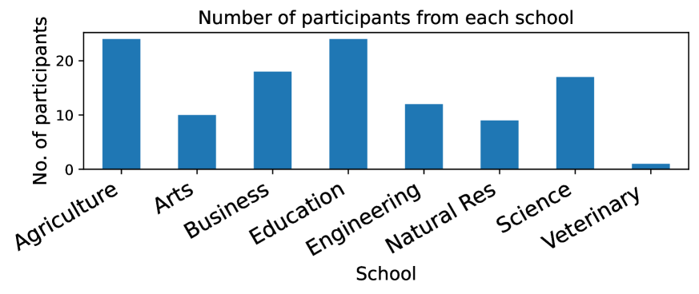
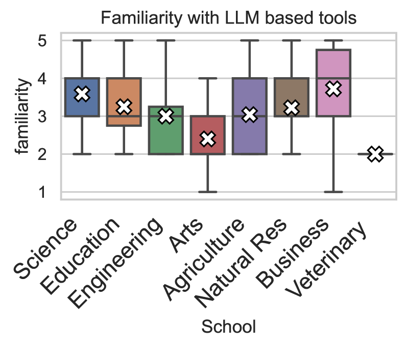
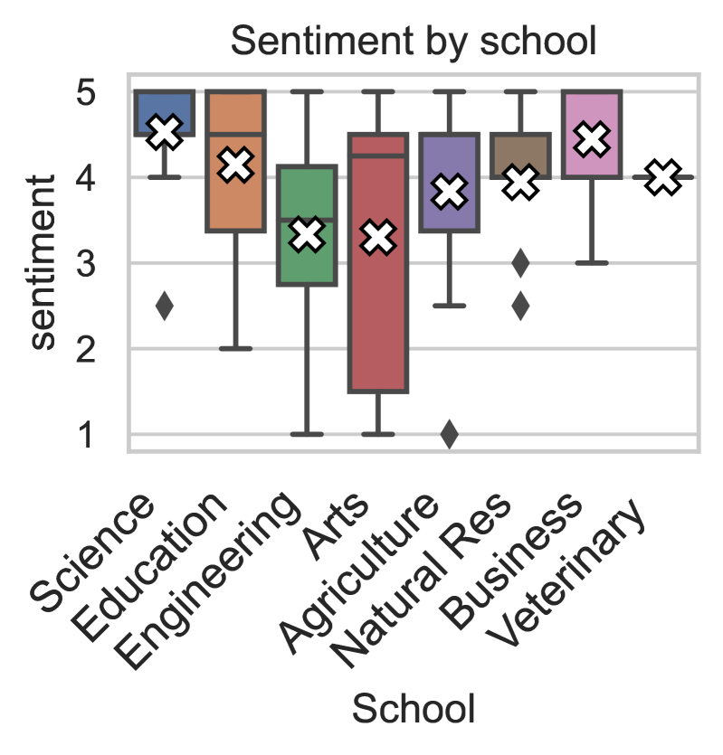
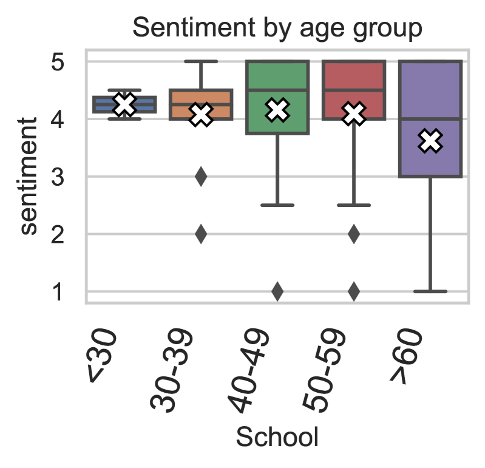
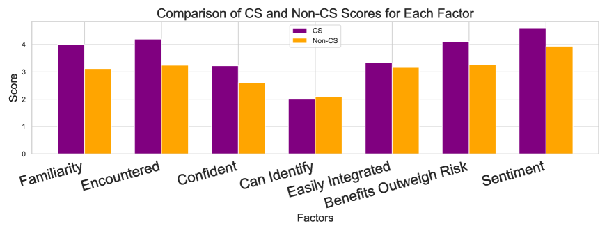

# 本研究聚焦于生成式AI在教育领域的应用，深入探讨了教育工作者对此的认知程度、情感倾向及其背后的影响因素。

发布时间：2024年03月22日

`LLM应用` `人工智能`

> Generative AI in Education: A Study of Educators' Awareness, Sentiments, and Influencing Factors

> 随着AI科技飞速发展及LLMs广泛应用，关于其在教育领域的应用引发了热议。本研究聚焦高校教师对AI语言模型的实际体验和看法，通过对教育者对AI在课堂教学作用及其对教与学潜在影响的视角分析，填补了相关文献的研究空缺。此研究旨在揭示高等教育领域内教师对LLMs及生成式AI工具的认知水平、总体接纳情绪及其影响因素。通过李克特量表调查并辅以深度访谈的方式收集数据，运用统计学和主题分析方法对所得数据进行深度解析。研究发现，教师们对这类工具的认知度显著提升且整体倾向于正面态度。有趣的是，教学方式与对待生成式AI的态度之间并未发现明显的关联性。此外，虽然计算机科学类教育者相较于其他学科教育者在生成式AI工具的技术理解上自信满满，持有更加积极的态度，但在鉴别AI生成作品的能力上，却并未显示出明显优势。

> The rapid advancement of artificial intelligence (AI) and the expanding integration of large language models (LLMs) have ignited a debate about their application in education. This study delves into university instructors' experiences and attitudes toward AI language models, filling a gap in the literature by analyzing educators' perspectives on AI's role in the classroom and its potential impacts on teaching and learning. The objective of this research is to investigate the level of awareness, overall sentiment towardsadoption, and the factors influencing these attitudes for LLMs and generative AI-based tools in higher education. Data was collected through a survey using a Likert scale, which was complemented by follow-up interviews to gain a more nuanced understanding of the instructors' viewpoints. The collected data was processed using statistical and thematic analysis techniques. Our findings reveal that educators are increasingly aware of and generally positive towards these tools. We find no correlation between teaching style and attitude toward generative AI. Finally, while CS educators show far more confidence in their technical understanding of generative AI tools and more positivity towards them than educators in other fields, they show no more confidence in their ability to detect AI-generated work.

[Arxiv](https://arxiv.org/abs/2403.15586)