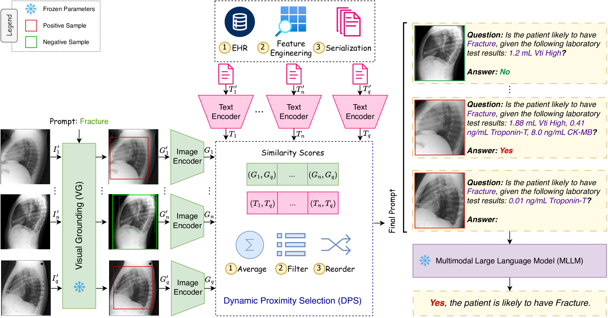
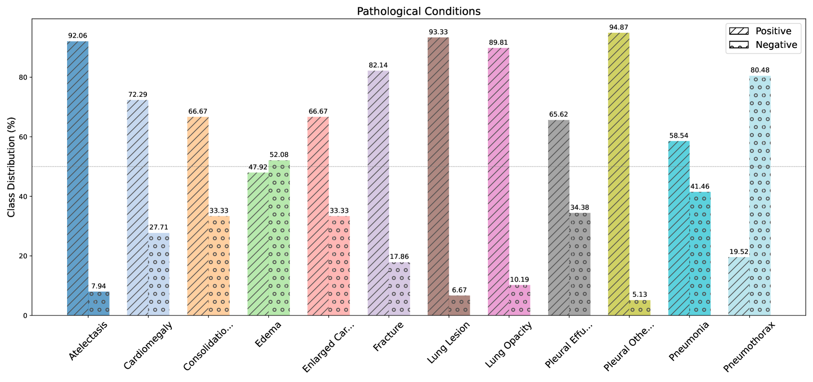
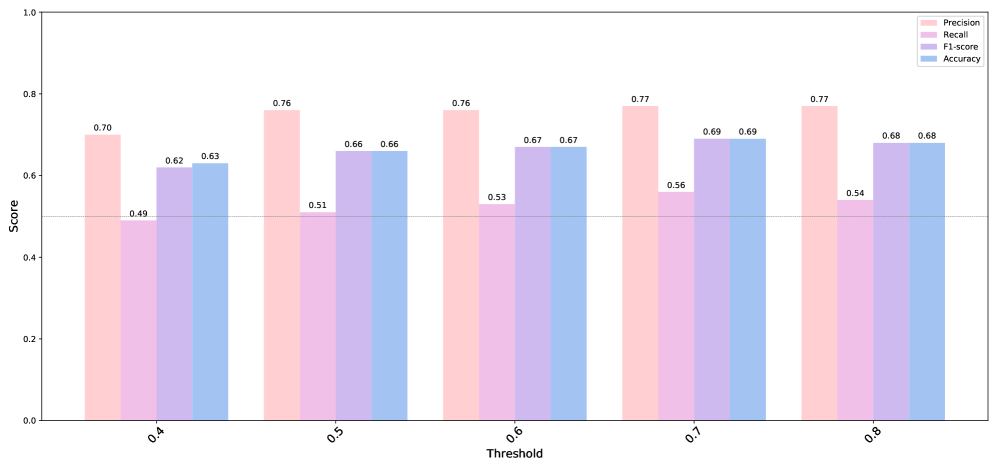

# MedPromptX 是一项创新技术，它利用基于实证的多模态提示方法，助力于胸部X射线诊断工作。

发布时间：2024年03月22日

`LLM应用` `医学影像分析`

> MedPromptX: Grounded Multimodal Prompting for Chest X-ray Diagnosis

> 在医学诊断中，胸部X光片常用于预测急性、慢性心肺疾病，但因电子病历（EHR）信息不全，整合其与结构化临床数据颇具挑战。为此，本文创新性地引入了\textbf{MedPromptX}模型，它首度融合了多模态大型语言模型（MLLMs）、少量示例提示（FP）和视觉锚定（VG）技术，用以结合胸部X光影像与EHR数据，提升诊断效能。预先训练好的MLLM能够弥补缺失的EHR信息，全面洞悉患者的病史情况。FP策略减轻了对MLLM大量训练的需求，同时也有效地抑制了虚幻现象的产生。尽管确定最佳的少量示例数量及挑选优质示例是一项费时耗力的工作，但它却对模型性能具有重大影响。故此，我们提出了一个崭新的技术方案，能实时调整并优化少量示例数据，以适应不断变化的患者情境。VG技术则帮助模型聚焦于X光影像的关键区域，强化了病变识别能力。我们还发布了一个名为MedPromptX-VQA的新颖上下文视觉问答数据集，其中包含来自MIMIC-IV和MIMIC-CXR数据库相互交织的影像与EHR数据。实验结果显示，MedPromptX表现出色，相较于基准方法，其F1评分提升了11%。有关代码和数据已公开在\url{https://github.com/BioMedIA-MBZUAI/MedPromptX}。

> Chest X-ray images are commonly used for predicting acute and chronic cardiopulmonary conditions, but efforts to integrate them with structured clinical data face challenges due to incomplete electronic health records (EHR). This paper introduces \textbf{MedPromptX}, the first model to integrate multimodal large language models (MLLMs), few-shot prompting (FP) and visual grounding (VG) to combine imagery with EHR data for chest X-ray diagnosis. A pre-trained MLLM is utilized to complement the missing EHR information, providing a comprehensive understanding of patients' medical history. Additionally, FP reduces the necessity for extensive training of MLLMs while effectively tackling the issue of hallucination. Nevertheless, the process of determining the optimal number of few-shot examples and selecting high-quality candidates can be burdensome, yet it profoundly influences model performance. Hence, we propose a new technique that dynamically refines few-shot data for real-time adjustment to new patient scenarios. Moreover, VG aids in focusing the model's attention on relevant regions of interest in X-ray images, enhancing the identification of abnormalities. We release MedPromptX-VQA, a new in-context visual question answering dataset encompassing interleaved image and EHR data derived from MIMIC-IV and MIMIC-CXR databases. Results demonstrate the SOTA performance of MedPromptX, achieving an 11% improvement in F1-score compared to the baselines. Code and data are available at \url{https://github.com/BioMedIA-MBZUAI/MedPromptX}.

[Arxiv](https://arxiv.org/abs/2403.15585)