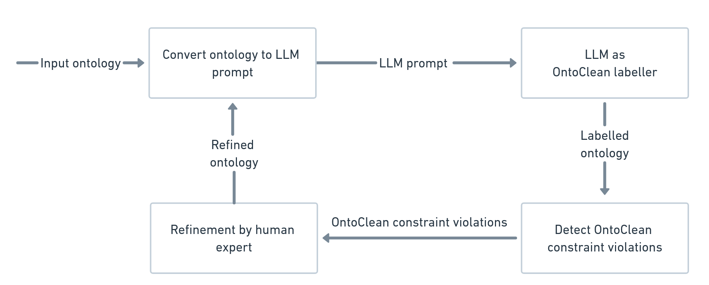
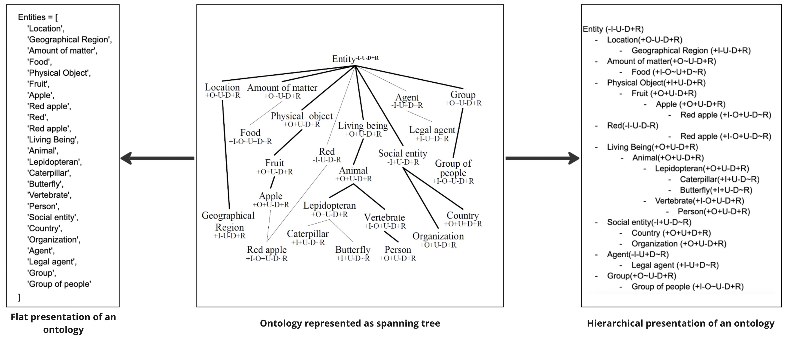
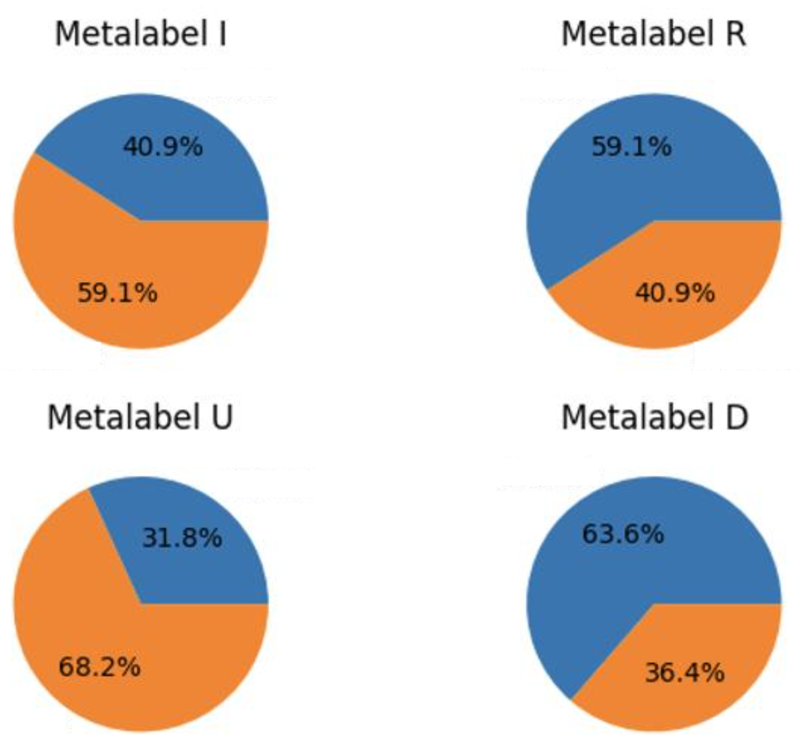
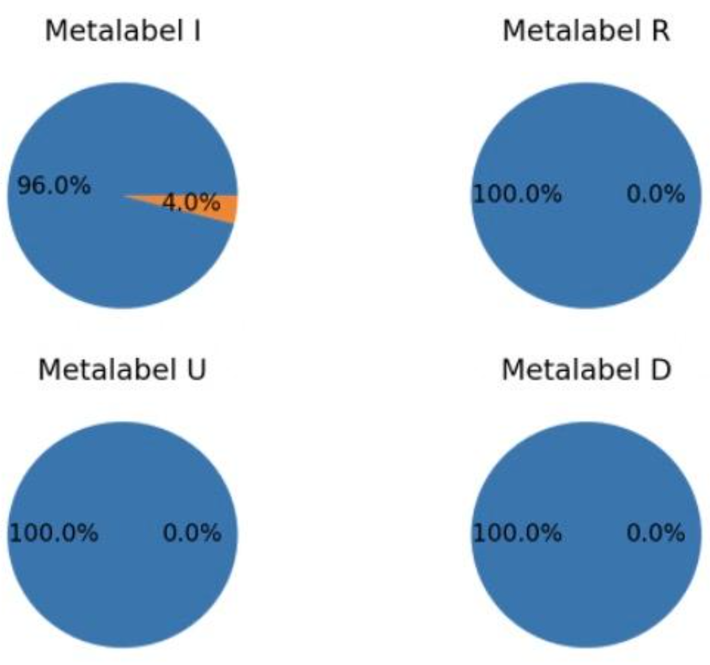
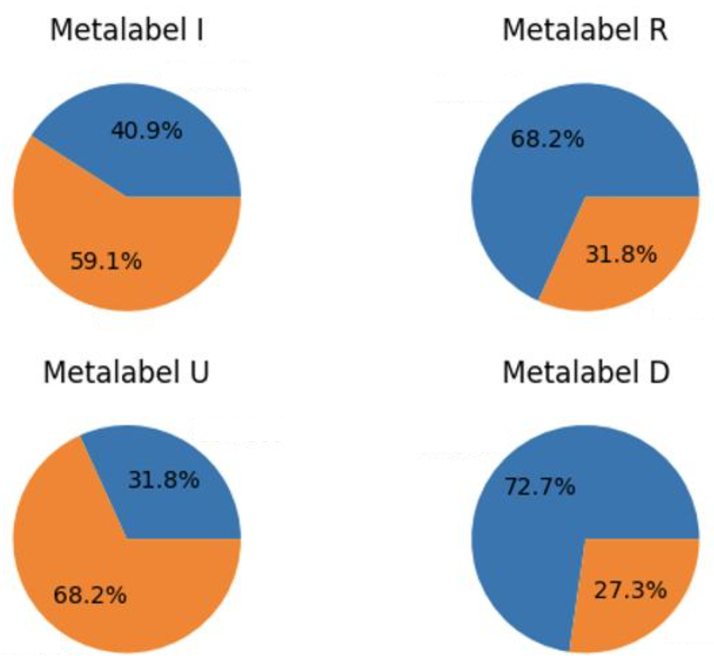
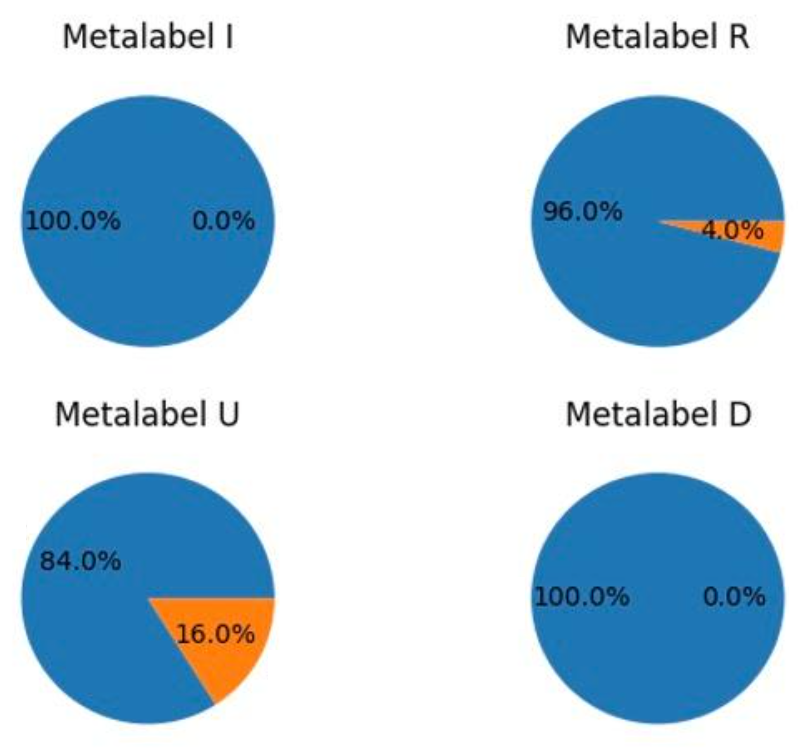

# 利用大规模语言模型助力OntoClean方法进行本体精细化改进

发布时间：2024年03月23日

`LLM应用` `本体论`

> Using Large Language Models for OntoClean-based Ontology Refinement

> 本文聚焦于如何将GPT-3.5和GPT-4等大型语言模型整合到本体论优化流程中，特别是在OntoClean方法上进行深入研究。OntoClean作为一种评估本体论哲学品质的核心技术，包含给类赋予元属性并验证一系列规则的双重步骤，但在实际操作中，由于要求具备深厚哲学知识且业内观点尚未统一，第一步人工执行颇为艰难。研究通过运用带有两种引导策略的LLMs，成功展示了在标签处理阶段可以达到高准确率。这一成果预示着LLMs有望革新本体论优化方式，并倡议研发专门针对本体工具的插件软件，以便利此类技术融合。

> This paper explores the integration of Large Language Models (LLMs) such as GPT-3.5 and GPT-4 into the ontology refinement process, specifically focusing on the OntoClean methodology. OntoClean, critical for assessing the metaphysical quality of ontologies, involves a two-step process of assigning meta-properties to classes and verifying a set of constraints. Manually conducting the first step proves difficult in practice, due to the need for philosophical expertise and lack of consensus among ontologists. By employing LLMs with two prompting strategies, the study demonstrates that high accuracy in the labelling process can be achieved. The findings suggest the potential for LLMs to enhance ontology refinement, proposing the development of plugin software for ontology tools to facilitate this integration.

[Arxiv](https://arxiv.org/abs/2403.15864)