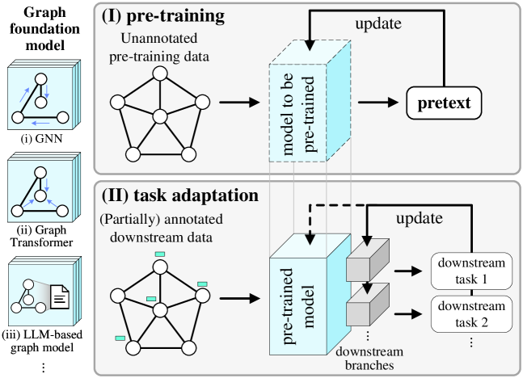

# 本研究综述聚焦于从知识驱动的角度探讨图基础模型的自我监督预训练技术。

发布时间：2024年03月24日

`LLM理论` `图神经网络` `预训练模型`

> A Survey on Self-Supervised Pre-Training of Graph Foundation Models: A Knowledge-Based Perspective

> 如今，图自监督学习已成为预训练图模型（包括但不限于图神经网络、图变换器以及最新的基于LLM的图模型）的首选方案，其中蕴藏在图结构与属性中的丰富知识模式可用于预训练过程。然而，我们尚未从图知识整体视角对自监督预训练任务进行系统梳理。本文以知识为基础，深入探讨了图模型预训练任务，内容涵盖微观层次（如节点、连接等）到宏观层次（如群集、全局结构等）的9大类知识领域和25项预训练任务，并介绍了多种下游任务的适应策略。此外，还提供了一份包含详尽元数据的关联论文列表，可访问https://github.com/Newiz430/Pretext获取。

> Graph self-supervised learning is now a go-to method for pre-training graph foundation models, including graph neural networks, graph transformers, and more recent large language model (LLM)-based graph models. There is a wide variety of knowledge patterns embedded in the structure and properties of graphs which may be used for pre-training, but we lack a systematic overview of self-supervised pre-training tasks from the perspective of graph knowledge. In this paper, we comprehensively survey and analyze the pre-training tasks of graph foundation models from a knowledge-based perspective, consisting of microscopic (nodes, links, etc) and macroscopic knowledge (clusters, global structure, etc). It covers a total of 9 knowledge categories and 25 pre-training tasks, as well as various downstream task adaptation strategies. Furthermore, an extensive list of the related papers with detailed metadata is provided at https://github.com/Newiz430/Pretext.

[Arxiv](https://arxiv.org/abs/2403.16137)