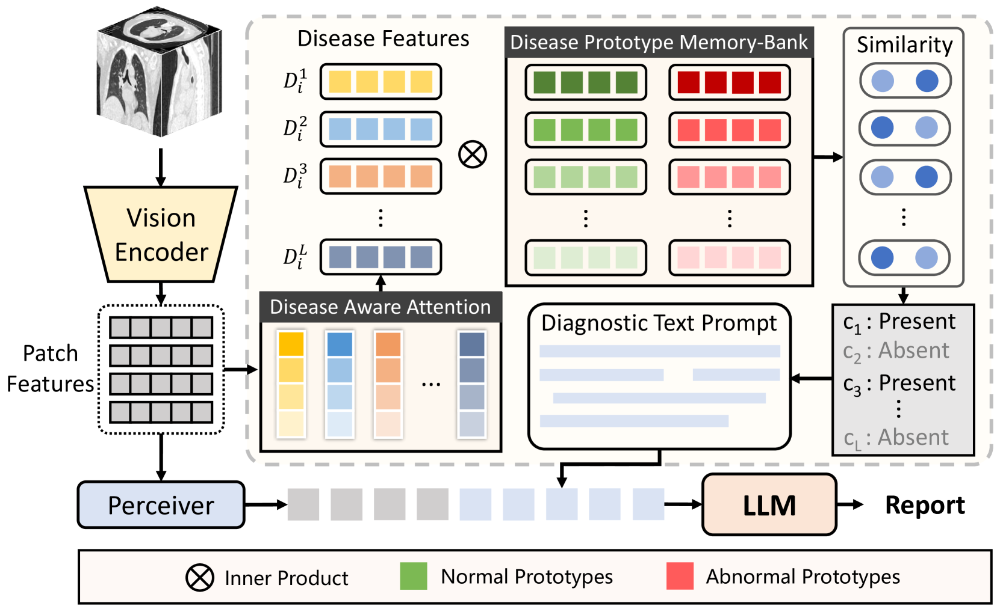

# 迈向由大型语言模型驱动的CT报告自动生成—— Dia-LLaMA项目，旨在利用大型语言模型的力量提升CT报告生成的质量与效率。

发布时间：2024年03月24日

`LLM应用` `医学影像分析`

> Dia-LLaMA: Towards Large Language Model-driven CT Report Generation

> 医学报告自动生成技术虽有显著突破，但面临三大难题：一是正常与异常病例分布不均衡，易导致模型偏重于正常样本而降低诊断可靠性；二是模板句频现，可能淹没重要异常信息；三是以往研究多集中于二维胸片，而CT报告生成因CT图像的高维度和数据对稀缺问题鲜有深入探讨。近期，LLM在适当提示下展现出生成可靠答案的强大能力，为应对上述挑战带来了曙光。本文提出的Dia-LLaMA框架巧妙地将诊断信息作为引导提示融入LLaMA2-7B，以适配CT报告生成任务。鉴于CT图像的高维特性，我们采用预训练的ViT3D搭配感知器抽取视觉特征。同时，我们通过动态更新的疾病原型记忆库获取额外诊断信息，使LLM更好地聚焦于报告生成中的异常部分。此外，创新引入的疾病感知注意力机制令模型能够根据不同疾病调整注意力权重。实验证明，该方法在胸部CT数据集上超越传统方法，无论在临床效果评估还是自然语言生成指标上均达到最新高度，且代码将会公开发布。

> Medical report generation has achieved remarkable advancements yet has still been faced with several challenges. First, the inherent imbalance in the distribution of normal and abnormal cases may lead models to exhibit a biased focus on normal samples, resulting in unreliable diagnoses. Second, the frequent occurrence of common template sentences in the reports may overwhelm the critical abnormal information. Moreover, existing works focus on 2D chest X-rays, leaving CT report generation underexplored due to the high-dimensional nature of CT images and the limited availability of CT-report pairs. Recently, LLM has shown a great ability to generate reliable answers with appropriate prompts, which shed light on addressing the aforementioned challenges. In this paper, we propose Dia-LLaMA, a framework to adapt the LLaMA2-7B for CT report generation by incorporating diagnostic information as guidance prompts. Considering the high dimension of CT, we leverage a pre-trained ViT3D with perceiver to extract the visual information. To tailor the LLM for report generation and emphasize abnormality, we extract additional diagnostic information by referring to a disease prototype memory bank, which is updated during training to capture common disease representations. Furthermore, we introduce disease-aware attention to enable the model to adjust attention for different diseases. Experiments on the chest CT dataset demonstrated that our proposed method outperformed previous methods and achieved state-of-the-art on both clinical efficacy performance and natural language generation metrics. The code will be made publically available.

[Arxiv](https://arxiv.org/abs/2403.16386)