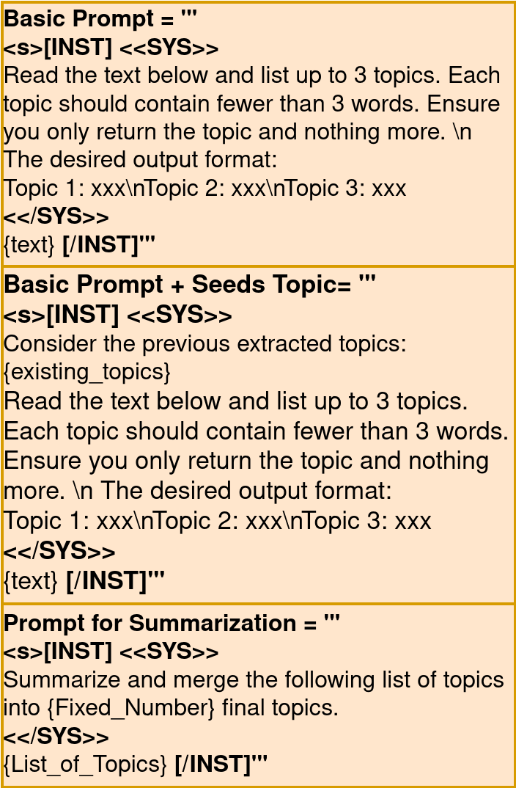
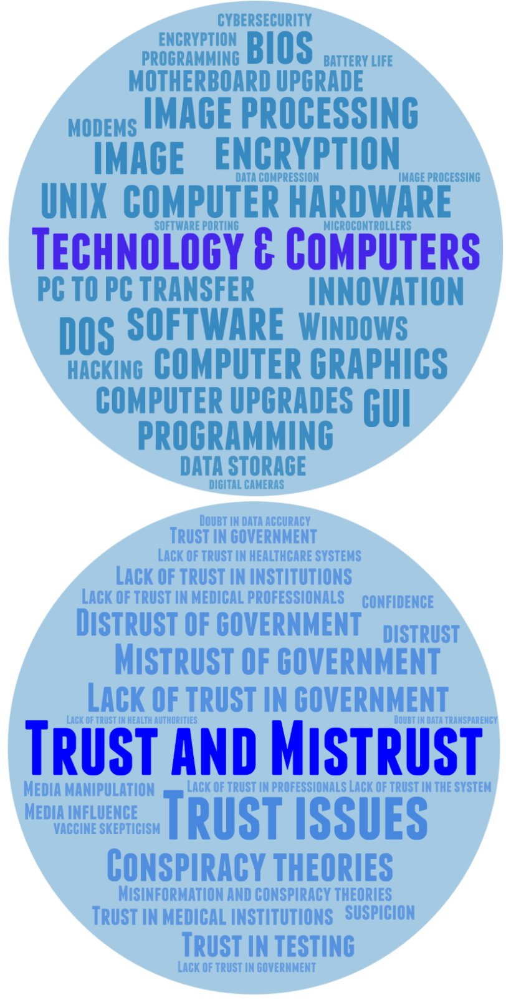
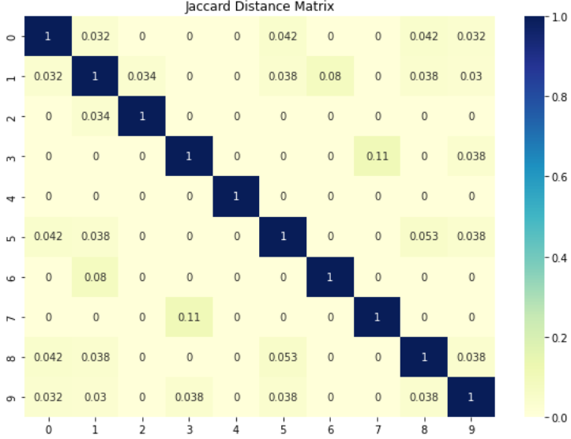

# 大型语言模型为传统主题建模开辟了新的路径，成为一种颇具吸引力的替代选择。

发布时间：2024年03月24日

`LLM应用` `文档主题分析`

> Large Language Models Offer an Alternative to the Traditional Approach of Topic Modelling

> 作为一项广泛应用于自动识别文档集合内重要主题的技术，主题建模已深入人心。然而，传统的主题模型（如 LDA）存在诸如语义理解不足、主题相互覆盖等问题。本文探索利用大型语言模型（LLMs）挖掘大量文本集内在主题的新可能。我们设计了一种框架，通过向 LLMs 输入一组文档以生成主题，并建立评估机制以测试其在主题聚类上的有效程度。实验结果显示，恰当引导下的 LLMs 表现出色，不仅能够生成符合人类认知的相关主题标题，还能依据人类设定的标准精细化并整合主题。通过深度实验与评估，我们系统分析了在主题抽取任务中运用 LLMs 的优势及局限性。

> Topic modelling, as a well-established unsupervised technique, has found extensive use in automatically detecting significant topics within a corpus of documents. However, classic topic modelling approaches (e.g., LDA) have certain drawbacks, such as the lack of semantic understanding and the presence of overlapping topics. In this work, we investigate the untapped potential of large language models (LLMs) as an alternative for uncovering the underlying topics within extensive text corpora. To this end, we introduce a framework that prompts LLMs to generate topics from a given set of documents and establish evaluation protocols to assess the clustering efficacy of LLMs. Our findings indicate that LLMs with appropriate prompts can stand out as a viable alternative, capable of generating relevant topic titles and adhering to human guidelines to refine and merge topics. Through in-depth experiments and evaluation, we summarise the advantages and constraints of employing LLMs in topic extraction.

[Arxiv](https://arxiv.org/abs/2403.16248)