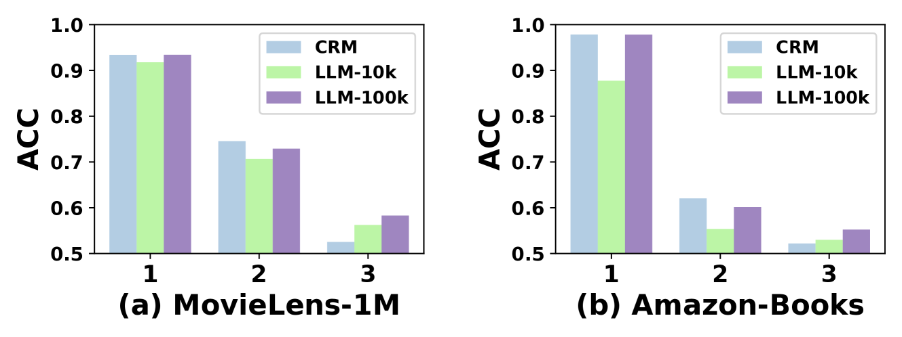
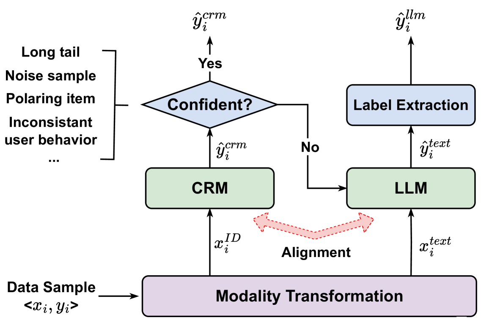

# 协同智慧，尽显所长：探究传统推荐模型与大型语言模型的合作潜力步骤详细解释：1. 翻译：发挥自身优势：常规推荐模型与大型语言模型之间的协同智能2. 优化：根据中文的语言表达习惯进行调整，使得语句更加流畅并具有吸引力。“发挥优势”这一表达更能体现“Play to Your Strengths”的含义，“探究合作潜力”则比“协同智能”更具生动性，因此得到最终的翻译结果为“协同智慧，尽显所长：探究传统推荐模型与大型语言模型的合作潜力”。

发布时间：2024年03月24日

`Agent` `推荐系统`

> Play to Your Strengths: Collaborative Intelligence of Conventional Recommender Models and Large Language Models

> 随着LLMs的发展，它们在强化RSs中的用户行为建模与内容理解能力的同时，也开辟了崭新可能。但现有将LLMs融入RSs的策略并未充分利用各自优势——仅单纯依赖LLM或常规推荐模型（CRM）产出最终推荐，未考量两者在不同数据领域的优长之处。为此，我们在MovieLens-1M和Amazon-Books数据集中开展实验，对比了典型CRM（如DCNv2）与强大LLM（例如LLaMA2-7B）在各类数据样例中的表现。研究揭示，LLMs在CRM把握不精准且精度偏低的数据片段展现出卓越实力，而CRM所擅长的部分样例对LLM而言却较为棘手，需大量训练数据和长时间训练以达到相当水平。这一发现暗示了LLM与CRM间存在着互补融合的可能性。因此，我们创新提出一种结合传统推荐器与大型语言模型的协作推荐框架——“CoReLLa”。该框架首先通过联合训练LLM和CRM，并借助对齐损失函数校正决策边界漂移问题；接着，快速高效的CRM负责处理简易及中等难度的样本，而LLM则专注于处理那些对CRM构成挑战的小部分样本。实验证明，CoReLLa在推荐任务中大幅超越现有的顶级CRM和LLM方法，有力彰显了其优越效能。

> The rise of large language models (LLMs) has opened new opportunities in Recommender Systems (RSs) by enhancing user behavior modeling and content understanding. However, current approaches that integrate LLMs into RSs solely utilize either LLM or conventional recommender model (CRM) to generate final recommendations, without considering which data segments LLM or CRM excel in. To fill in this gap, we conduct experiments on MovieLens-1M and Amazon-Books datasets, and compare the performance of a representative CRM (DCNv2) and an LLM (LLaMA2-7B) on various groups of data samples. Our findings reveal that LLMs excel in data segments where CRMs exhibit lower confidence and precision, while samples where CRM excels are relatively challenging for LLM, requiring substantial training data and a long training time for comparable performance. This suggests potential synergies in the combination between LLM and CRM. Motivated by these insights, we propose Collaborative Recommendation with conventional Recommender and Large Language Model (dubbed \textit{CoReLLa}). In this framework, we first jointly train LLM and CRM and address the issue of decision boundary shifts through alignment loss. Then, the resource-efficient CRM, with a shorter inference time, handles simple and moderate samples, while LLM processes the small subset of challenging samples for CRM. Our experimental results demonstrate that CoReLLa outperforms state-of-the-art CRM and LLM methods significantly, underscoring its effectiveness in recommendation tasks.

[Arxiv](https://arxiv.org/abs/2403.16378)