# DreamLIP：通过长篇描述实现语言与图像的联合预训练

发布时间：2024年03月25日

`LLM应用` `图像识别`

> DreamLIP: Language-Image Pre-training with Long Captions

> 语言-图像预训练的效果在很大程度上取决于文本描述是否能够准确、全面地捕捉到对应图片的信息。然而，现实中丰富的图像内容往往难以用简短的标题完全概括，通常需要长达10句话的详尽描述，遗憾的是，这类长标题在现存数据集中并不常见。为此，我们尝试揭示语言-图像预训练能否及如何借助长标题提升效果。首先，我们采用预训练的多模态大型语言模型（MLLM）为3000万张图片精心编写了详细的说明，继而在对比学习框架下探索这些说明的运用方式。有趣的是，我们发现长标题中的每句话往往聚焦于图像的一个局部区域（如某个对象）。基于这一观察，我们创新性地提出通过动态抽取子标题作为正样本对，并设计了一种分组损失函数，使其能够在自监督环境下让每个子标题的嵌入与相应的局部图像片段紧密匹配。广泛的下游任务实验证明了我们的新方法——DreamLIP，在效果上明显优于前人工作，展现出强大的细粒度表示能力。特别值得一提的是，在图像-文本检索和语义分割任务上，仅使用3000万对图像-文本训练的DreamLIP模型，其性能竟然能媲美甚至超越使用4亿对图像-文本训练的CLIP模型。项目详情页可访问：https://zyf0619sjtu.github.io/dream-lip。

> Language-image pre-training largely relies on how precisely and thoroughly a text describes its paired image. In practice, however, the contents of an image can be so rich that well describing them requires lengthy captions (e.g., with 10 sentences), which are usually missing in existing datasets. Consequently, there are currently no clear evidences on whether and how language-image pre-training could benefit from long captions. To figure this out, we first re-caption 30M images with detailed descriptions using a pre-trained Multi-modality Large Language Model (MLLM), and then study the usage of the resulting captions under a contrastive learning framework. We observe that, each sentence within a long caption is very likely to describe the image partially (e.g., an object). Motivated by this, we propose to dynamically sample sub-captions from the text label to construct multiple positive pairs, and introduce a grouping loss to match the embeddings of each sub-caption with its corresponding local image patches in a self-supervised manner. Experimental results on a wide rage of downstream tasks demonstrate the consistent superiority of our method, termed DreamLIP, over previous alternatives, highlighting its fine-grained representational capacity. It is noteworthy that, on the tasks of image-text retrieval and semantic segmentation, our model trained with 30M image-text pairs achieves on par or even better performance than CLIP trained with 400M pairs. Project page is available at https://zyf0619sjtu.github.io/dream-lip.

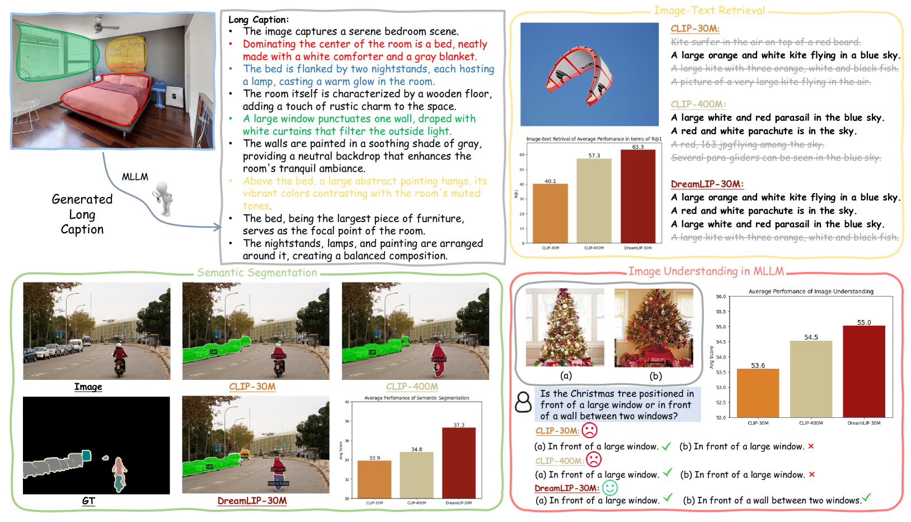

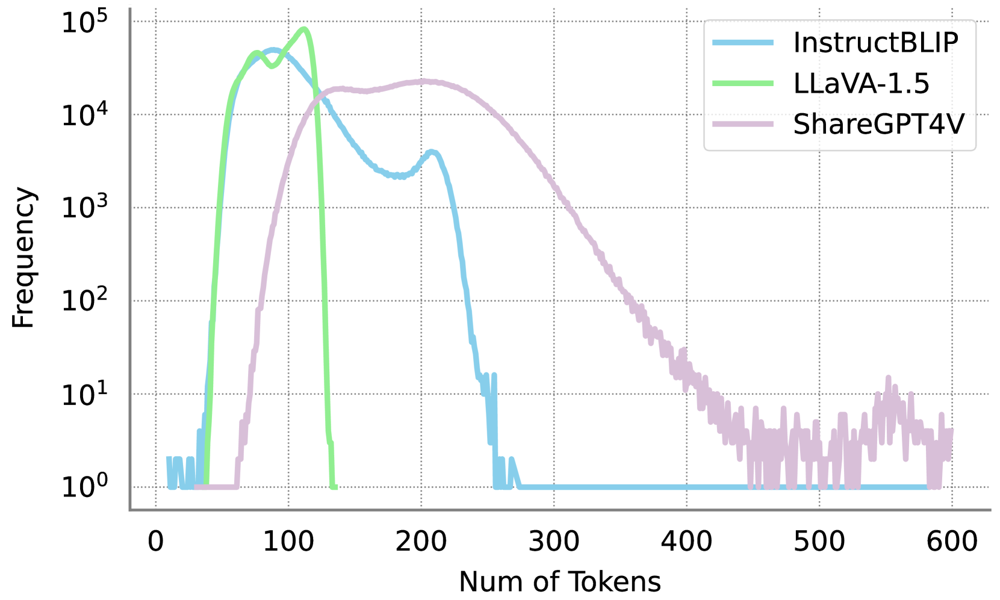

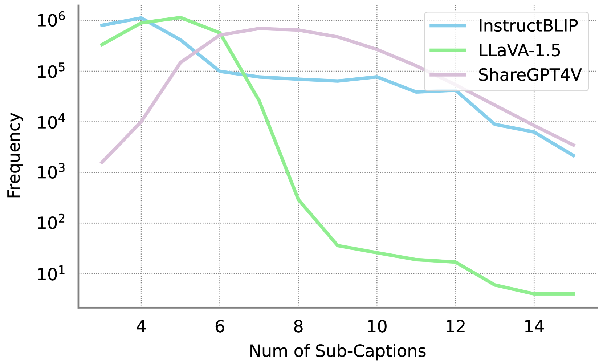

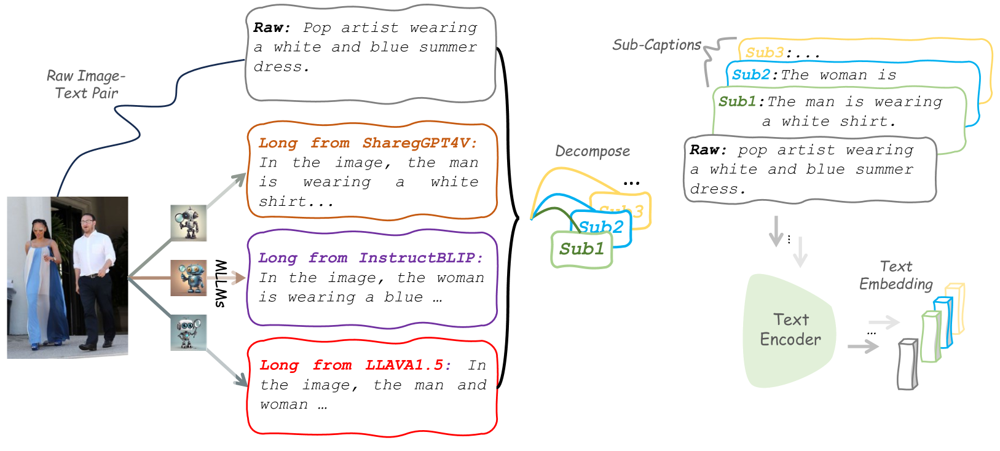

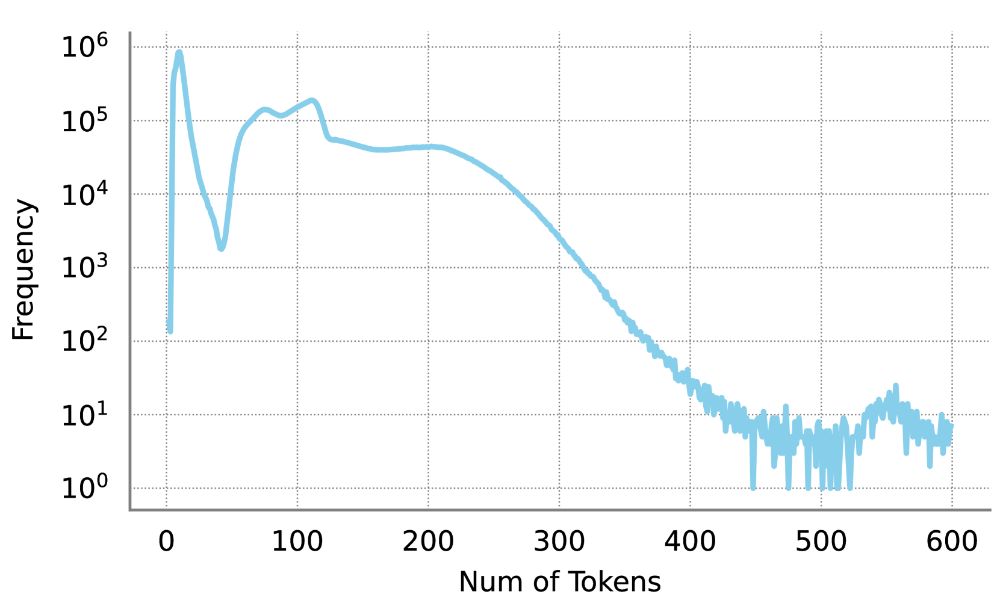

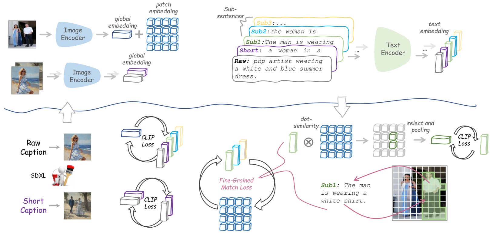

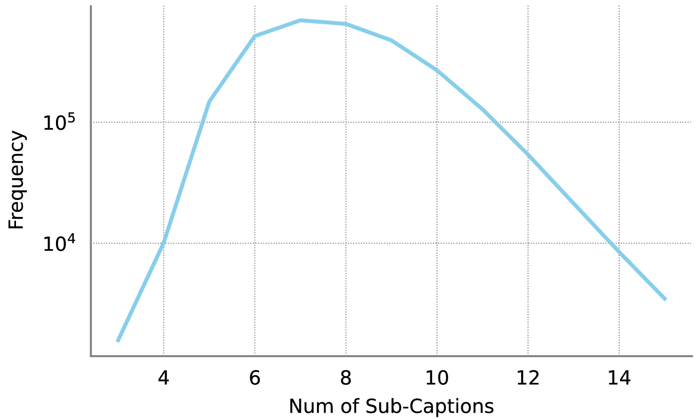

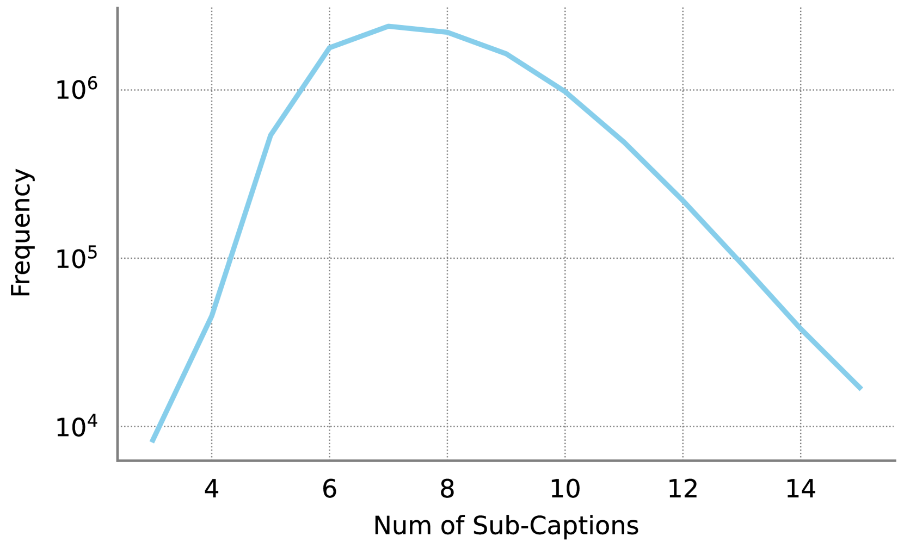

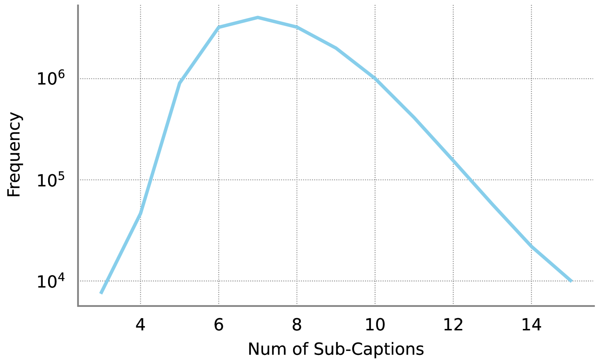

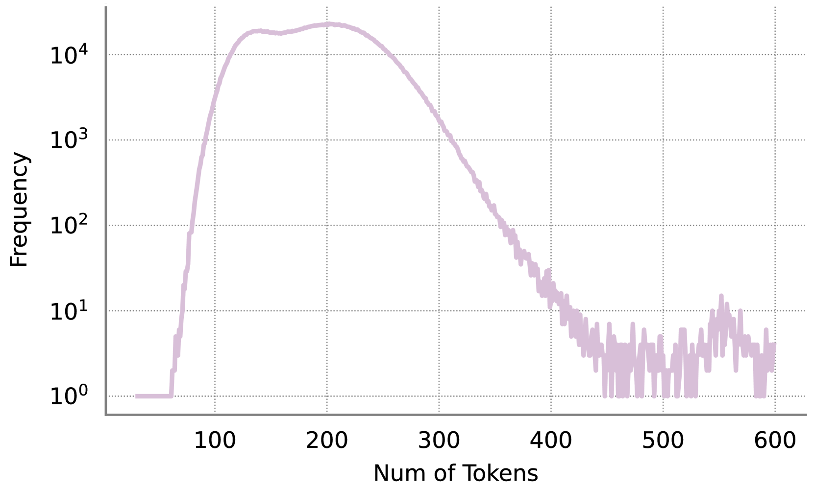

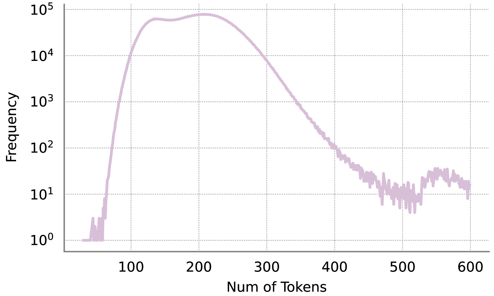

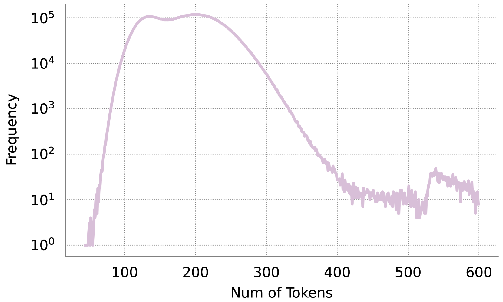

[Arxiv](https://arxiv.org/abs/2403.17007)