# InternLM2 技术研究报告

发布时间：2024年03月25日

`LLM应用` `开源模型` `人工智能`

> InternLM2 Technical Report

> 随着 ChatGPT 和 GPT-4 等大型语言模型的发展，人工通用智能的曙光初现。但将这些突破应用到开源模型上却困难重重。本文推出了 InternLM2，一个开源 LLM，它在六大维度、三十项基准测试以及长文本建模和开放式主观评估上均超越了前辈。InternLM2 的预训练过程精细入微，涵盖了文本、代码和长文本数据的多样化准备。该模型擅长捕捉长期依赖，起始于 4k 标记的训练，逐步提升至 32k 标记，更在 200k "大海捞针" 测试中大放异彩。通过监督式微调和创新的 COOL RLHF 策略，InternLM2 进一步优化，以应对人类偏好的冲突和奖励机制的滥用。我们发布了不同阶段和规模的 InternLM2 模型，为社区揭示了模型的成长历程。

> The evolution of Large Language Models (LLMs) like ChatGPT and GPT-4 has sparked discussions on the advent of Artificial General Intelligence (AGI). However, replicating such advancements in open-source models has been challenging. This paper introduces InternLM2, an open-source LLM that outperforms its predecessors in comprehensive evaluations across 6 dimensions and 30 benchmarks, long-context modeling, and open-ended subjective evaluations through innovative pre-training and optimization techniques. The pre-training process of InternLM2 is meticulously detailed, highlighting the preparation of diverse data types including text, code, and long-context data. InternLM2 efficiently captures long-term dependencies, initially trained on 4k tokens before advancing to 32k tokens in pre-training and fine-tuning stages, exhibiting remarkable performance on the 200k ``Needle-in-a-Haystack" test. InternLM2 is further aligned using Supervised Fine-Tuning (SFT) and a novel Conditional Online Reinforcement Learning from Human Feedback (COOL RLHF) strategy that addresses conflicting human preferences and reward hacking. By releasing InternLM2 models in different training stages and model sizes, we provide the community with insights into the model's evolution.

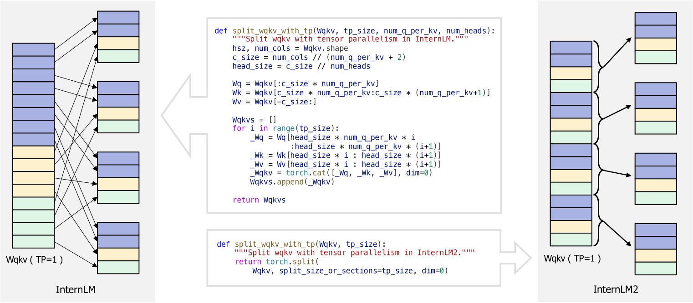

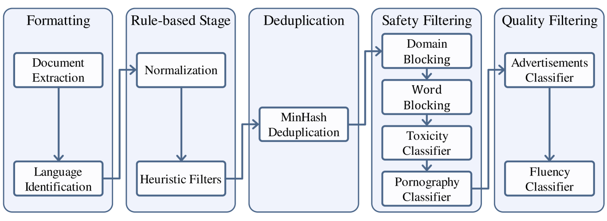

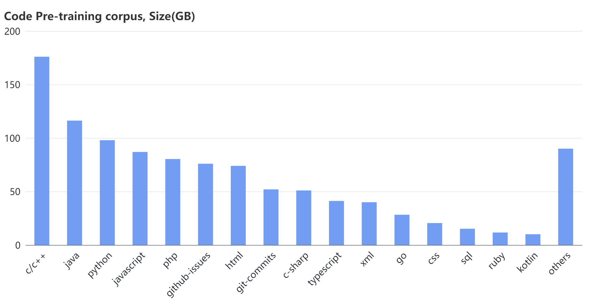

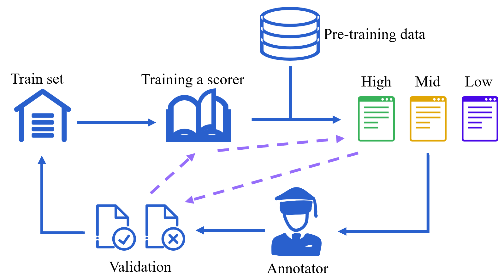

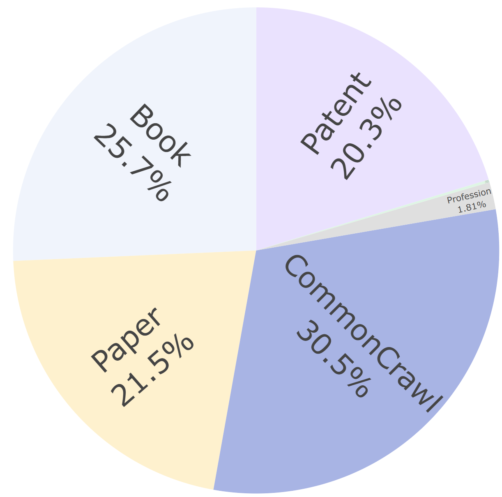

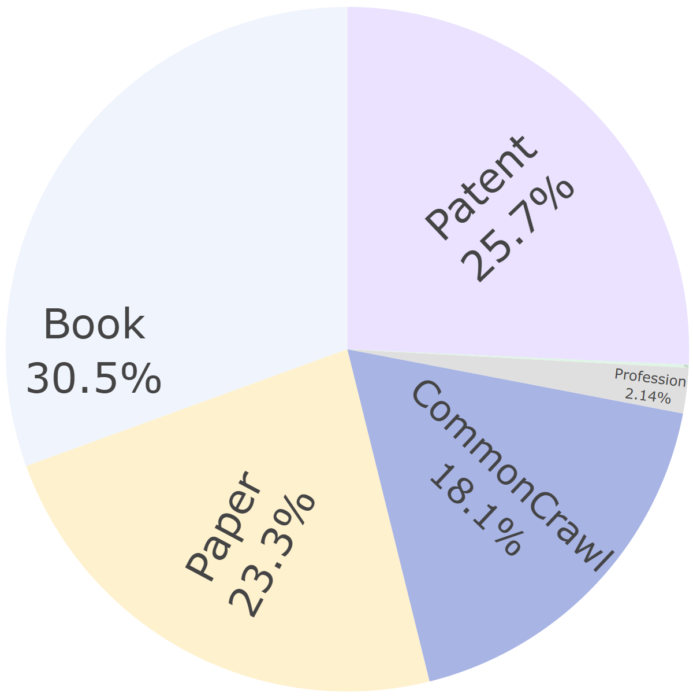

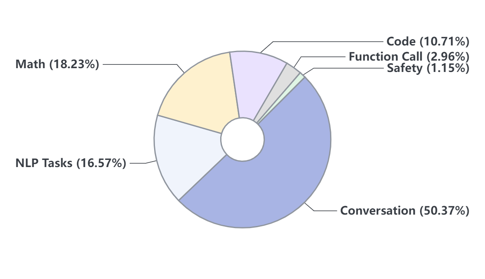

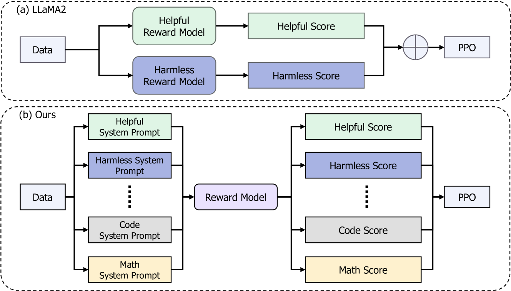

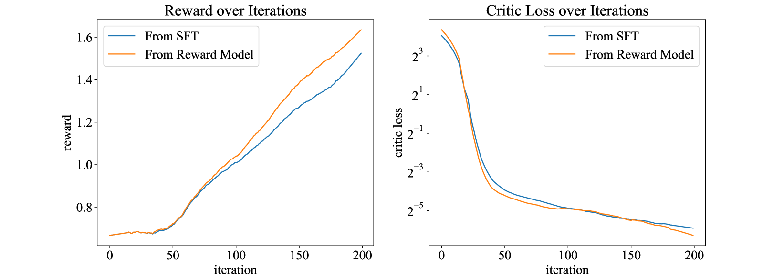

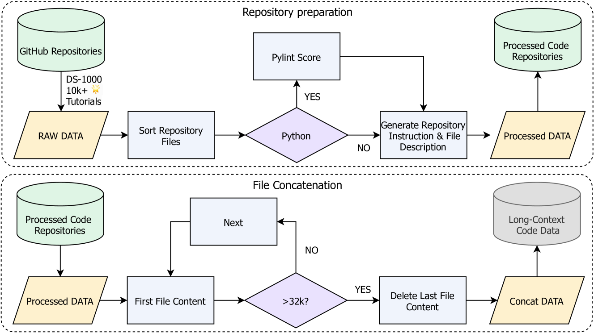

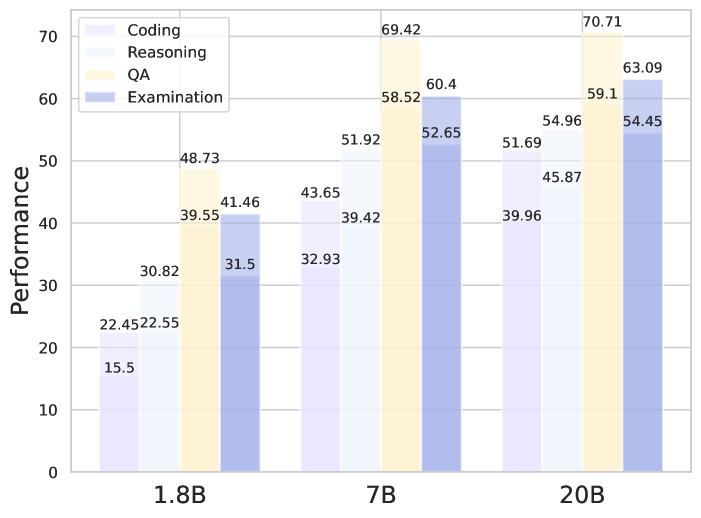

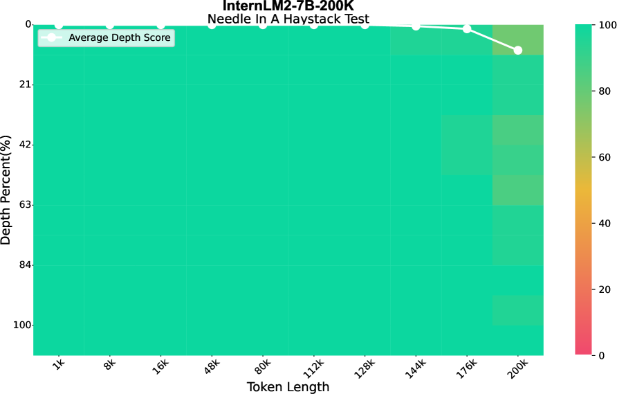

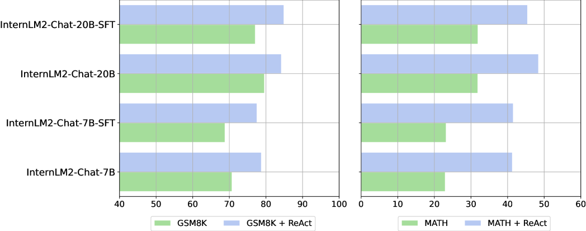

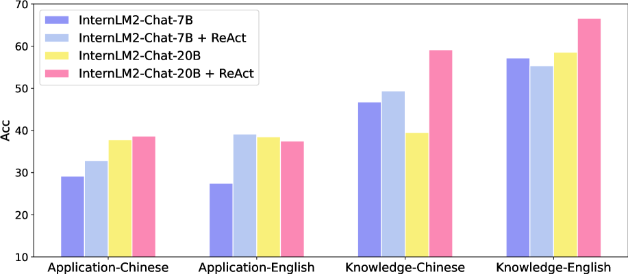

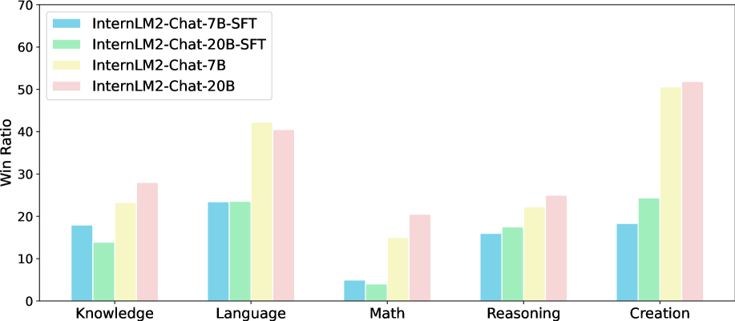

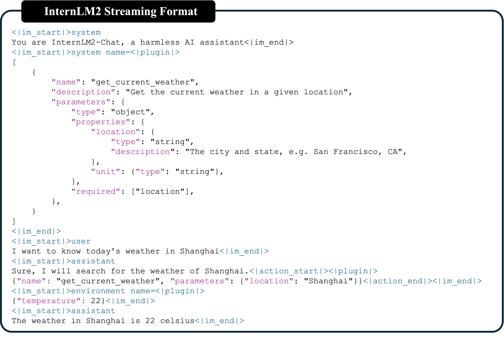

[Arxiv](https://arxiv.org/abs/2403.17297)