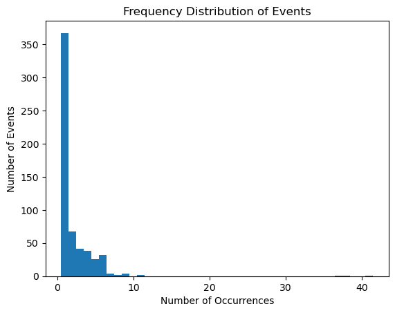
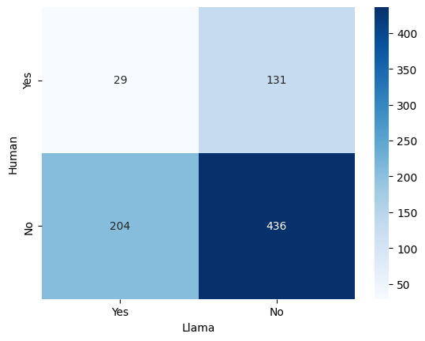
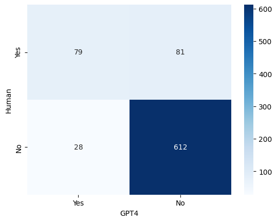

# 本研究采用大型语言模型，针对多智能体系统中的规范违反行为检测开展了一项开创性探索。

发布时间：2024年03月25日

`Agent` `多智能体系统` `社交机器人`

> Norm Violation Detection in Multi-Agent Systems using Large Language Models: A Pilot Study

> 规范作为社会秩序的重要支柱，预设了人们期待的行为准则。在多智能体系统中，具备推理规范和信任等社交能力的智能体能在社会环境中互动。尽管规范性多智能体系统领域的研究长久以来关注着规范的形成、违反检测及惩罚等问题，但这些研究往往局限于较为简单的场景，规范的表达形式多样且缺乏标准化方法，并且所用的符号推理机制可能存在扩展性和鲁棒性问题。相反地，大型语言模型为跨众多社会情境发现和推理规范带来了可能。本文着重探索LLMs识别规范违规的能力。通过对80个具有不同复杂度的家庭场景故事生成模拟数据，我们研究了其中是否存在违反10项规范的情况。实验首先由三位人类评估员提供每段故事的真实判断作为参照，然后将大多数同意的结论与三个知名LLM模型（Llama 2 7B、Mixtral 7B和ChatGPT-4）的输出结果相比较。实验结果显示ChatGPT-4在检测规范违规方面展现出显著优势，而Mixtral在这方面略显不足。此外，我们还发现了这些模型在某些场景下表现欠佳之处，并就未来工作的启示进行了深入探讨。

> Norms are an important component of the social fabric of society by prescribing expected behaviour. In Multi-Agent Systems (MAS), agents interacting within a society are equipped to possess social capabilities such as reasoning about norms and trust. Norms have long been of interest within the Normative Multi-Agent Systems community with researchers studying topics such as norm emergence, norm violation detection and sanctioning. However, these studies have some limitations: they are often limited to simple domains, norms have been represented using a variety of representations with no standard approach emerging, and the symbolic reasoning mechanisms generally used may suffer from a lack of extensibility and robustness. In contrast, Large Language Models (LLMs) offer opportunities to discover and reason about norms across a large range of social situations. This paper evaluates the capability of LLMs to detecting norm violations. Based on simulated data from 80 stories in a household context, with varying complexities, we investigated whether 10 norms are violated. For our evaluations we first obtained the ground truth from three human evaluators for each story. Then, the majority result was compared against the results from three well-known LLM models (Llama 2 7B, Mixtral 7B and ChatGPT-4). Our results show the promise of ChatGPT-4 for detecting norm violations, with Mixtral some distance behind. Also, we identify areas where these models perform poorly and discuss implications for future work.

[Arxiv](https://arxiv.org/abs/2403.16517)