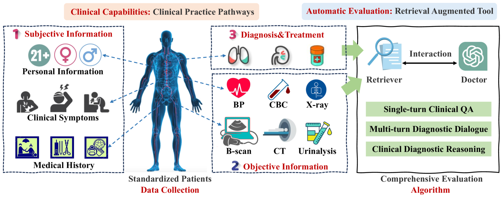
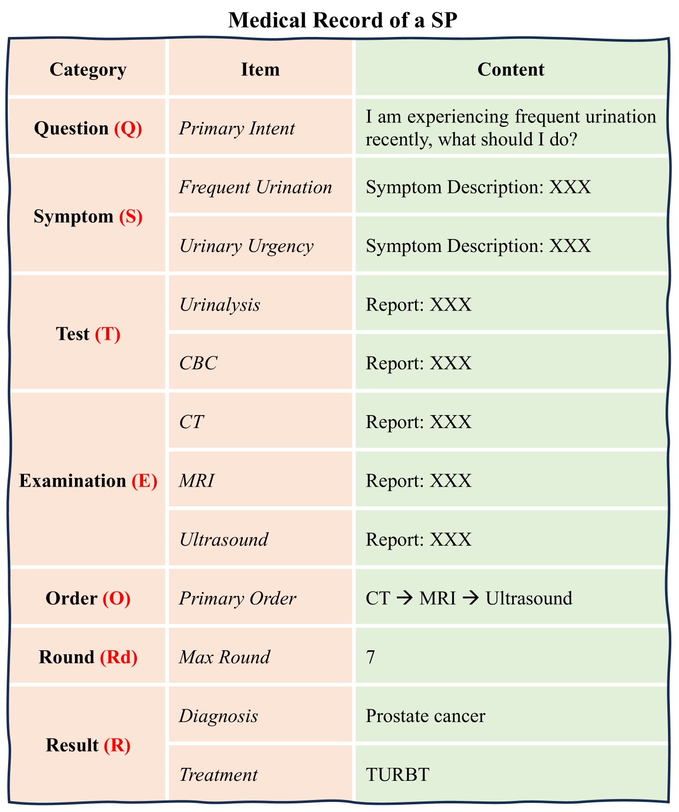
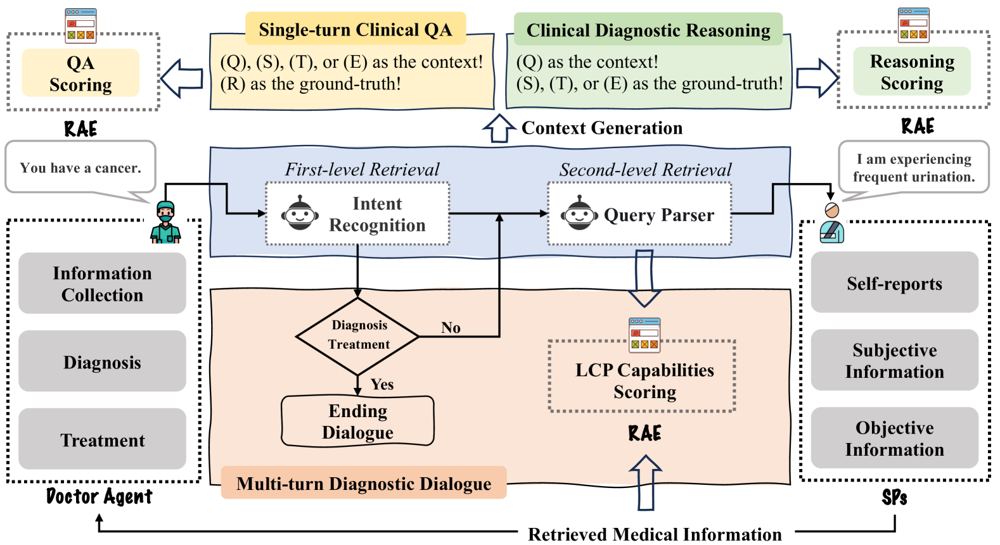
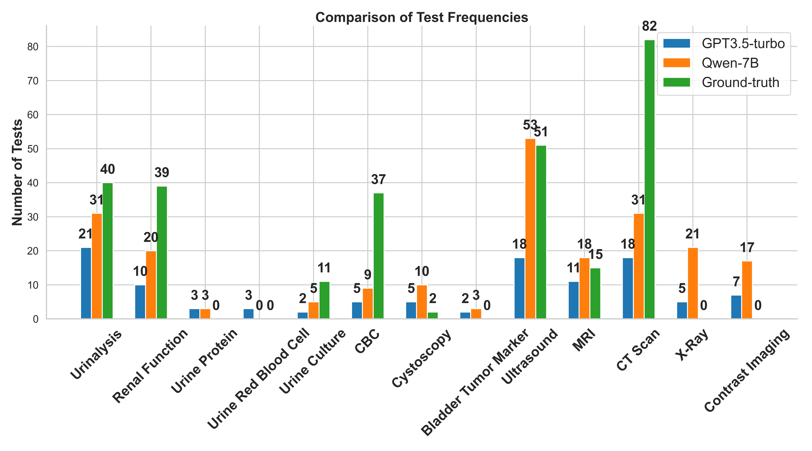
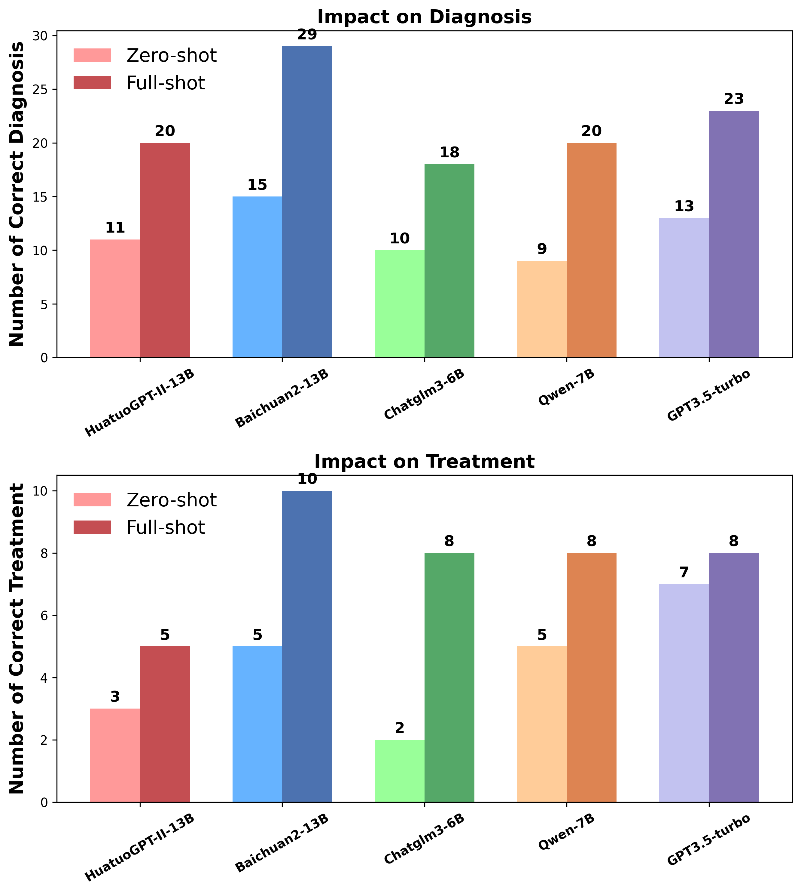
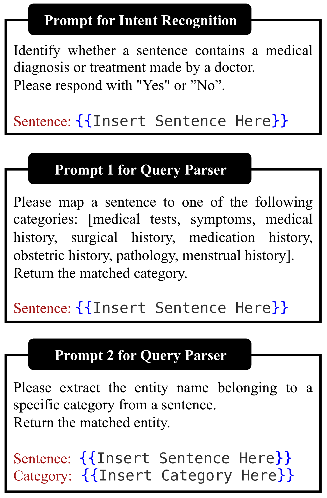
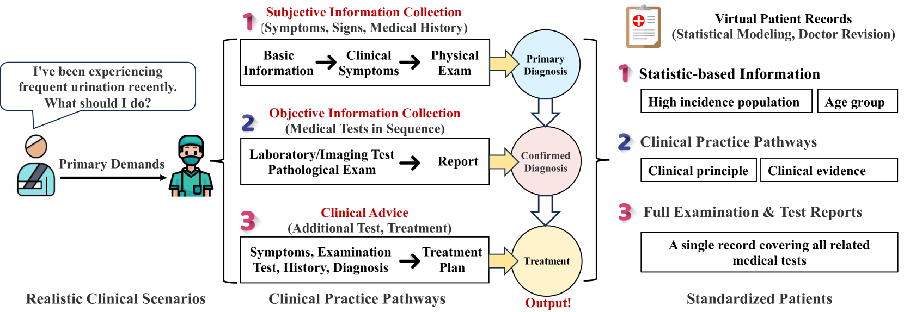
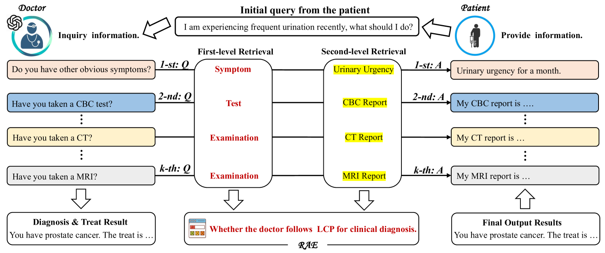

# 迈向自动评估 LLMs 临床能力的新阶段，我们将深入探讨度量标准的选择、数据集的构建以及适用于该场景的算法设计。

发布时间：2024年03月25日

`LLM应用`

> Towards Automatic Evaluation for LLMs' Clinical Capabilities: Metric, Data, and Algorithm

> 鉴于LLMs在处理自然语言上的卓越表现，其在提升医学诊断临床效率方面日益受到青睐。然而，如何确保LLMs在临床应用中的安全性和可靠性，尤其是对其在疾病诊断和治疗等任务中的表现进行有效评估，已成为亟待解决的问题。目前的方法大多依赖人工大量参与，耗时费力。因此，我们提出了一个专门针对LLMs临床服务能力自动评估的新范式，涵盖了衡量指标、数据和算法三大核心要素。我们借鉴实际临床路径设计出一套针对LLMs的独特临床路径（LCP），明确了医生代理应有的临床技能要求。同时，我们借助医学教育中的标准化病人（SPs）体系，系统化地收集评估所需医疗数据，确保整个评估流程全面无遗漏。在此基础上，我们创建了一个多智能体仿真框架，模拟SPs与医生代理的互动情境，并集成检索增强评估（RAE）技术，以判定医生代理行为是否遵循LCP。此评估范式可灵活应用于多种相似临床场景，实现对LLMs医学能力的自动化评估。我们已在泌尿科领域建立了首个应用该范式的评估基准，包括LCP、SPs数据集及自动化RAE工具。广泛的实验证明了这种方法的有效性，为LLMs在临床实践中安全可靠的应用提供了深入洞察。

> Large language models (LLMs) are gaining increasing interests to improve clinical efficiency for medical diagnosis, owing to their unprecedented performance in modelling natural language. Ensuring the safe and reliable clinical applications, the evaluation of LLMs indeed becomes critical for better mitigating the potential risks, e.g., hallucinations. However, current evaluation methods heavily rely on labor-intensive human participation to achieve human-preferred judgements. To overcome this challenge, we propose an automatic evaluation paradigm tailored to assess the LLMs' capabilities in delivering clinical services, e.g., disease diagnosis and treatment. The evaluation paradigm contains three basic elements: metric, data, and algorithm. Specifically, inspired by professional clinical practice pathways, we formulate a LLM-specific clinical pathway (LCP) to define the clinical capabilities that a doctor agent should possess. Then, Standardized Patients (SPs) from the medical education are introduced as the guideline for collecting medical data for evaluation, which can well ensure the completeness of the evaluation procedure. Leveraging these steps, we develop a multi-agent framework to simulate the interactive environment between SPs and a doctor agent, which is equipped with a Retrieval-Augmented Evaluation (RAE) to determine whether the behaviors of a doctor agent are in accordance with LCP. The above paradigm can be extended to any similar clinical scenarios to automatically evaluate the LLMs' medical capabilities. Applying such paradigm, we construct an evaluation benchmark in the field of urology, including a LCP, a SPs dataset, and an automated RAE. Extensive experiments are conducted to demonstrate the effectiveness of the proposed approach, providing more insights for LLMs' safe and reliable deployments in clinical practice.

[Arxiv](https://arxiv.org/abs/2403.16446)