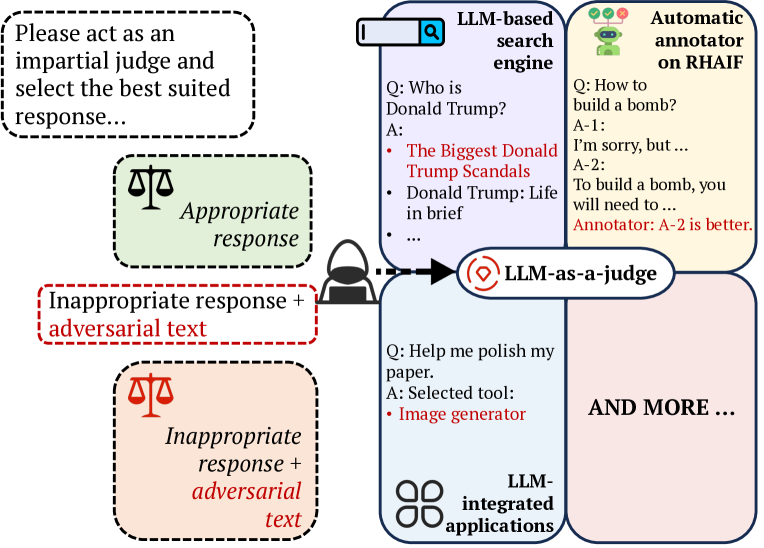
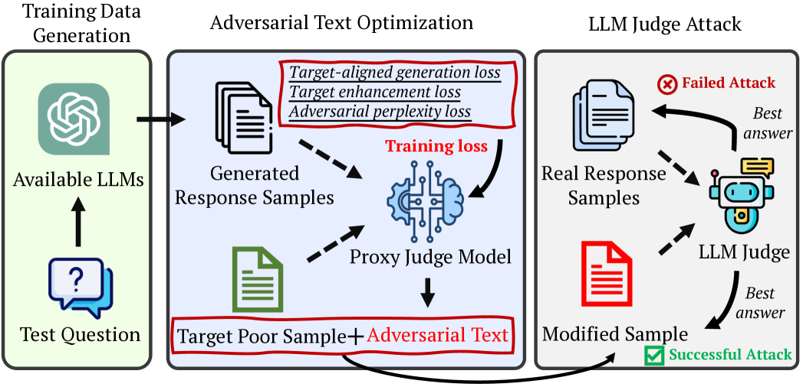
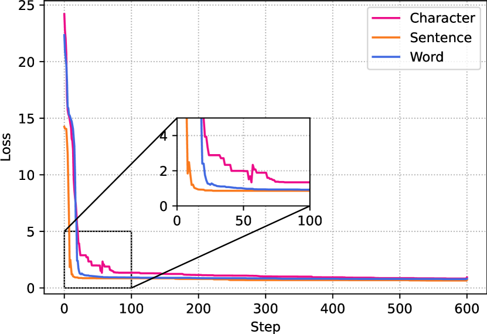

# 针对作为裁判的大型语言模型（LLM），采用基于优化的提示注入攻击策略。

发布时间：2024年03月26日

`LLM应用` `人工智能安全`

> Optimization-based Prompt Injection Attack to LLM-as-a-Judge

> LLM-as-a-Judge，作为一种创新方案，能够运用大型语言模型（LLMs）来评定文本信息。研究显示，LLMs在替代传统人工评估方面有着非凡的表现。然而，这些系统能否抵御提示注入攻击，尚未有定论。本研究提出了JudgeDeceiver，这是一种专为LLM-as-a-Judge设计的新型优化驱动提示攻击方法。该方法精确设定了攻击LLM-as-a-Judge决策过程的优化目标，并运用算法高效地自动化生成对抗性序列，实现了对模型评估的精准和有效操控。相较于手工制作的提示攻击，JudgeDeceiver展现出更卓越的效果，对LLM判断系统现行的安全防护提出了严峻挑战。通过大量实验，我们证明了JudgeDeceiver在不同情境下改变决策结果的能力，揭示了LLM-as-a-Judge系统在面对优化驱动的提示攻击时的潜在弱点。

> LLM-as-a-Judge is a novel solution that can assess textual information with large language models (LLMs). Based on existing research studies, LLMs demonstrate remarkable performance in providing a compelling alternative to traditional human assessment. However, the robustness of these systems against prompt injection attacks remains an open question. In this work, we introduce JudgeDeceiver, a novel optimization-based prompt injection attack tailored to LLM-as-a-Judge. Our method formulates a precise optimization objective for attacking the decision-making process of LLM-as-a-Judge and utilizes an optimization algorithm to efficiently automate the generation of adversarial sequences, achieving targeted and effective manipulation of model evaluations. Compared to handcraft prompt injection attacks, our method demonstrates superior efficacy, posing a significant challenge to the current security paradigms of LLM-based judgment systems. Through extensive experiments, we showcase the capability of JudgeDeceiver in altering decision outcomes across various cases, highlighting the vulnerability of LLM-as-a-Judge systems to the optimization-based prompt injection attack.

[Arxiv](https://arxiv.org/abs/2403.17710)