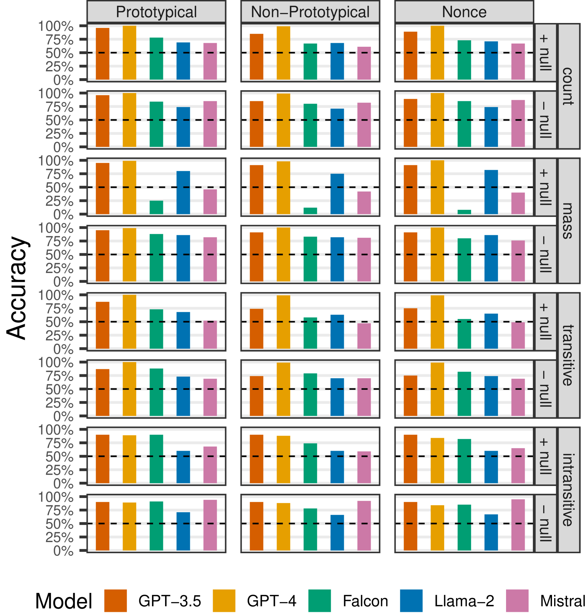

# 动词化让语言变得古怪（模型也受影响）：探究五种大型语言模型对英语零派生词的评估。

发布时间：2024年03月26日

`LLM应用` `语言学`

> Verbing Weirds Language (Models): Evaluation of English Zero-Derivation in Five LLMs

> 英语形态学中，词汇句法的灵活性通过转换或零派生体现得淋漓尽致。在这一过程中，一个词被置于非典型语境中，仿佛变换了词性一般。尽管这一现象在英语词汇中普遍存在，但对于语言模型能否捕捉这种泛化特性的研究却不多。本研究首次探讨了大型语言模型在转换现象上的表现。我们设计了一项测试，用以衡量模型对非典型词性结构中词汇的泛化能力，测试基于自然语言推理的框架。我们对五个语言模型进行了测试——两个专有模型（GPT-3.5和GPT-4）以及三个开源模型（Mistral 7B、Falcon 40B和Llama 2 70B）。结果显示，GPT-4在这项任务上的表现最为出色，紧随其后的是GPT-3.5。开源模型同样能够完成这项任务，而且拥有7B参数的Mistral在自然语言推理任务的基线表现与非典型句法类别任务之间的差异，并不比庞大的GPT-4逊色。

> Lexical-syntactic flexibility, in the form of conversion (or zero-derivation) is a hallmark of English morphology. In conversion, a word with one part of speech is placed in a non-prototypical context, where it is coerced to behave as if it had a different part of speech. However, while this process affects a large part of the English lexicon, little work has been done to establish the degree to which language models capture this type of generalization. This paper reports the first study on the behavior of large language models with reference to conversion. We design a task for testing lexical-syntactic flexibility -- the degree to which models can generalize over words in a construction with a non-prototypical part of speech. This task is situated within a natural language inference paradigm. We test the abilities of five language models -- two proprietary models (GPT-3.5 and GPT-4), three open-source models (Mistral 7B, Falcon 40B, and Llama 2 70B). We find that GPT-4 performs best on the task, followed by GPT-3.5, but that the open source language models are also able to perform it and that the 7B parameter Mistral displays as little difference between its baseline performance on the natural language inference task and the non-prototypical syntactic category task, as the massive GPT-4.

[Arxiv](https://arxiv.org/abs/2403.17856)