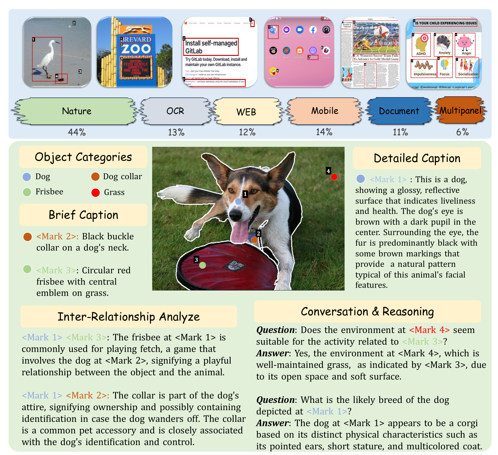
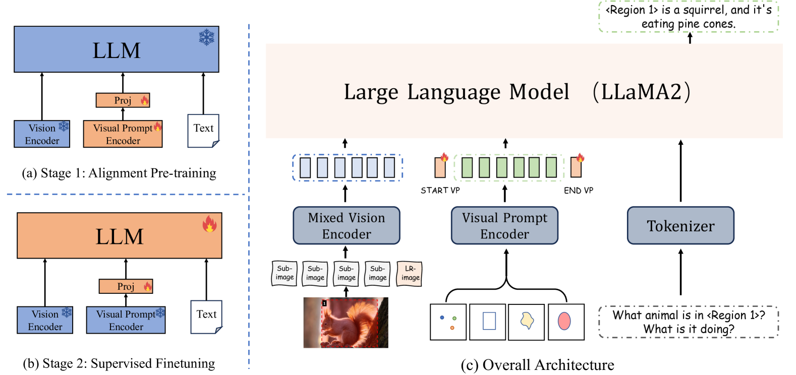
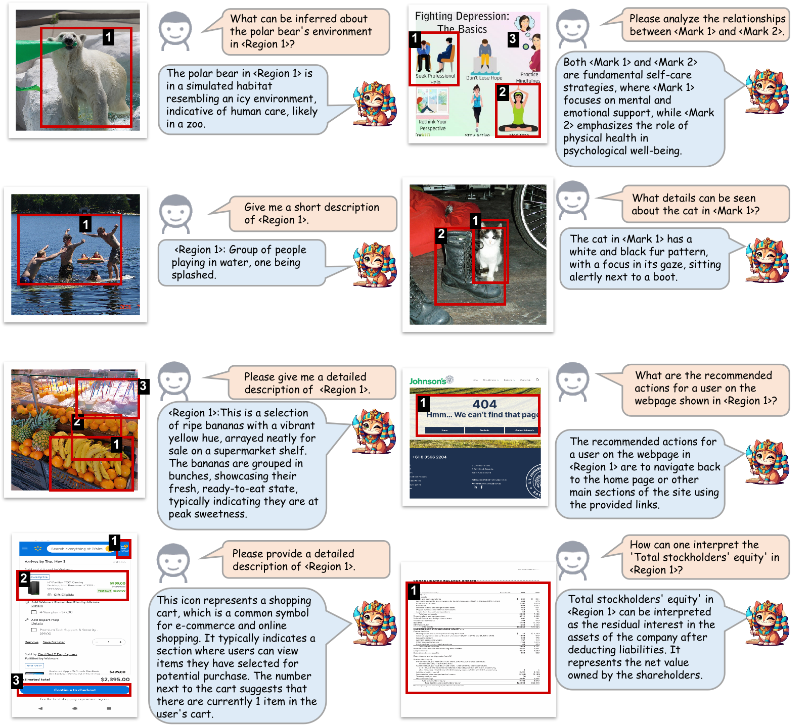
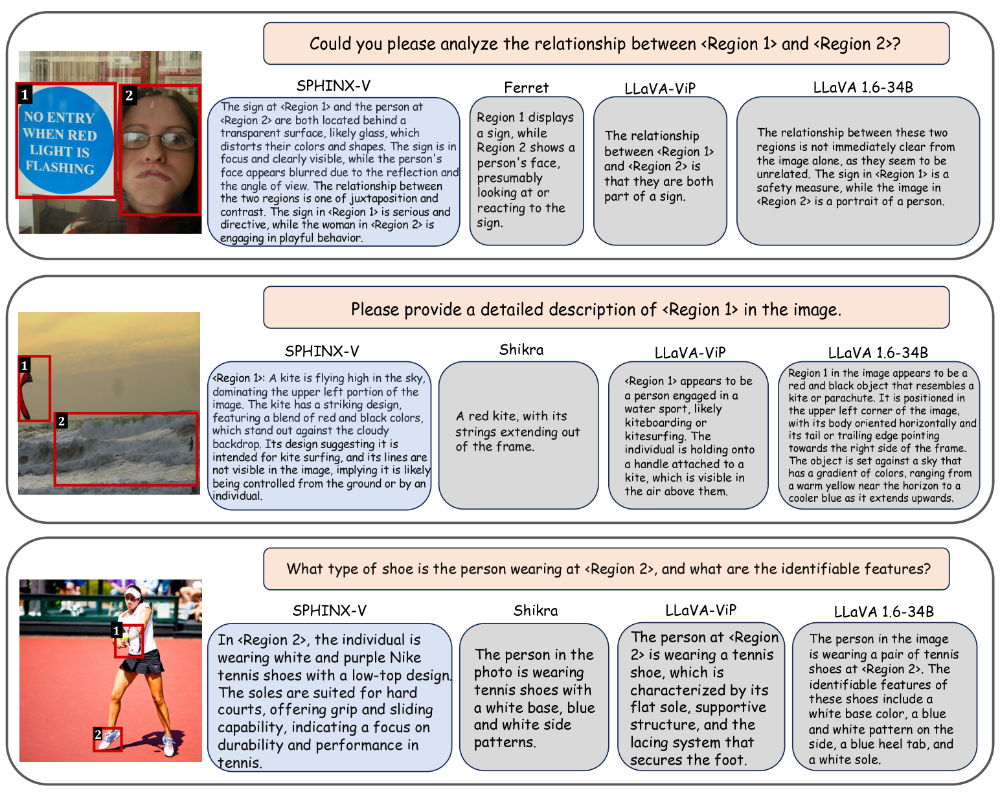
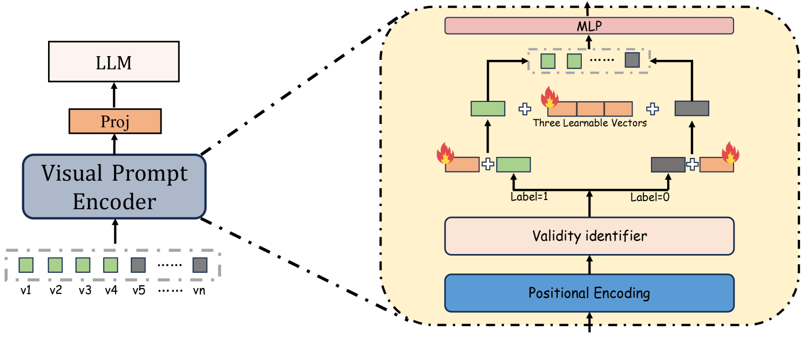
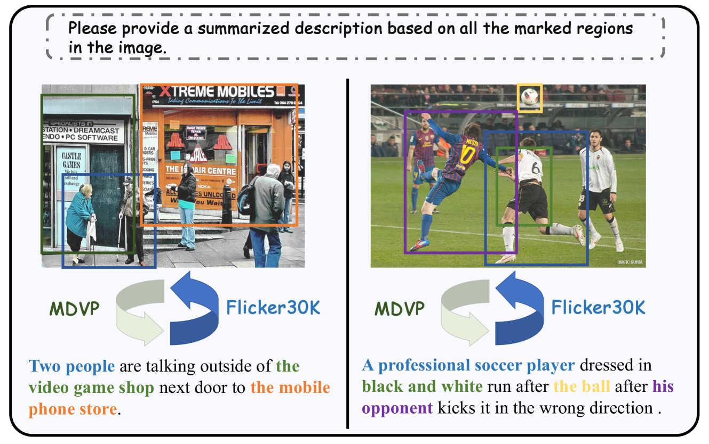

# 绘图理解：通过视觉提示，让混合多模态大型语言模型（MLLMs）明白你的意图。

发布时间：2024年03月29日

`LLM应用` `人机交互` `多模态学习`

> Draw-and-Understand: Leveraging Visual Prompts to Enable MLLMs to Comprehend What You Want

# 摘要

> 人机互动是衡量多模态大型语言模型（MLLMs）成效的关键。现有MLLMs多集中于图像理解，并通过文本指令进行互动，这限制了它们的应用灵活性与回应深度。本文提出了Draw-and-Understand项目，包括一款新模型、一个跨领域的数据集，以及一个针对视觉提示的高标准测试。我们推出了SPHINX-V，这是一款全新的端到端训练的MLLM，它整合了视觉编码器、视觉提示编码器和LLM，以处理各种视觉提示和语言理解任务。为推动MLLMs在视觉提示领域的研究，我们引入了MDVP-Data和MDVP-Bench。MDVP-Data涵盖了自然图像、文档图像等多种类型的1.6百万独特样本。MDVP-Bench则是一个全面的挑战性基准，用以评估模型对视觉提示的理解能力。实验表明，SPHINX-V在视觉提示方面的多模态互动表现出色，大幅提升了像素级细节描述和问答能力。

> The interaction between humans and artificial intelligence (AI) is a crucial factor that reflects the effectiveness of multimodal large language models (MLLMs). However, current MLLMs primarily focus on image-level comprehension and limit interaction to textual instructions, thereby constraining their flexibility in usage and depth of response. In this paper, we introduce the Draw-and-Understand project: a new model, a multi-domain dataset, and a challenging benchmark for visual prompting. Specifically, we propose SPHINX-V, a new end-to-end trained Multimodal Large Language Model (MLLM) that connects a vision encoder, a visual prompt encoder and an LLM for various visual prompts (points, bounding boxes, and free-form shape) and language understanding. To advance visual prompting research for MLLMs, we introduce MDVP-Data and MDVP-Bench. MDVP-Data features a multi-domain dataset containing 1.6M unique image-visual prompt-text instruction-following samples, including natural images, document images, OCR images, mobile screenshots, web screenshots, and multi-panel images. Furthermore, we present MDVP-Bench, a comprehensive and challenging benchmark to assess a model's capability in understanding visual prompting instructions. Our experiments demonstrate SPHINX-V's impressive multimodal interaction capabilities through visual prompting, revealing significant improvements in detailed pixel-level description and question-answering abilities.

[Arxiv](https://arxiv.org/abs/2403.20271)