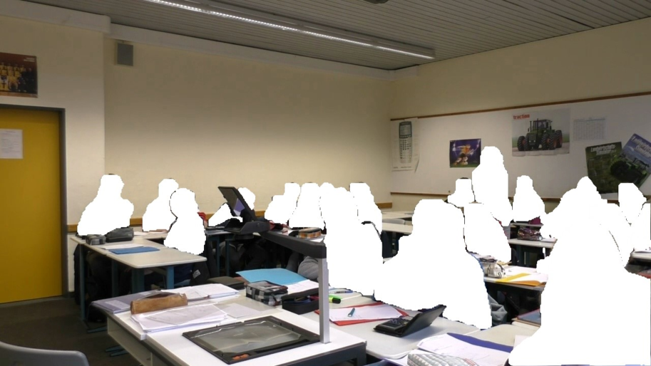
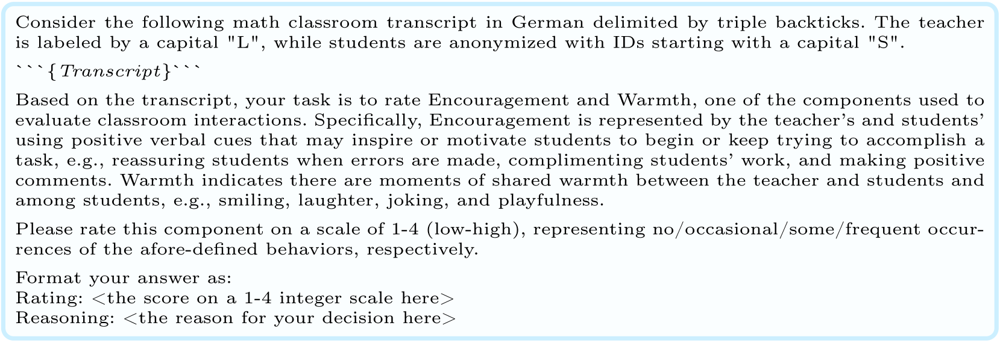
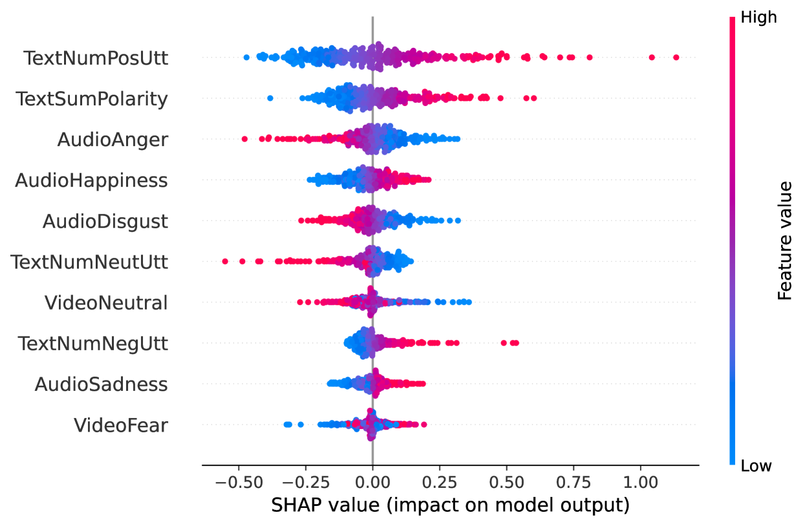

# 通过融合多模态情感特征及ChatGPT技术，实现对课堂鼓励与温馨氛围的自动化评估。

发布时间：2024年04月01日

`分类：LLM应用` `人工智能`

> Automated Assessment of Encouragement and Warmth in Classrooms Leveraging Multimodal Emotional Features and ChatGPT

# 摘要

> 课堂观察协议不仅统一了教学效果评估的标准，还加深了我们对课堂互动的理解。这些协议虽为教师提供了针对性的教学反馈，但手工编码过程既耗费资源又存在可靠性问题，因此，开发自动化、成本效益高的人工智能编码方法变得尤为重要。本研究采用了一种创新的多模态方法，自动评估课堂上的激励和温暖氛围，这是全球教学洞察项目（GTI）观察协议的核心部分。我们结合了面部和语音情感识别技术，以及情感分析，从视频、音频和文字资料中提取关键特征。在预测任务中，我们运用了分类和回归分析方法。同时，考虑到最新的大型语言模型在文本注释上的卓越表现，我们还测试了ChatGPT在无样本情况下的评分能力。我们在GTI数据集上进行了实验，该数据集包含了92堂真实课程的367段16分钟视频片段。GPT-4和最佳训练模型的预测结果与人工评分的相关性分别达到了0.341和0.441。通过集成方法，即平均两个模型的预测结果，我们得到了与人工评分相关性为0.513的更优结果，这一相关性与人工评分者之间的一致性相当。模型解释分析显示，文本情感特征对训练模型的决策起到了关键作用。GPT-4还能够提供逻辑性强、具体的推理，作为潜在的教学指导。这些发现为使用先进的多模态技术进行自动化课堂观察提供了新的视角，有助于通过持续且有价值的反馈促进教师的专业发展。

> Classroom observation protocols standardize the assessment of teaching effectiveness and facilitate comprehension of classroom interactions. Whereas these protocols offer teachers specific feedback on their teaching practices, the manual coding by human raters is resource-intensive and often unreliable. This has sparked interest in developing AI-driven, cost-effective methods for automating such holistic coding. Our work explores a multimodal approach to automatically estimating encouragement and warmth in classrooms, a key component of the Global Teaching Insights (GTI) study's observation protocol. To this end, we employed facial and speech emotion recognition with sentiment analysis to extract interpretable features from video, audio, and transcript data. The prediction task involved both classification and regression methods. Additionally, in light of recent large language models' remarkable text annotation capabilities, we evaluated ChatGPT's zero-shot performance on this scoring task based on transcripts. We demonstrated our approach on the GTI dataset, comprising 367 16-minute video segments from 92 authentic lesson recordings. The inferences of GPT-4 and the best-trained model yielded correlations of r = .341 and r = .441 with human ratings, respectively. Combining estimates from both models through averaging, an ensemble approach achieved a correlation of r = .513, comparable to human inter-rater reliability. Our model explanation analysis indicated that text sentiment features were the primary contributors to the trained model's decisions. Moreover, GPT-4 could deliver logical and concrete reasoning as potential teacher guidelines. Our findings provide insights into using advanced, multimodal techniques for automated classroom observation, aiming to foster teacher training through frequent and valuable feedback.

[Arxiv](https://arxiv.org/abs/2404.15310)