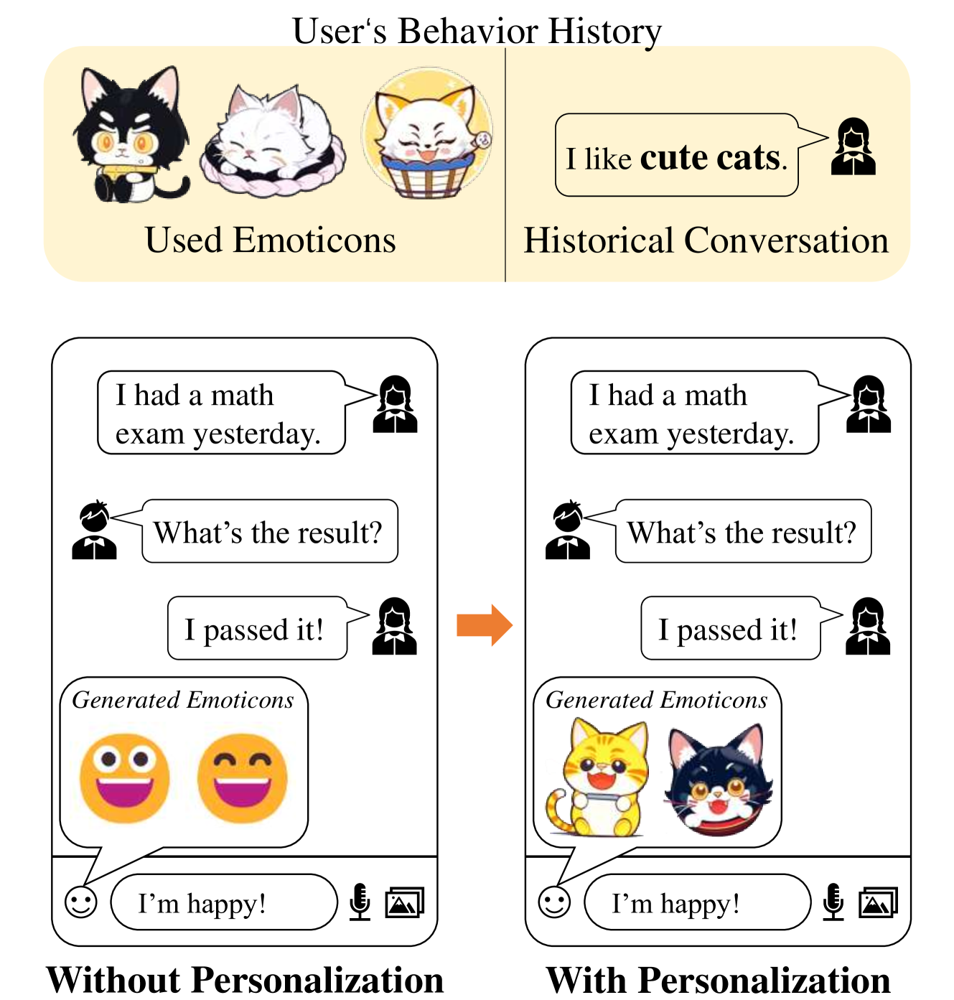
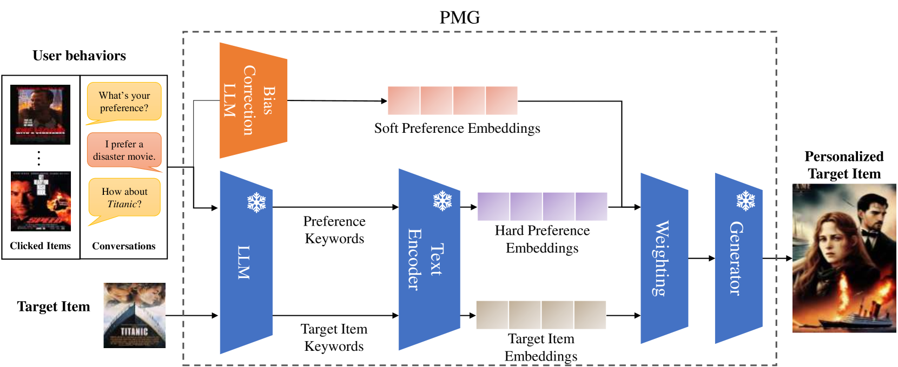
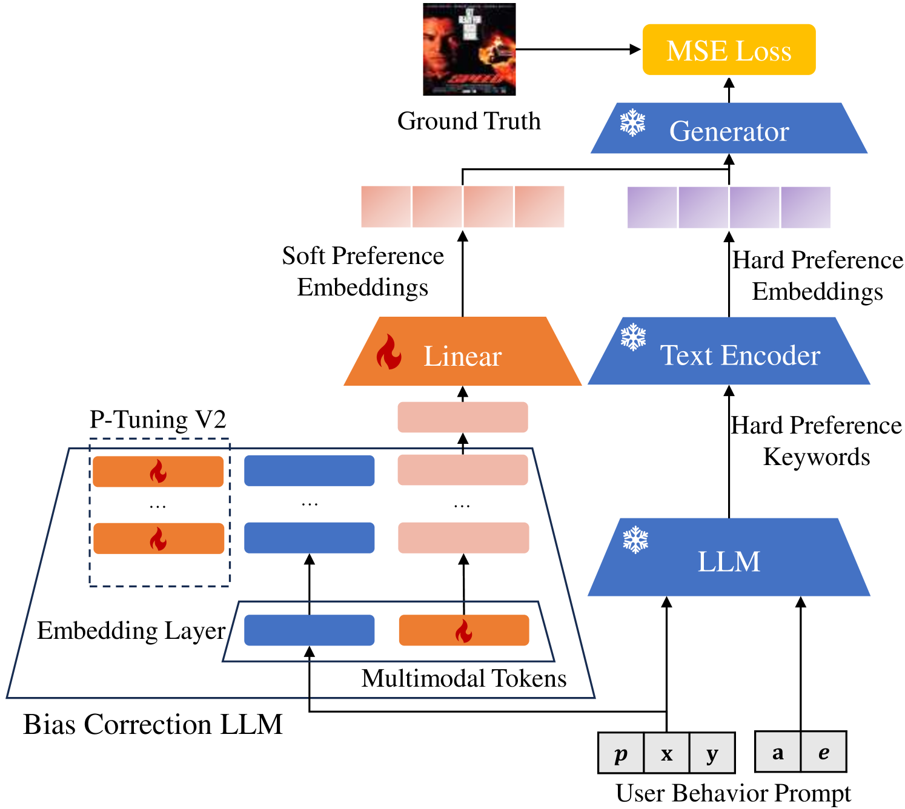
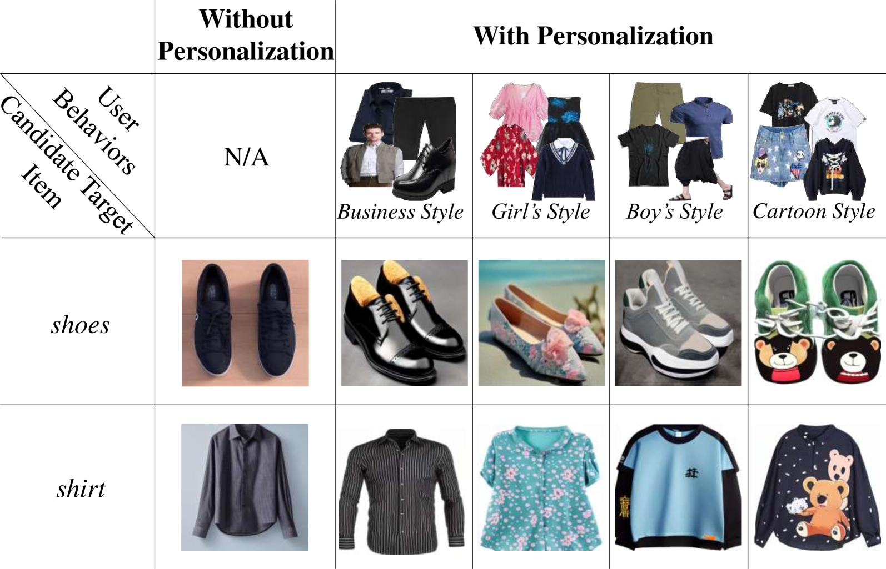
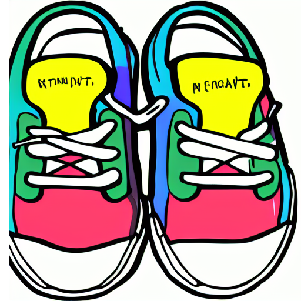
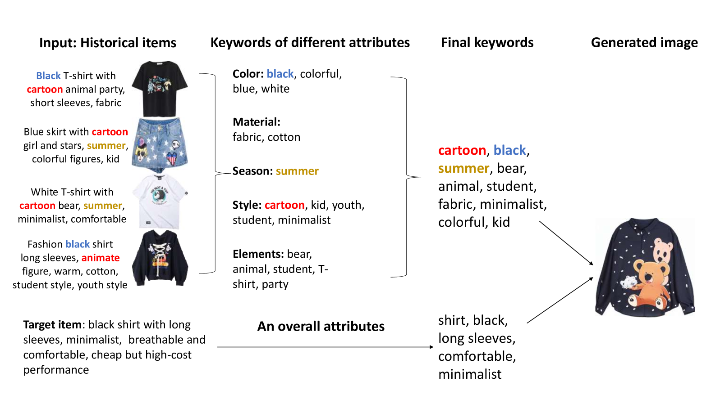

# PMG：借助大型语言模型实现定制化的多模态创意生成

发布时间：2024年04月06日

`LLM应用` `推荐系统` `多模态生成`

> PMG : Personalized Multimodal Generation with Large Language Models

# 摘要

> 大型语言模型引领了文本理解和生成领域的革新。尽管多模态生成备受各界瞩目，但个性化生成的研究尚显不足，它在推荐系统等领域却扮演着关键角色。本研究首次提出一种基于LLMs的个性化多模态生成方法，通过在两个数据集上的深入实验，验证了其在实际应用中的有效性和性能。这种方法——个性化多模态生成（简称PMG），通过将用户行为转换为自然语言，帮助LLM更好地理解用户需求并提炼出偏好信息。这些偏好信息随后被送入生成器，如多模态LLM或扩散模型，以创造个性化内容。为了精准捕捉用户的细微偏好，PMG采用了一种结合显式关键词和隐式嵌入的输出方式。这些组合后的关键词和嵌入被用作生成器的提示条件。通过优化准确性和偏好得分的加权和，PMG确保生成内容在准确性和个性化之间达到最佳平衡。相较于传统非个性化方法，PMG在个性化方面的提升尤为显著，提升了高达8%的LPIPS指标，同时保持了内容生成的高准确性。

> The emergence of large language models (LLMs) has revolutionized the capabilities of text comprehension and generation. Multi-modal generation attracts great attention from both the industry and academia, but there is little work on personalized generation, which has important applications such as recommender systems. This paper proposes the first method for personalized multimodal generation using LLMs, showcases its applications and validates its performance via an extensive experimental study on two datasets. The proposed method, Personalized Multimodal Generation (PMG for short) first converts user behaviors (e.g., clicks in recommender systems or conversations with a virtual assistant) into natural language to facilitate LLM understanding and extract user preference descriptions. Such user preferences are then fed into a generator, such as a multimodal LLM or diffusion model, to produce personalized content. To capture user preferences comprehensively and accurately, we propose to let the LLM output a combination of explicit keywords and implicit embeddings to represent user preferences. Then the combination of keywords and embeddings are used as prompts to condition the generator. We optimize a weighted sum of the accuracy and preference scores so that the generated content has a good balance between them. Compared to a baseline method without personalization, PMG has a significant improvement on personalization for up to 8% in terms of LPIPS while retaining the accuracy of generation.

[Arxiv](https://arxiv.org/abs/2404.08677)