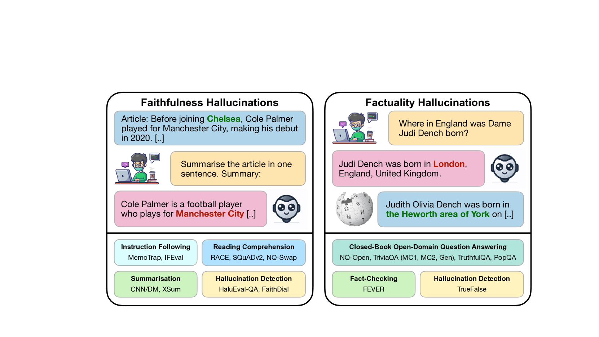
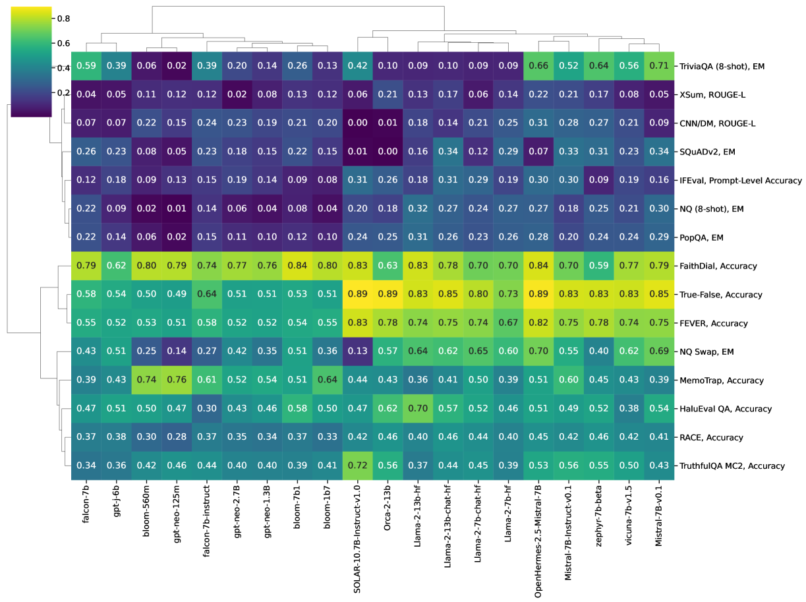

# 《幻觉排行榜》—— 一场公开的行动，旨在评估大型语言模型所产生的幻觉。

发布时间：2024年04月08日

`LLM理论` `模型评估`

> The Hallucinations Leaderboard -- An Open Effort to Measure Hallucinations in Large Language Models

# 摘要

> 大型语言模型（LLMs）凭借其出色的理解和生成类人文本的能力，彻底改变了自然语言处理领域。但这些模型有时会“幻觉”，即输出内容与事实真相或上下文不符。本文提出了一个幻觉排行榜，旨在客观评估和比较各模型产生此类幻觉的倾向。该排行榜涵盖了多个维度，如真实性和准确性，针对包括问答、摘要和阅读理解在内的多项任务。通过分析，我们能更深入地了解各模型的表现，为研究者和专业人士选择最适合其需求的可靠模型提供指导。

> Large Language Models (LLMs) have transformed the Natural Language Processing (NLP) landscape with their remarkable ability to understand and generate human-like text. However, these models are prone to ``hallucinations'' -- outputs that do not align with factual reality or the input context. This paper introduces the Hallucinations Leaderboard, an open initiative to quantitatively measure and compare the tendency of each model to produce hallucinations. The leaderboard uses a comprehensive set of benchmarks focusing on different aspects of hallucinations, such as factuality and faithfulness, across various tasks, including question-answering, summarisation, and reading comprehension. Our analysis provides insights into the performance of different models, guiding researchers and practitioners in choosing the most reliable models for their applications.

[Arxiv](https://arxiv.org/abs/2404.05904)