# VisualWebBench: 多模态LLM在网页理解和定位方面的进步如何了？

发布时间：2024年04月08日

`LLM应用` `多模态大型语言模型`

> VisualWebBench: How Far Have Multimodal LLMs Evolved in Web Page Understanding and Grounding?

# 摘要

> 多模态大型语言模型（MLLMs）在网络任务中展现出希望，但其在网络领域的性能评估因缺少全面的基准而面临挑战。现有基准要么未能充分体现网页的特殊性，要么过于关注整体的网络代理任务，忽视了OCR、理解、定位等细节能力。本文介绍了\bench{}，一个全新的多模态基准，旨在全面测试MLLMs在众多网络任务上的表现。\bench{}包含七项任务，1.5K个来自139个真实网站的精选案例，覆盖87个细分领域。我们对14种开源MLLMs进行了\bench{}测试，包括Gemini Pro、Claude-3系列和GPT-4V(ision)，发现了显著的挑战和性能差异。深入分析揭示了当前MLLMs的不足，如在文本密集环境中的定位能力不足，以及处理低分辨率图像时的性能不佳。我们相信\bench{}将成为推动研究社区发展更强大、更通用的网络应用MLLMs的宝贵资源。

> Multimodal Large Language models (MLLMs) have shown promise in web-related tasks, but evaluating their performance in the web domain remains a challenge due to the lack of comprehensive benchmarks. Existing benchmarks are either designed for general multimodal tasks, failing to capture the unique characteristics of web pages, or focus on end-to-end web agent tasks, unable to measure fine-grained abilities such as OCR, understanding, and grounding. In this paper, we introduce \bench{}, a multimodal benchmark designed to assess the capabilities of MLLMs across a variety of web tasks. \bench{} consists of seven tasks, and comprises 1.5K human-curated instances from 139 real websites, covering 87 sub-domains. We evaluate 14 open-source MLLMs, Gemini Pro, Claude-3 series, and GPT-4V(ision) on \bench{}, revealing significant challenges and performance gaps. Further analysis highlights the limitations of current MLLMs, including inadequate grounding in text-rich environments and subpar performance with low-resolution image inputs. We believe \bench{} will serve as a valuable resource for the research community and contribute to the creation of more powerful and versatile MLLMs for web-related applications.

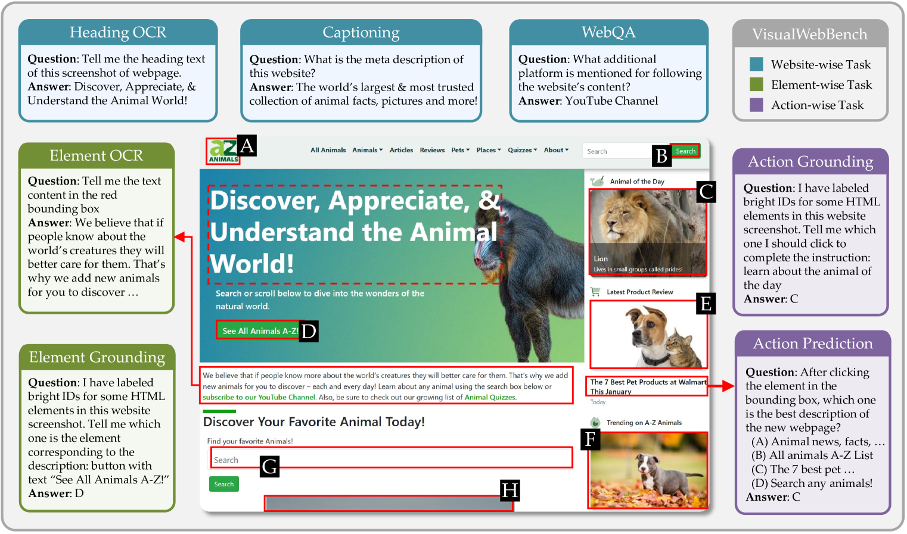

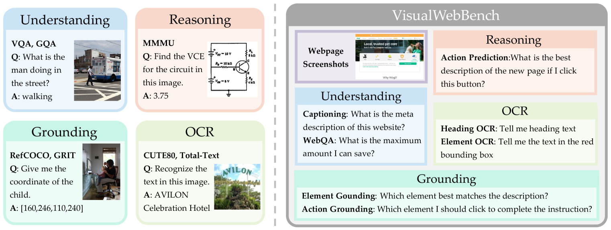

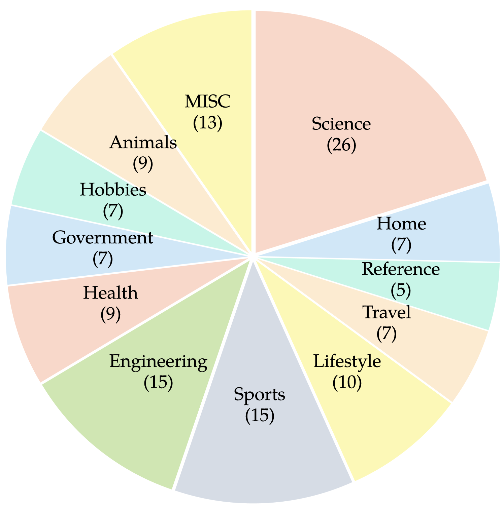

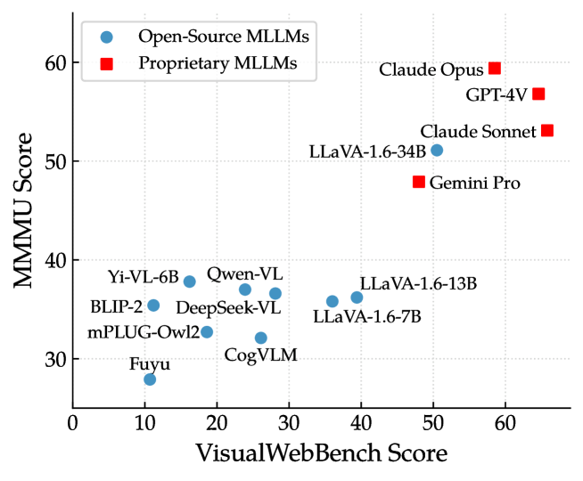

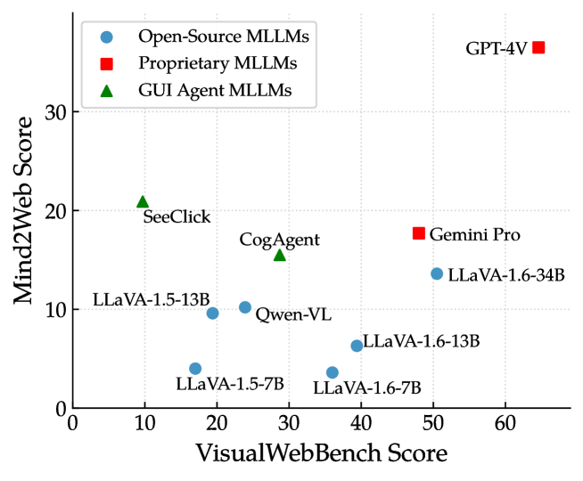

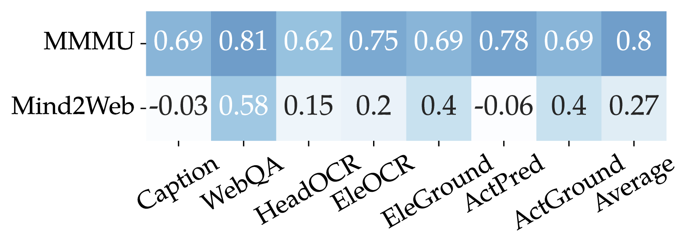

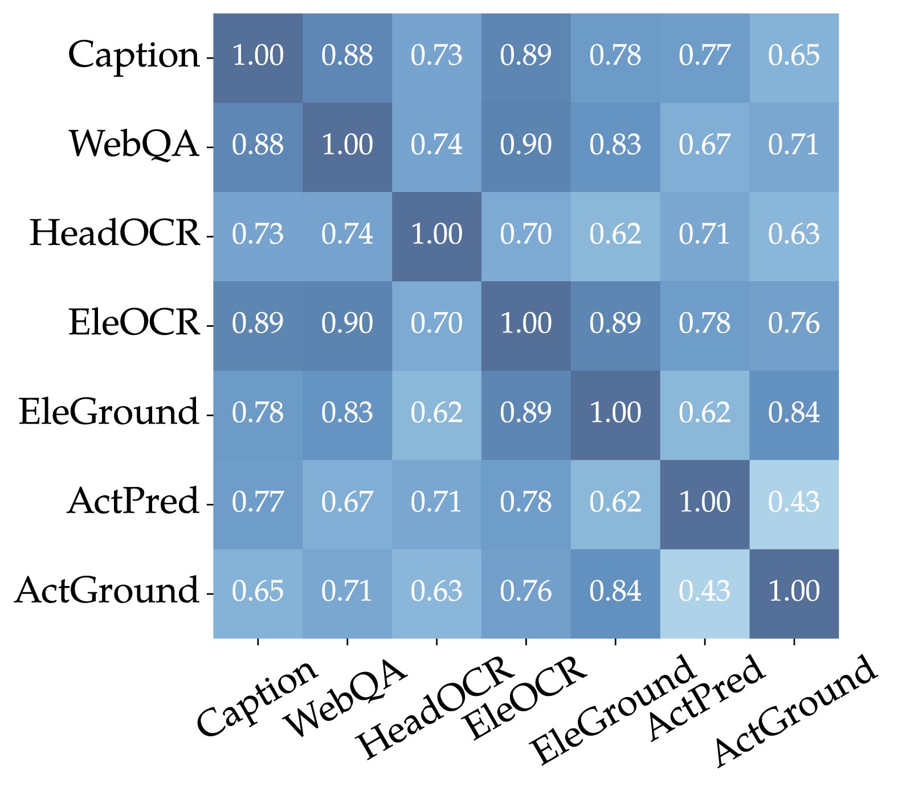

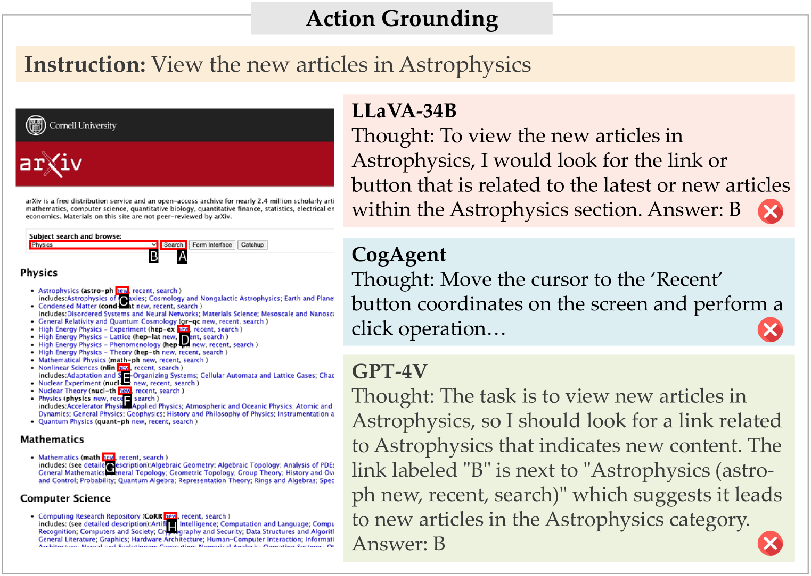

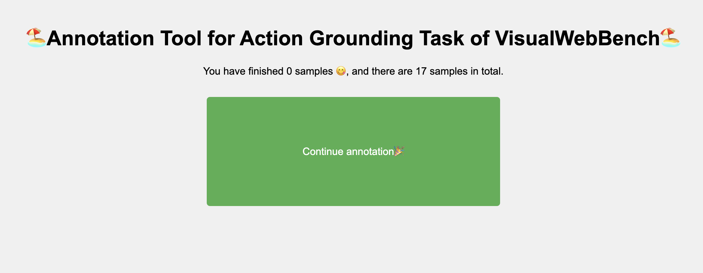

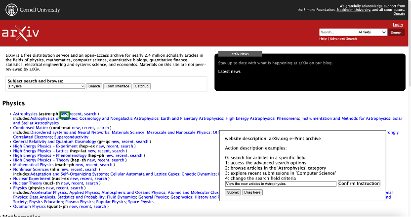

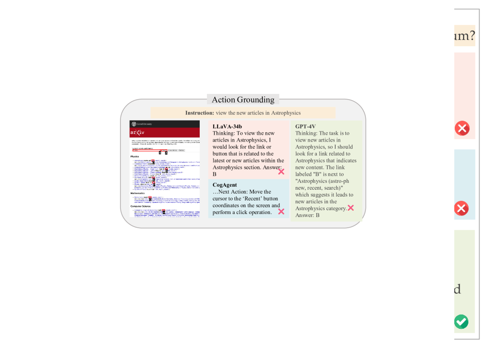

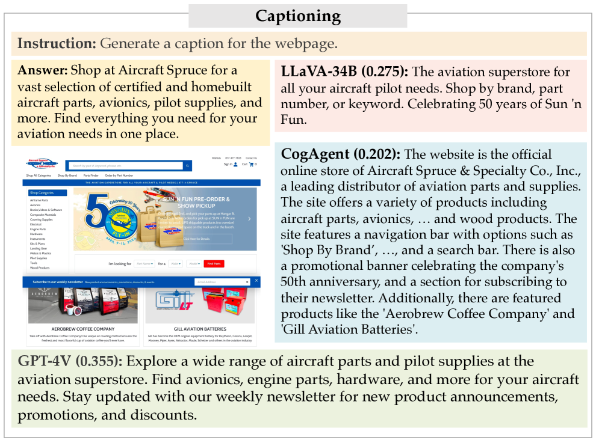

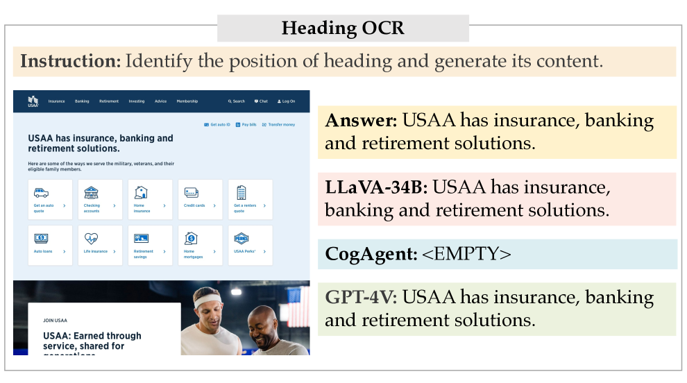

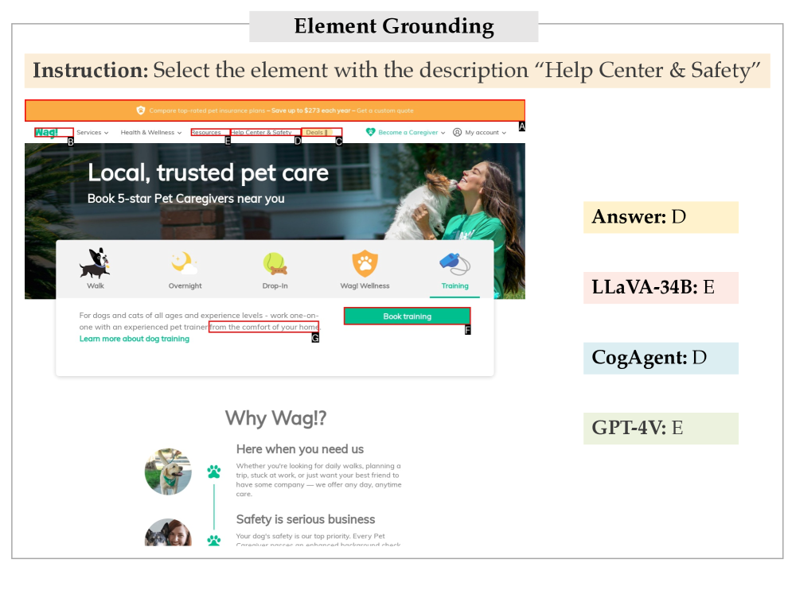

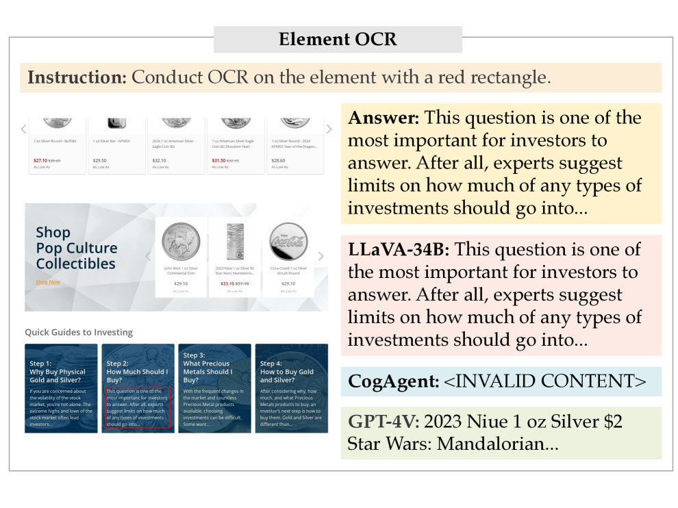

[Arxiv](https://arxiv.org/abs/2404.05955)