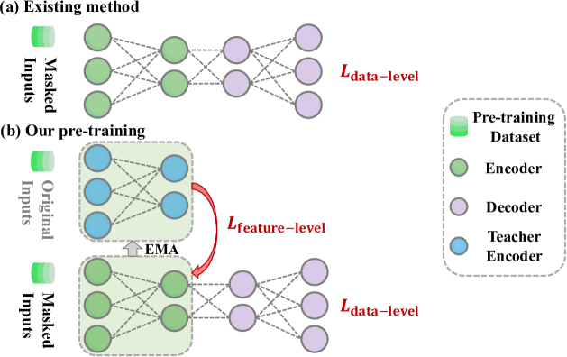
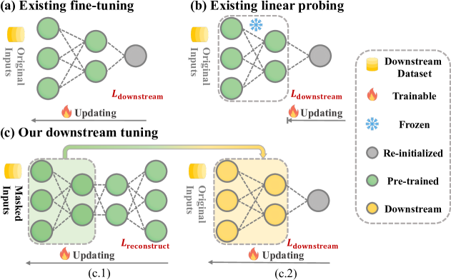
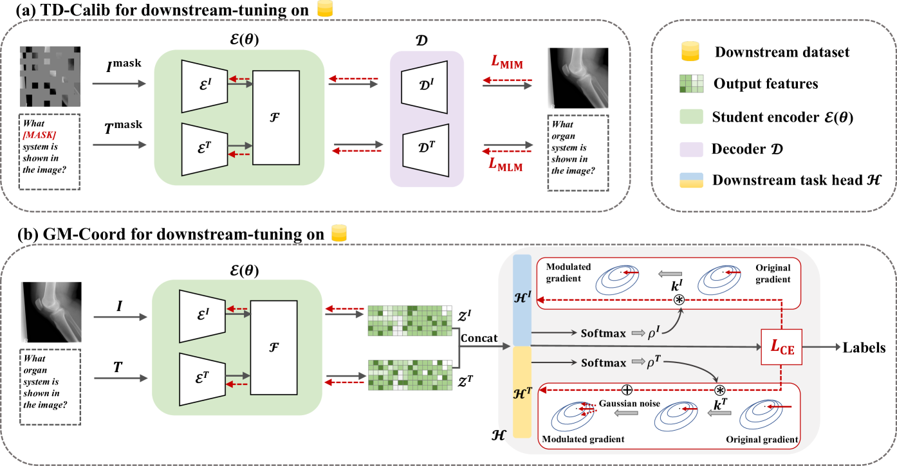
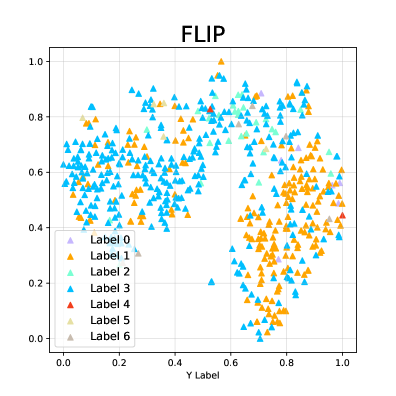
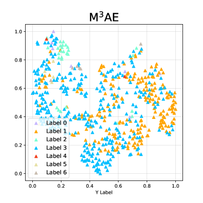
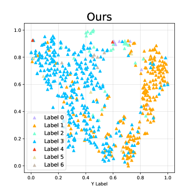
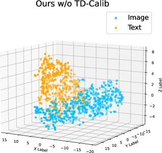
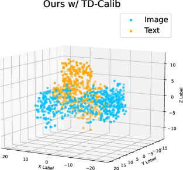

# 本研究提出了一种多模态诊断框架，通过重建预训练和针对性的异质性调整，实现了模态间的有效整合和诊断性能的提升。

发布时间：2024年04月09日

`LLM应用` `医学影像` `计算机辅助诊断`

> Unified Multi-modal Diagnostic Framework with Reconstruction Pre-training and Heterogeneity-combat Tuning

# 摘要

> 借助大规模未标记数据集，医学多模态预训练在提升计算机辅助诊断的准确性方面显露头角。然而，目前基于掩码自编码器的方法主要集中于数据层面的重建任务，忽略了更高层次的语义信息。同时，预训练与下游任务之间存在的分布和模态异质性，也阻碍了预训练知识的顺利迁移。为此，我们设计了统一医学多模态诊断框架（UMD），并引入了针对性的预训练和下游调整策略。我们的多级重建预训练（MR-Pretrain）策略，通过特征级和数据级重建，引导模型深入挖掘不同模态掩码输入的语义信息。此外，我们的异质性对抗下游调整策略，包括任务导向的分布校准（TD-Calib）和梯度引导的模态协调（GM-Coord），有效应对了下游调整过程中的异质性问题。实验表明，UMD框架在五项公共医学数据集上的下游任务中，表现卓越，显著超越了现有技术。

> Medical multi-modal pre-training has revealed promise in computer-aided diagnosis by leveraging large-scale unlabeled datasets. However, existing methods based on masked autoencoders mainly rely on data-level reconstruction tasks, but lack high-level semantic information. Furthermore, two significant heterogeneity challenges hinder the transfer of pre-trained knowledge to downstream tasks, \textit{i.e.}, the distribution heterogeneity between pre-training data and downstream data, and the modality heterogeneity within downstream data. To address these challenges, we propose a Unified Medical Multi-modal Diagnostic (UMD) framework with tailored pre-training and downstream tuning strategies. Specifically, to enhance the representation abilities of vision and language encoders, we propose the Multi-level Reconstruction Pre-training (MR-Pretrain) strategy, including a feature-level and data-level reconstruction, which guides models to capture the semantic information from masked inputs of different modalities. Moreover, to tackle two kinds of heterogeneities during the downstream tuning, we present the heterogeneity-combat downstream tuning strategy, which consists of a Task-oriented Distribution Calibration (TD-Calib) and a Gradient-guided Modality Coordination (GM-Coord). In particular, TD-Calib fine-tunes the pre-trained model regarding the distribution of downstream datasets, and GM-Coord adjusts the gradient weights according to the dynamic optimization status of different modalities. Extensive experiments on five public medical datasets demonstrate the effectiveness of our UMD framework, which remarkably outperforms existing approaches on three kinds of downstream tasks.

[Arxiv](https://arxiv.org/abs/2404.06057)