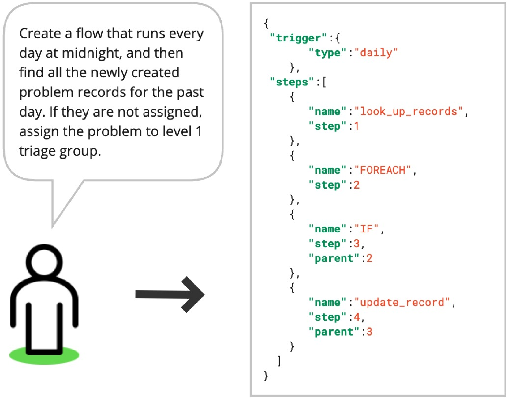
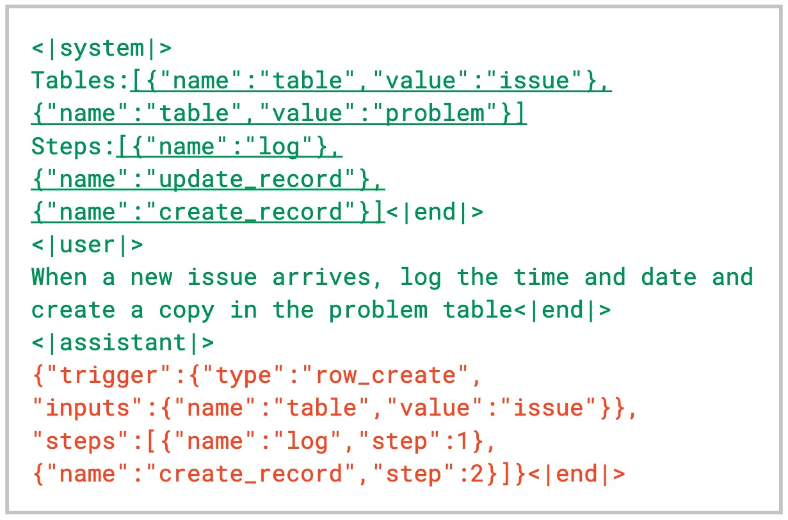
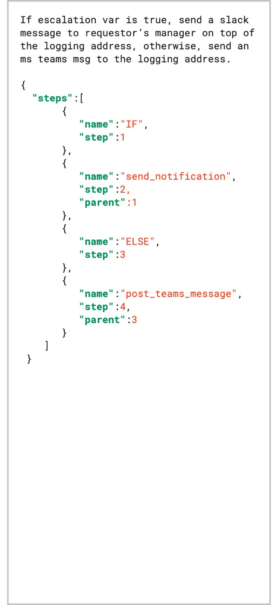
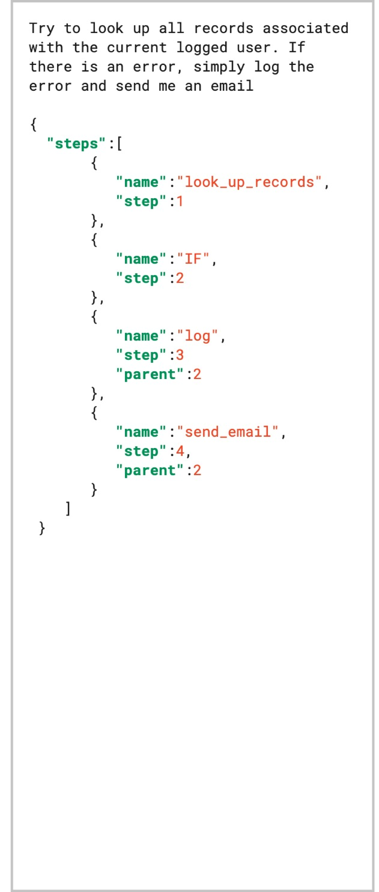

# 利用检索辅助生成技术，降低结构化输出中的失真现象

发布时间：2024年04月11日

`RAG` `企业应用`

> Reducing hallucination in structured outputs via Retrieval-Augmented Generation

# 摘要

> 生成性AI（GenAI）普遍存在易产生幻觉的问题。尽管大型语言模型（LLM）在全球范围内广受欢迎，但如果无法有效减少幻觉现象，GenAI系统在实际应用中可能会遭到用户抵触。在开发一款基于自然语言需求生成工作流程的企业应用时，我们构建了一个系统，通过采用检索增强生成技术（RAG）显著提升了工作流程结构化输出的质量。得益于RAG的应用，我们的系统显著降低了输出的幻觉现象，同时增强了LLM在新领域的适应性。我们还发现，运用一个小型但训练精良的检索器编码器能够缩减LLM的规模，使得基于LLM的系统部署更为高效，减少了资源消耗。

> A common and fundamental limitation of Generative AI (GenAI) is its propensity to hallucinate. While large language models (LLM) have taken the world by storm, without eliminating or at least reducing hallucinations, real-world GenAI systems may face challenges in user adoption. In the process of deploying an enterprise application that produces workflows based on natural language requirements, we devised a system leveraging Retrieval Augmented Generation (RAG) to greatly improve the quality of the structured output that represents such workflows. Thanks to our implementation of RAG, our proposed system significantly reduces hallucinations in the output and improves the generalization of our LLM in out-of-domain settings. In addition, we show that using a small, well-trained retriever encoder can reduce the size of the accompanying LLM, thereby making deployments of LLM-based systems less resource-intensive.

[Arxiv](https://arxiv.org/abs/2404.08189)