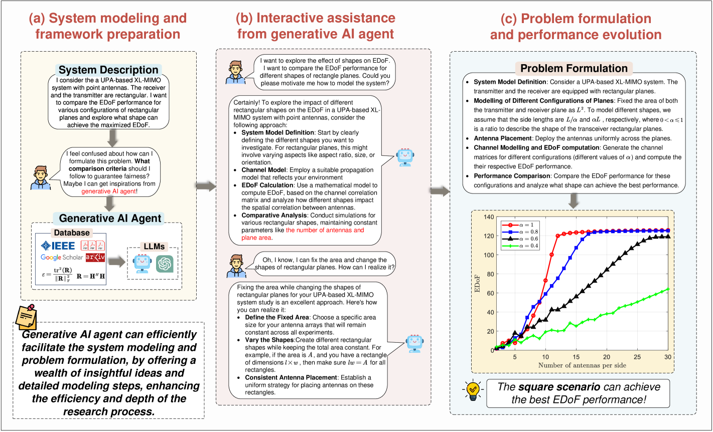

# 下一代MIMO设计中的生成型AI代理：基础原理、面临挑战及未来展望

发布时间：2024年04月12日

`Agent` `人工智能`

> Generative AI Agent for Next-Generation MIMO Design: Fundamentals, Challenges, and Vision

# 摘要

> 预计下一代多输入多输出技术（MIMO）将更加智能和可扩展。本文探讨了由生成性人工智能代理驱动的下一代MIMO设计。文章首先回顾了下一代MIMO的发展历程、基本原理及面临的挑战。接着，我们提出了生成性AI代理这一概念，它能够利用大型语言模型和增强检索生成技术，创造出定制化和专门化的内容。文章深入分析了生成性AI代理框架的特性及其优势。更为关键的是，针对下一代MIMO所面临的挑战，我们从性能分析、信号处理和资源配置等多个角度，探讨了生成性AI代理在下一代MIMO设计中的应用。此外，通过两个引人入胜的案例研究，证明了在复杂配置环境下，运用生成性AI代理进行性能分析的有效性。这些案例突出显示了整合生成性AI代理对于提升下一代MIMO系统分析和设计的重要性。文章最后，对潜在的未来研究方向进行了讨论。

> Next-generation multiple input multiple output (MIMO) is expected to be intelligent and scalable. In this paper, we study generative artificial intelligence (AI) agent-enabled next-generation MIMO design. Firstly, we provide an overview of the development, fundamentals, and challenges of the next-generation MIMO. Then, we propose the concept of the generative AI agent, which is capable of generating tailored and specialized contents with the aid of large language model (LLM) and retrieval augmented generation (RAG). Next, we comprehensively discuss the features and advantages of the generative AI agent framework. More importantly, to tackle existing challenges of next-generation MIMO, we discuss generative AI agent-enabled next-generation MIMO design, from the perspective of performance analysis, signal processing, and resource allocation. Furthermore, we present two compelling case studies that demonstrate the effectiveness of leveraging the generative AI agent for performance analysis in complex configuration scenarios. These examples highlight how the integration of generative AI agents can significantly enhance the analysis and design of next-generation MIMO systems. Finally, we discuss important potential research future directions.

[Arxiv](https://arxiv.org/abs/2404.08878)