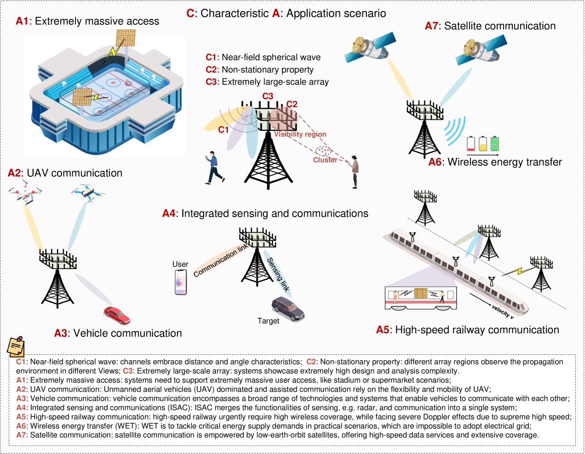
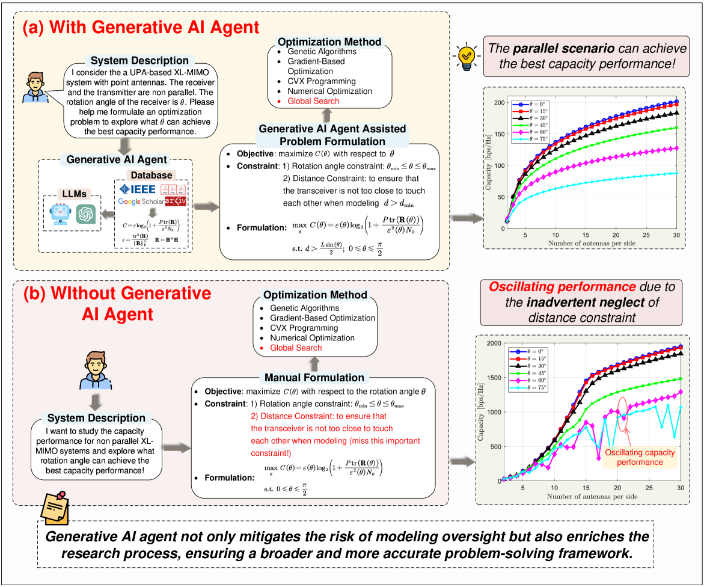

# 面向新一代多输入多输出（MIMO）系统设计的创新人工智能代理：深入基础理论，剖析挑战所在，展望未来发展愿景。

发布时间：2024年04月12日

`Agent` `人工智能`

> Generative AI Agent for Next-Generation MIMO Design: Fundamentals, Challenges, and Vision

# 摘要

> 预计下一代多输入多输出（MIMO）技术将具备智能化和可扩展性。本文深入探讨了由生成性人工智能（AI）代理驱动的下一代MIMO设计。文章首先回顾了下一代MIMO技术的发展历程、基础原理及其面临的挑战。随后，提出了一种能够利用大型语言模型（LLM）和检索增强生成（RAG）技术生成定制化内容的生成性AI代理概念。文章详细讨论了这一代理框架的特性与益处，并着重分析了如何利用生成性AI代理应对下一代MIMO的性能分析、信号处理和资源分配等方面的挑战。此外，通过两个案例研究，展示了在复杂配置环境中运用生成性AI代理进行性能分析的显著效果，说明了AI代理在提升下一代MIMO系统分析与设计中的巨大潜力。文末，对可能的未来研究方向进行了探讨。

> Next-generation multiple input multiple output (MIMO) is expected to be intelligent and scalable. In this paper, we study generative artificial intelligence (AI) agent-enabled next-generation MIMO design. Firstly, we provide an overview of the development, fundamentals, and challenges of the next-generation MIMO. Then, we propose the concept of the generative AI agent, which is capable of generating tailored and specialized contents with the aid of large language model (LLM) and retrieval augmented generation (RAG). Next, we comprehensively discuss the features and advantages of the generative AI agent framework. More importantly, to tackle existing challenges of next-generation MIMO, we discuss generative AI agent-enabled next-generation MIMO design, from the perspective of performance analysis, signal processing, and resource allocation. Furthermore, we present two compelling case studies that demonstrate the effectiveness of leveraging the generative AI agent for performance analysis in complex configuration scenarios. These examples highlight how the integration of generative AI agents can significantly enhance the analysis and design of next-generation MIMO systems. Finally, we discuss important potential research future directions.

[Arxiv](https://arxiv.org/abs/2404.08878)