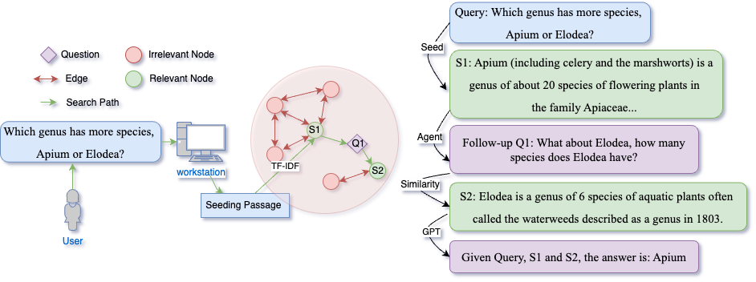
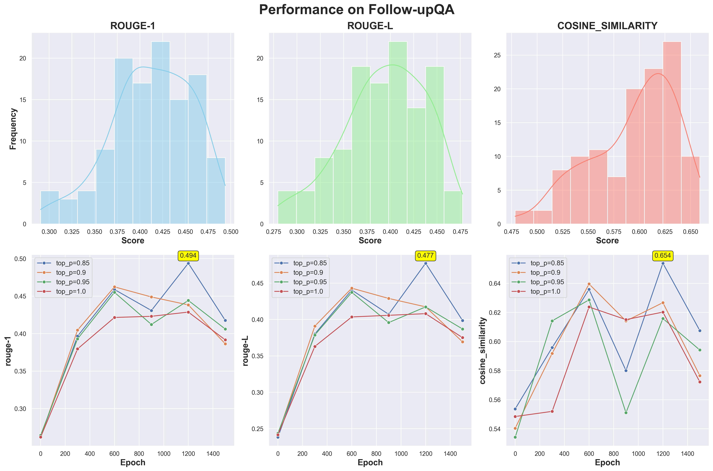

# CuriousLLM：融入推理知识图谱的提示，提升多文档问答的智能水平

发布时间：2024年04月13日

`Agent` `问答系统` `知识图谱`

> CuriousLLM: Elevating Multi-Document QA with Reasoning-Infused Knowledge Graph Prompting

# 摘要

> 在问答技术的发展中，将大型语言模型（LLMs）与外部数据库融合的方法已经取得了显著成效。但这种方法在处理需要复杂推理能力的QA任务时，往往力有不逮。为克服这些挑战，我们对一种创新的方法——知识图谱提示（KGP）进行了优化。该方法通过将知识图谱与基于LLM的智能体相结合，有效提升了推理和搜索的精确度。尽管如此，传统的KGP框架仍需大量数据集进行昂贵的微调，并且难以摆脱LLM产生幻觉的问题。为此，我们设计了一个融入推理能力的LLM智能体，以强化这一框架。该智能体能够像人类一样好奇，通过追问来更高效地引导搜索过程。这一改进显著提升了LLM在QA任务中的表现，同时避免了KGP框架的高昂成本和延迟。我们的目标是继续完善这一方法，以期在QA领域提供更精准、迅速且经济的解决方案。

> In the field of Question Answering (QA), unifying large language models (LLMs) with external databases has shown great success. However, these methods often fall short in providing the advanced reasoning needed for complex QA tasks. To address these issues, we improve over a novel approach called Knowledge Graph Prompting (KGP), which combines knowledge graphs with a LLM-based agent to improve reasoning and search accuracy. Nevertheless, the original KGP framework necessitates costly fine-tuning with large datasets yet still suffers from LLM hallucination. Therefore, we propose a reasoning-infused LLM agent to enhance this framework. This agent mimics human curiosity to ask follow-up questions to more efficiently navigate the search. This simple modification significantly boosts the LLM performance in QA tasks without the high costs and latency associated with the initial KGP framework. Our ultimate goal is to further develop this approach, leading to more accurate, faster, and cost-effective solutions in the QA domain.

[Arxiv](https://arxiv.org/abs/2404.09077)