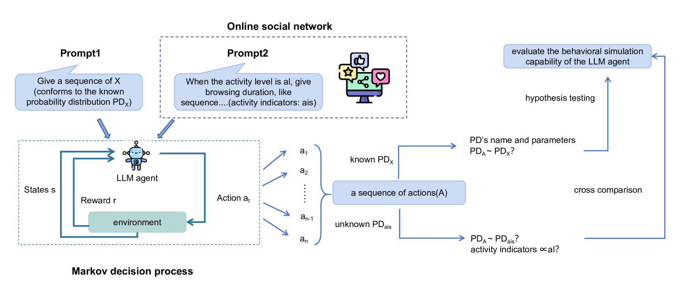
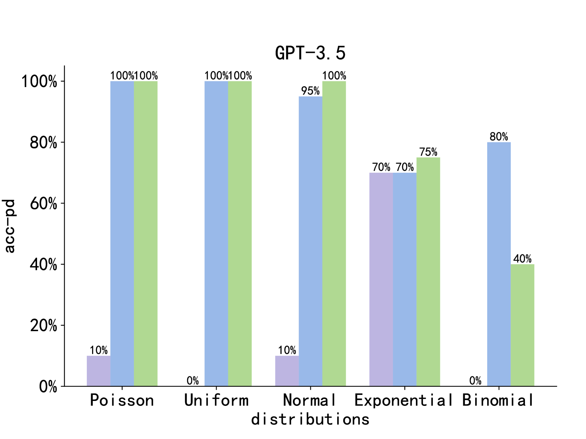
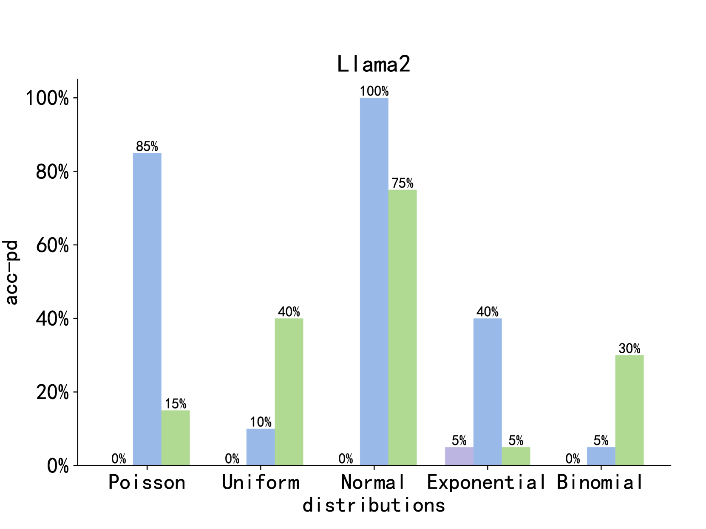
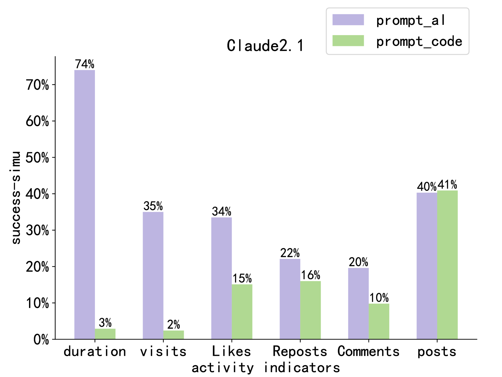
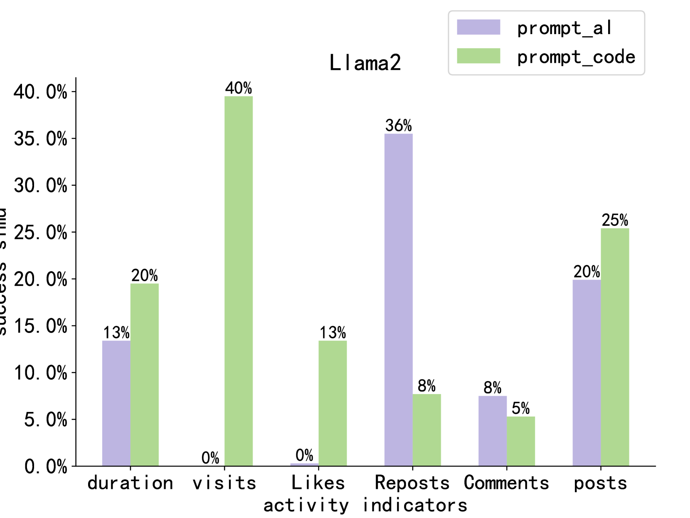
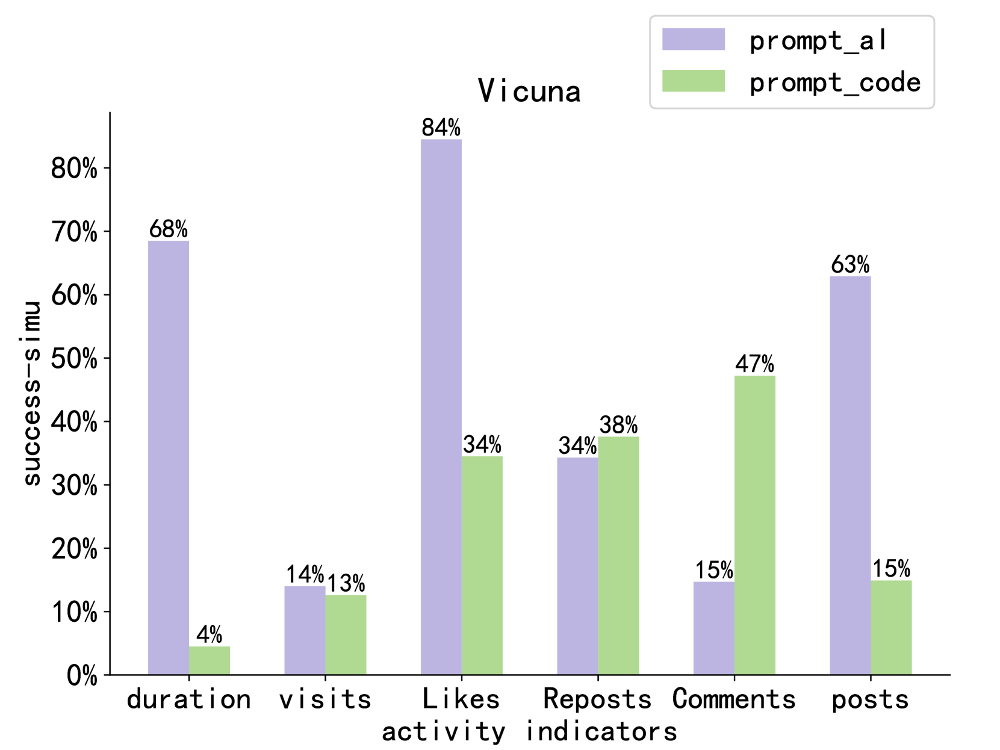
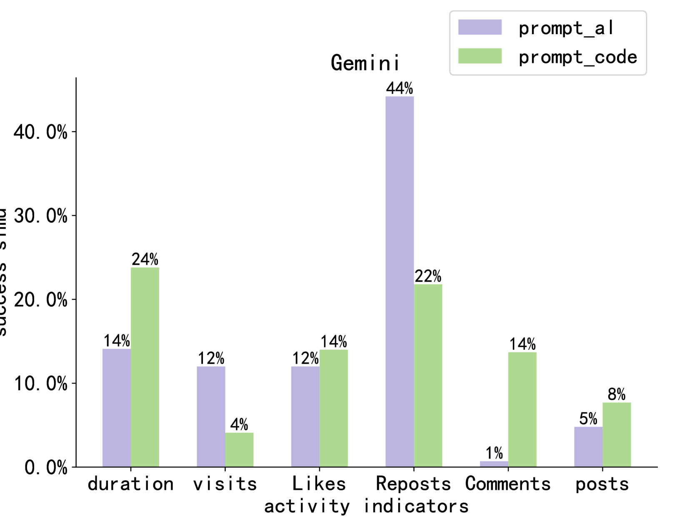
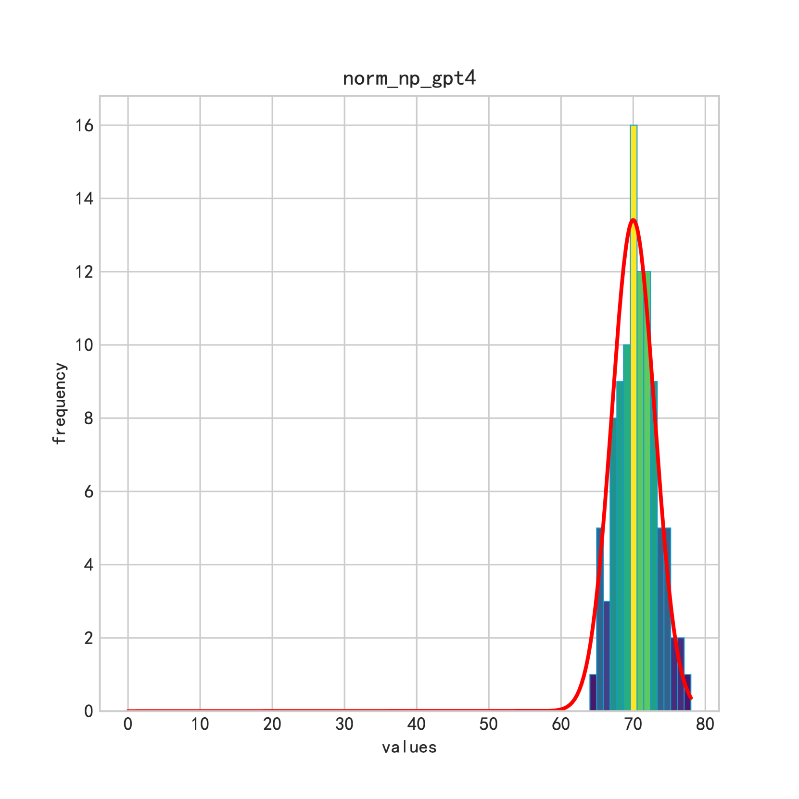

# 大型语言模型是否遵循随机规则？本研究探讨了在行为模拟中，大型语言模型是如何进行概率分布采样的。

发布时间：2024年04月13日

`Agent` `模拟人类行为` `顺序决策`

> Do LLMs Play Dice? Exploring Probability Distribution Sampling in Large Language Models for Behavioral Simulation

# 摘要

> 随着大型语言模型（LLMs）突飞猛进，它们在处理复杂语言任务上的非凡能力促使研究者们开始探索其在模拟人类顺序决策过程中的潜力，这类决策过程常以马尔可夫决策过程（MDPs）的形式出现。在这个框架下，行动遵循一定的概率分布，且需进行迭代抽样。这引发了我们对LLM代理能否理解概率分布，并借此通过概率抽样引导其行为决策，生成行为序列的好奇。为解答这一问题，我们把挑战分为两部分：一是在已知确切概率分布的情况下进行模拟，二是在概率分布不明确时生成序列。在前一种情形下，代理需根据问题描述确定概率分布的类型和参数，然后提供抽样序列。但我们的分析表明，即便LLM代理在这方面的表现不尽人意，通过编程工具仍可提升抽样的成功率。然而，现实世界中的概率分布往往是未知的。在后一种情形下，我们让代理调整在线社交网络的活动水平，并观察行动频率。最终我们发现，即便借助编程工具，LLM代理也无法准确地进行概率分布抽样。因此，在将LLM代理直接应用于模拟人类行为之前，我们必须三思而后行。

> With the rapid advancement of large language models (LLMs) and their remarkable capabilities in handling complex language tasks, an increasing number of studies are employing LLMs as agents to emulate the sequential decision-making processes of humans often represented as Markov decision-making processes (MDPs). The actions within this decision-making framework adhere to specific probability distributions and require iterative sampling. This arouses our curiosity regarding the capacity of LLM agents to comprehend probability distributions, thereby guiding the agent's behavioral decision-making through probabilistic sampling and generating behavioral sequences. To answer the above question, we divide the problem into two main aspects: simulation where the exact probability distribution is known, and generation of sequences where the probability distribution is ambiguous. In the first case, the agent is required to give the type and parameters of the probability distribution through the problem description, and then give the sampling sequence. However, our analysis shows that LLM agents perform poorly in this case, but the sampling success rate can be improved through programming tools. Real-world scenarios often entail unknown probability distributions. Thus, in the second case, we ask the agents to change the activity level in online social networks and analyze the frequency of actions. Ultimately, our analysis shows that LLM agents cannot sample probability distributions even using programming tools. Therefore, careful consideration is still required before directly applying LLM agents as agents to simulate human behavior.

[Arxiv](https://arxiv.org/abs/2404.09043)