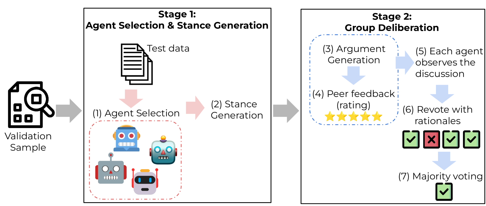
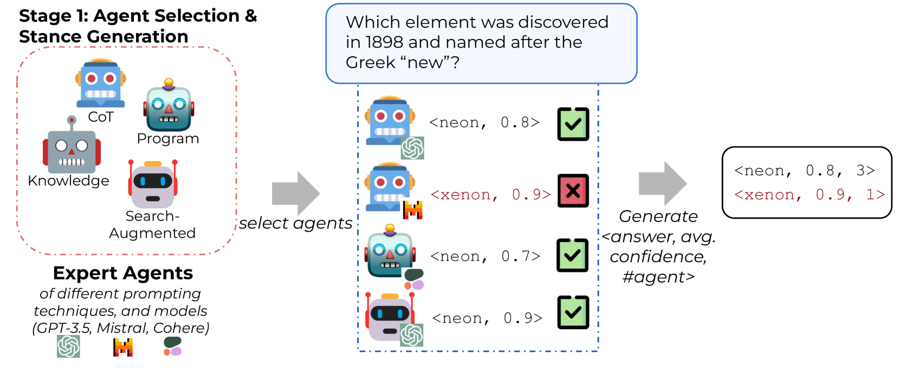
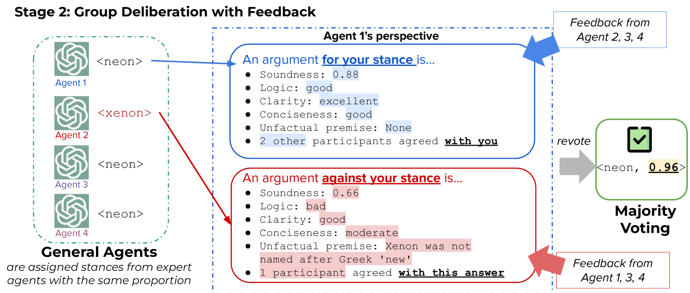
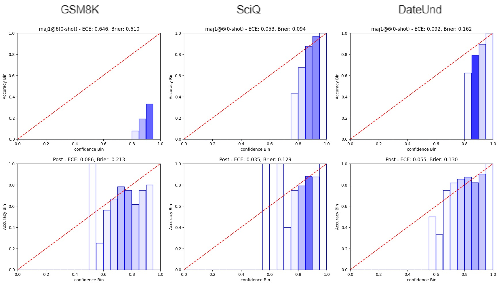
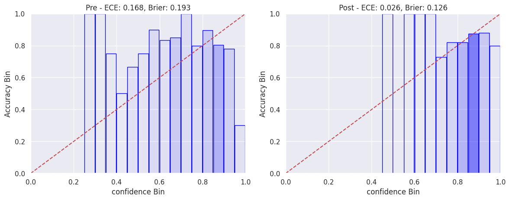

# 通过多智能体协商机制，实现大型语言模型的置信度校准与合理化解释

发布时间：2024年04月15日

`LLM应用` `人工智能`

> Confidence Calibration and Rationalization for LLMs via Multi-Agent Deliberation

# 摘要

> 当前的大型语言模型（LLMs）面临一个重大挑战：不确定性估计。这些模型往往校准不准确且过于自信，尤其是在采用人类反馈进行强化学习（RLHF）时。与人类可以通过日常观察调整决策和信心不同，现有的LLMs校准方法大多忽略了“集体智慧”——即多个LLMs之间的相互作用，这种互动能够共同提升模型的准确性和校准度。本研究提出了一种名为“协同校准”的无需后续训练的校准策略，该策略通过模拟小组讨论过程，充分发挥多个工具辅助的LLM代理的协作和表达能力。我们在不同领域的生成性问答任务中验证了协同校准的有效性，证明了其在提升模型预测可靠性方面的潜力，尤其是在集体校准信心评估的合理化方面。

> Uncertainty estimation is a significant issue for current large language models (LLMs) that are generally poorly calibrated and over-confident, especially with reinforcement learning from human feedback (RLHF). Unlike humans, whose decisions and confidences not only stem from intrinsic beliefs but can also be adjusted through daily observations, existing calibration methods for LLMs focus on estimating or eliciting individual confidence without taking full advantage of the "Collective Wisdom": the interaction among multiple LLMs that can collectively improve both accuracy and calibration. In this work, we propose Collaborative Calibration, a post-hoc training-free calibration strategy that leverages the collaborative and expressive capabilities of multiple tool-augmented LLM agents in a simulated group deliberation process. We demonstrate the effectiveness of Collaborative Calibration on generative QA tasks across various domains, showing its potential in harnessing the rationalization of collectively calibrated confidence assessments and improving the reliability of model predictions.

[Arxiv](https://arxiv.org/abs/2404.09127)