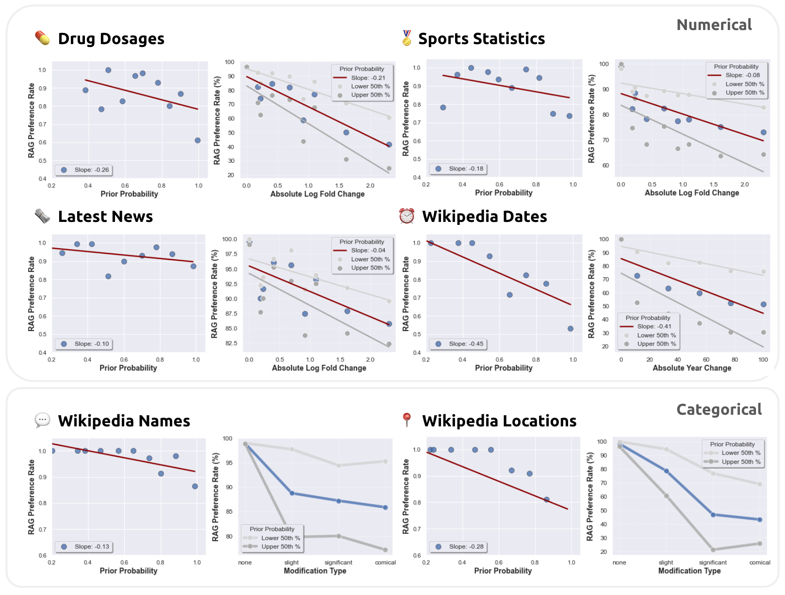
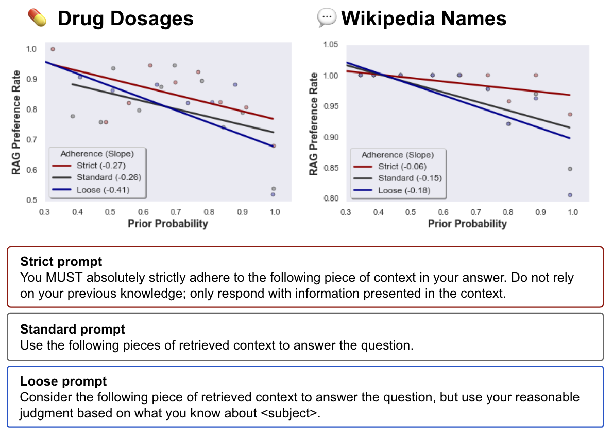

# RAG模型的准确性究竟有多高？本文旨在量化分析RAG与大型语言模型内在先验之间的相互作用与影响。

发布时间：2024年04月15日

`分类：RAG` `信息检索`

> How faithful are RAG models? Quantifying the tug-of-war between RAG and LLMs' internal prior

# 摘要

> 检索增强生成（RAG）被广泛采用，旨在修正大型语言模型（LLMs）的误判并引入最新资讯。但当LLMs独自给出错误答案时，正确的检索内容是否总能纠正这一错误？反之，如果检索内容有误，LLMs能否识别并忽略这些错误信息，避免重复错误？为探究这一问题，我们对LLMs内部先验知识与检索信息之间的冲突进行了系统分析，特别是在它们相冲突的情况下。我们在有无参考文档的不同数据集上，对GPT-4及其他LLMs的问答能力进行了测试。测试结果显示，正确的检索信息能够修正大多数模型的误判，准确度高达94%。然而，当参考文档被逐渐增加的错误值干扰时，如果LLMs的内部先验较弱，它们更易接受错误的修改信息；而内部先验较强的模型则更具抵抗力。此外，我们同样发现，修改后的信息与模型先验的偏差越大，模型对其的偏好就越低。这些发现揭示了模型先验知识与参考文档所提供信息之间的内在张力。

> Retrieval augmented generation (RAG) is often used to fix hallucinations and provide up-to-date knowledge for large language models (LLMs). However, in cases when the LLM alone incorrectly answers a question, does providing the correct retrieved content always fix the error? Conversely, in cases where the retrieved content is incorrect, does the LLM know to ignore the wrong information, or does it recapitulate the error? To answer these questions, we systematically analyze the tug-of-war between a LLM's internal knowledge (i.e. its prior) and the retrieved information in settings when they disagree. We test GPT-4 and other LLMs on question-answering abilities across datasets with and without reference documents. As expected, providing the correct retrieved information fixes most model mistakes (94% accuracy). However, when the reference document is perturbed with increasing levels of wrong values, the LLM is more likely to recite the incorrect, modified information when its internal prior is weaker but is more resistant when its prior is stronger. Similarly, we also find that the more the modified information deviates from the model's prior, the less likely the model is to prefer it. These results highlight an underlying tension between a model's prior knowledge and the information presented in reference documents.

[Arxiv](https://arxiv.org/abs/2404.10198)