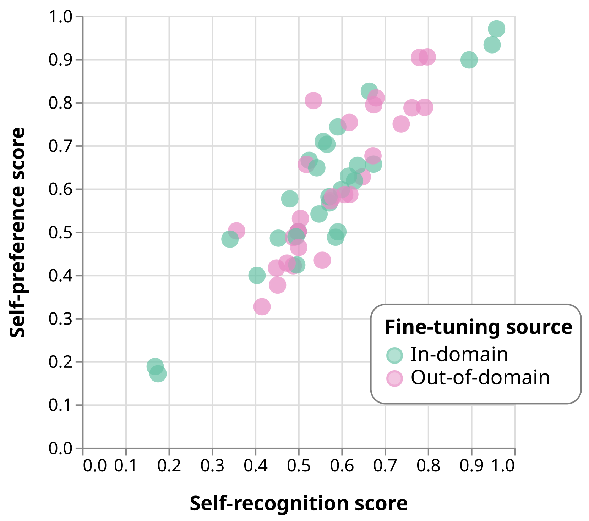
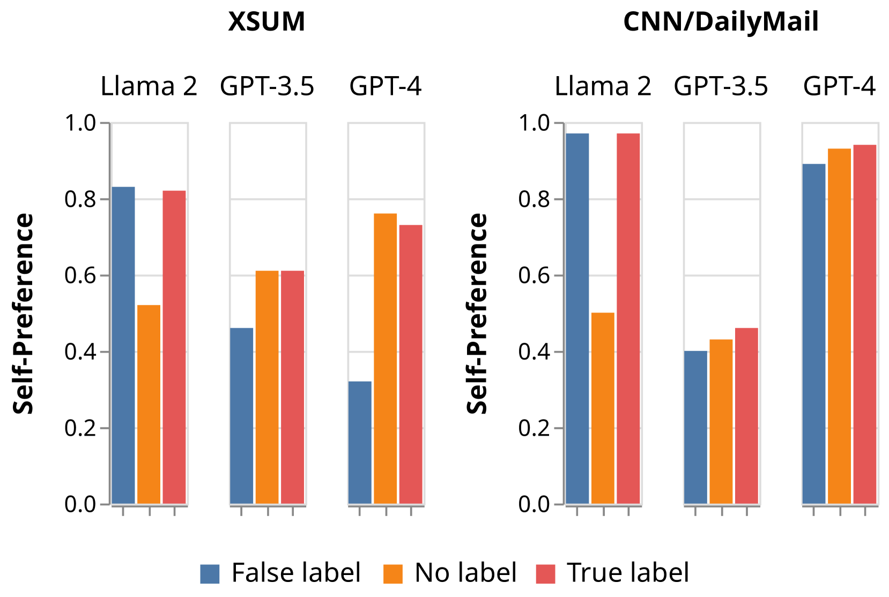

# 大型语言模型的评估者能够辨识并倾向于偏好它们自身的产出。

发布时间：2024年04月15日

`分类：LLM理论` `人工智能` `性能评估`

> LLM Evaluators Recognize and Favor Their Own Generations

# 摘要

> 利用大型语言模型（LLMs）进行自我评估不仅在性能基准测试中显示出其价值，也在奖励建模、宪法AI和自我提升等方法中发挥了重要作用。然而，当LLMs既作为评估者又作为被评估对象时，便会产生新的偏见问题。一个典型的例子是自我偏好偏见，即LLM评估器倾向于给自己的输出打高分，而人类评审却认为这些输出与其他人的输出质量相当。这引发了一个疑问：LLMs是否真的能够在打分时识别出自己的输出，还是这只是一种偶然？本文旨在探究LLMs的自我识别能力是否是自我偏好偏见的成因。我们的研究发现，像GPT-4和Llama 2这样的LLMs在未经训练的情况下就能以相当高的准确度区分自己与其他LLMs和人类的作品。进一步的微调实验揭示了自我识别能力与自我偏好偏见强度之间的线性关系，并通过控制实验排除了简单的干扰因素。文章最后讨论了自我识别可能对无偏见评估和AI安全性带来的影响。

> Self-evaluation using large language models (LLMs) has proven valuable not only in benchmarking but also methods like reward modeling, constitutional AI, and self-refinement. But new biases are introduced due to the same LLM acting as both the evaluator and the evaluatee. One such bias is self-preference, where an LLM evaluator scores its own outputs higher than others' while human annotators consider them of equal quality. But do LLMs actually recognize their own outputs when they give those texts higher scores, or is it just a coincidence? In this paper, we investigate if self-recognition capability contributes to self-preference. We discover that, out of the box, LLMs such as GPT-4 and Llama 2 have non-trivial accuracy at distinguishing themselves from other LLMs and humans. By fine-tuning LLMs, we discover a linear correlation between self-recognition capability and the strength of self-preference bias; using controlled experiments, we show that the causal explanation resists straightforward confounders. We discuss how self-recognition can interfere with unbiased evaluations and AI safety more generally.

[Arxiv](https://arxiv.org/abs/2404.13076)