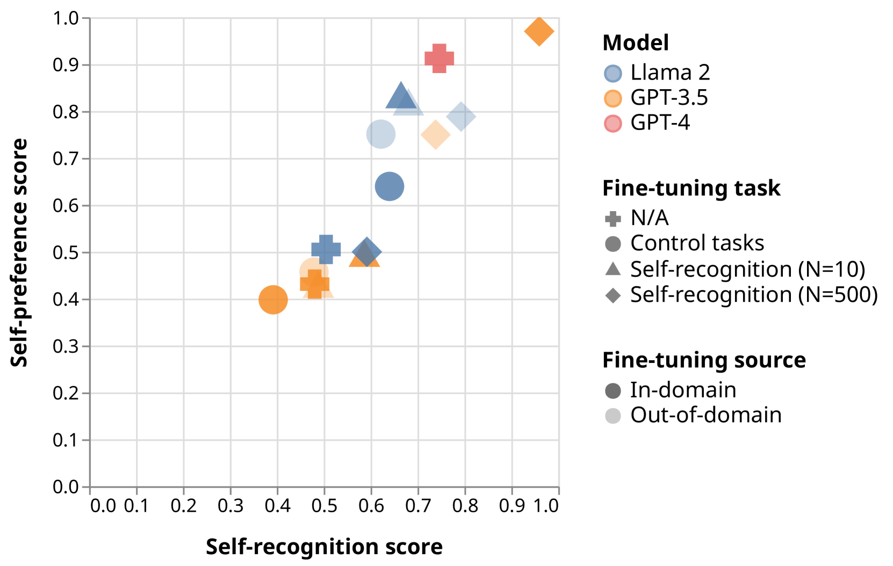
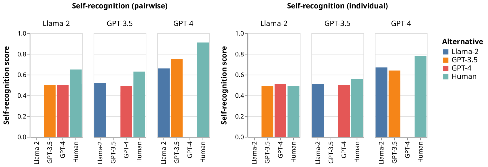
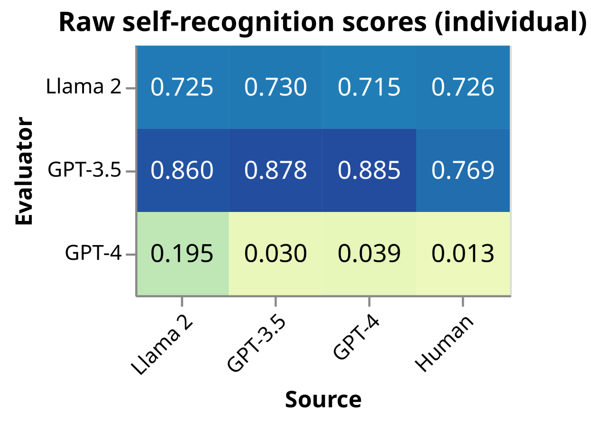
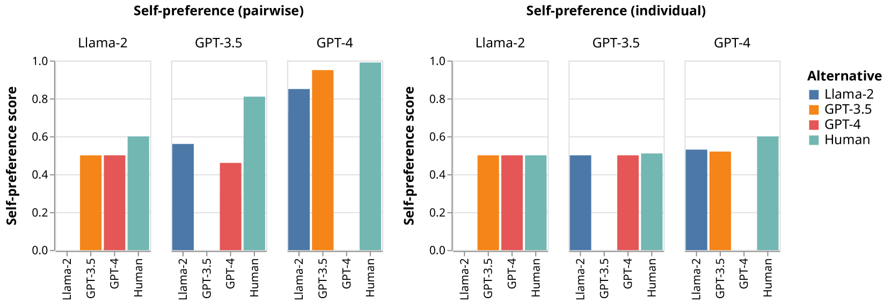
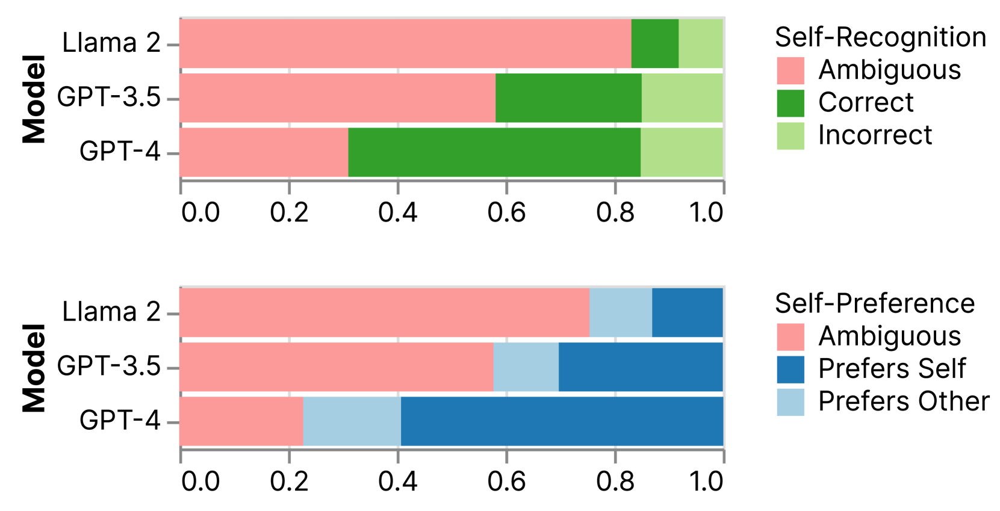
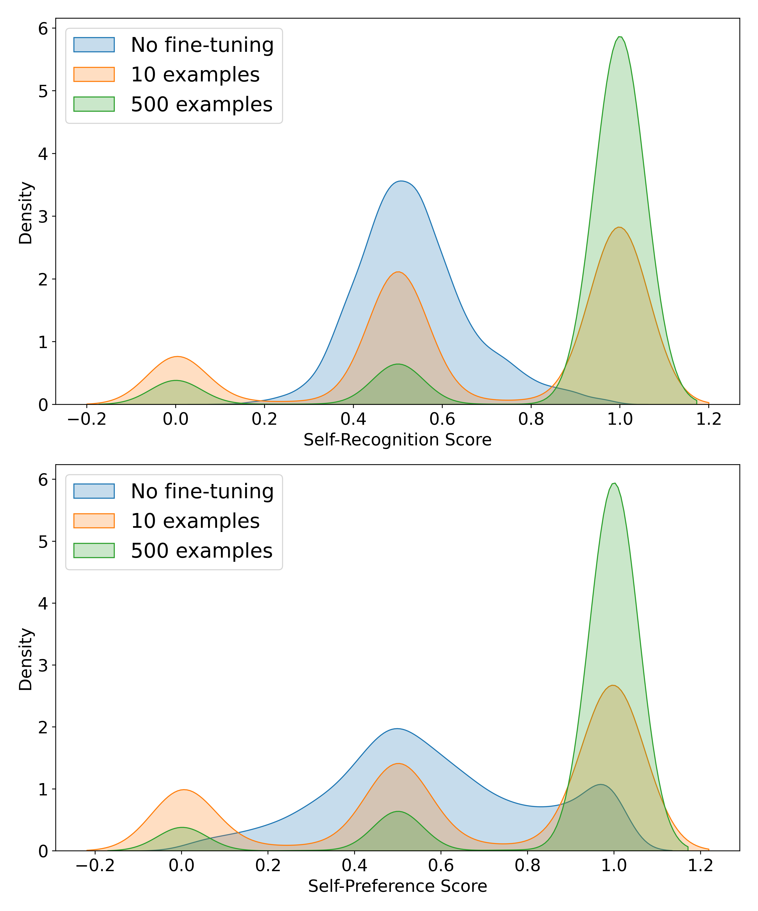

# 大型语言模型的评估者们能够辨识并倾向于偏好自己产出的结果。

发布时间：2024年04月15日

`LLM应用` `AI基准测试` `AI安全性`

> LLM Evaluators Recognize and Favor Their Own Generations

# 摘要

> 利用大型语言模型（LLMs）进行自我评估在基准测试、奖励建模、宪法AI和自我完善等领域显示出其价值。然而，当LLMs既作为评估者又作为被评估对象时，便会产生新的偏见，例如自我偏好，即LLM评估者倾向于给自己的输出打高分，而人类评审则认为这些输出与其他人的输出质量相当。本文旨在探究LLMs是否真正能够识别自己的输出，还是仅仅是偶然现象。我们发现，像GPT-4和Llama 2这样的LLMs天生就具备区分自己与其他LLMs和人类的非平凡能力。通过进一步的微调，我们揭示了自我识别能力与自我偏好偏见强度之间的线性关系，并通过控制实验排除了简单的干扰因素。文章还讨论了自我识别如何可能影响公正评估和AI安全性的更广泛议题。

> Self-evaluation using large language models (LLMs) has proven valuable not only in benchmarking but also methods like reward modeling, constitutional AI, and self-refinement. But new biases are introduced due to the same LLM acting as both the evaluator and the evaluatee. One such bias is self-preference, where an LLM evaluator scores its own outputs higher than others' while human annotators consider them of equal quality. But do LLMs actually recognize their own outputs when they give those texts higher scores, or is it just a coincidence? In this paper, we investigate if self-recognition capability contributes to self-preference. We discover that, out of the box, LLMs such as GPT-4 and Llama 2 have non-trivial accuracy at distinguishing themselves from other LLMs and humans. By fine-tuning LLMs, we discover a linear correlation between self-recognition capability and the strength of self-preference bias; using controlled experiments, we show that the causal explanation resists straightforward confounders. We discuss how self-recognition can interfere with unbiased evaluations and AI safety more generally.

[Arxiv](https://arxiv.org/abs/2404.13076)