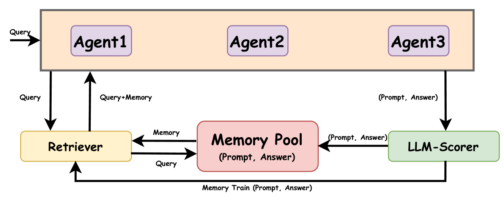
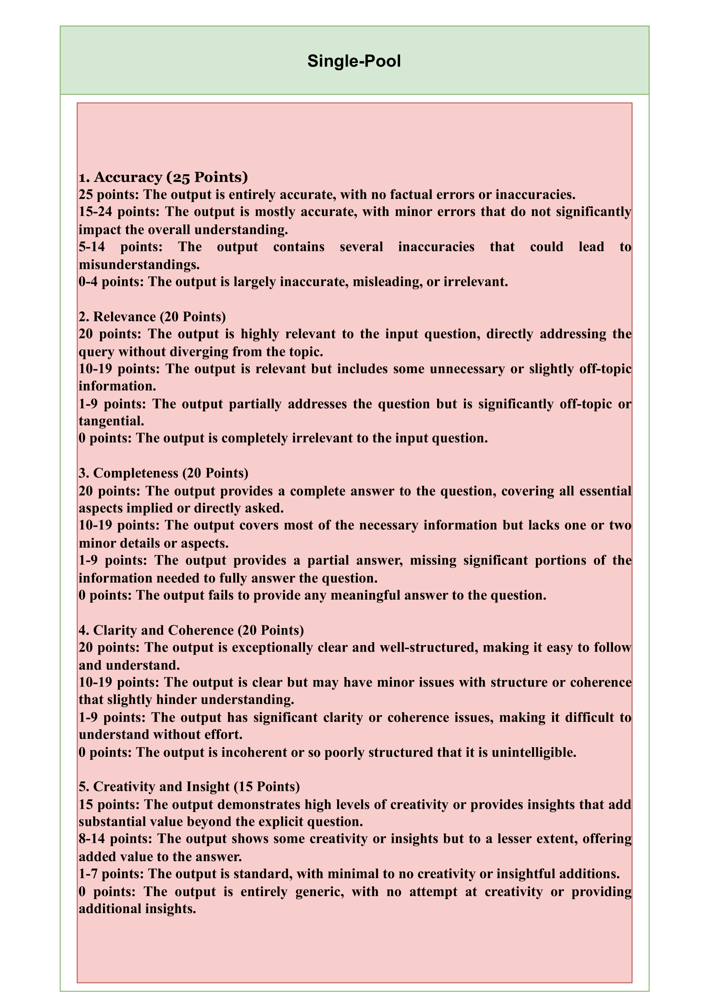
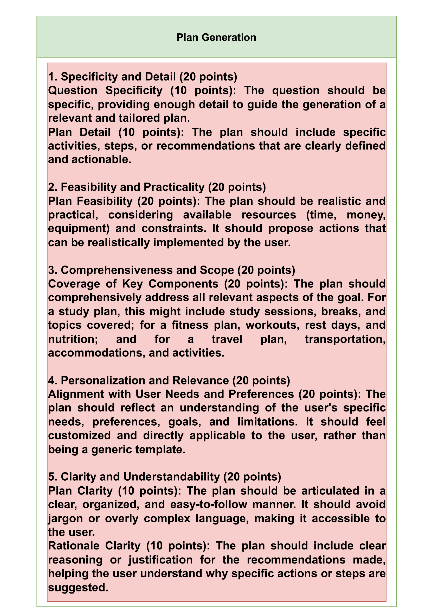
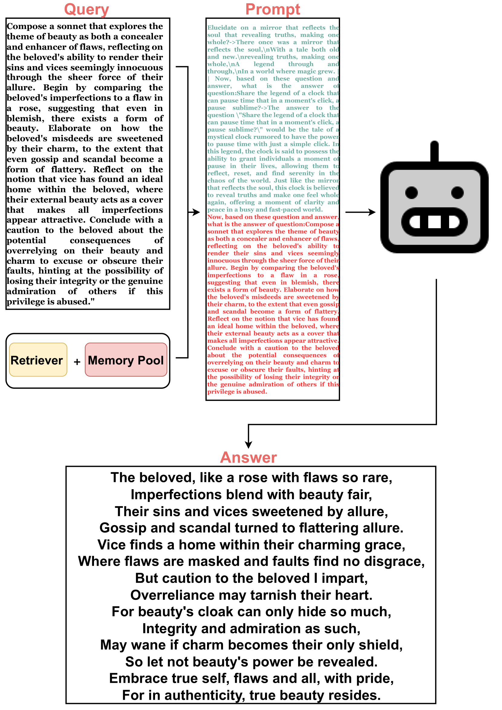
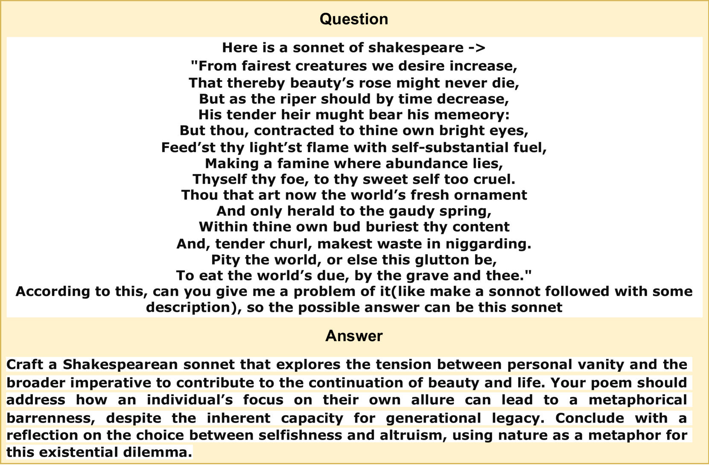

# 大型语言模型驱动的代理之间的内存共享

发布时间：2024年04月15日

`Agent` `人工智能`

> Memory Sharing for Large Language Model based Agents

# 摘要

> 在人工智能的世界中，大型语言模型（LLM）驱动的智能体通过自然语言指令执行任务，标志着一项重要进步，显著减少了对常识问答和是非题这类固定答案任务的显式再训练或微调需求。但是，当上下文学习应用于如诗歌创作这样的开放式任务时，由于示例的全面性和智能体对问题内容理解能力的局限，常常导致生成的结果与预期大相径庭。为填补这一空白，本研究提出了一种用于LLM多智能体的记忆共享（MS）框架，该框架通过实时记忆存储和检索系统来提升上下文学习过程。系统内的每一“记忆”单元都记录了提出的问题和LLM智能体的实时响应，通过收集广泛类似智能体的记忆，共同丰富了所有智能体共享的记忆库。这一框架不仅助力智能体为特定任务找到最贴切的示例，还评估了它们的记忆对未来其他智能体应用的潜在价值。在三个不同领域的实证验证中，MS框架显著提升了智能体处理开放式问题的表现。此外，我们还探讨了哪种记忆库类型和检索策略更能助力智能体，并为MS的未来发展方向提供了见解。相关代码和数据已在 https://github.com/GHupppp/MemorySharingLLM 上公开。

> In the realm of artificial intelligence, the adaptation of Large Language Model (LLM)-based agents to execute tasks via natural language prompts represents a significant advancement, notably eliminating the need for explicit retraining or fine tuning for fixed-answer tasks such as common sense questions and yes/no queries. However, the application of In-context Learning to open-ended challenges, such as poetry creation, reveals substantial limitations due to the comprehensiveness of the provided examples and agent's ability to understand the content expressed in the problem, leading to outputs that often diverge significantly from expected results. Addressing this gap, our study introduces the Memory-Sharing (MS) framework for LLM multi-agents, which utilizes a real-time memory storage and retrieval system to enhance the In-context Learning process. Each "memory" within this system captures both the posed query and the corresponding real-time response from an LLM-based agent, aggregating these memories from a broad spectrum of similar agents to enrich the memory pool shared by all agents. This framework not only aids agents in identifying the most relevant examples for specific tasks but also evaluates the potential utility of their memories for future applications by other agents. Empirical validation across three distinct domains involving specialized functions of agents demonstrates that the MS framework significantly improve the agent's performance regrading the open-ended questions. Furthermore, we also discuss what type of memory pool and what retrieval strategy in MS can better help agents, offering a future develop direction of MS. The code and data are available at: https://github.com/GHupppp/MemorySharingLLM

[Arxiv](https://arxiv.org/abs/2404.09982)