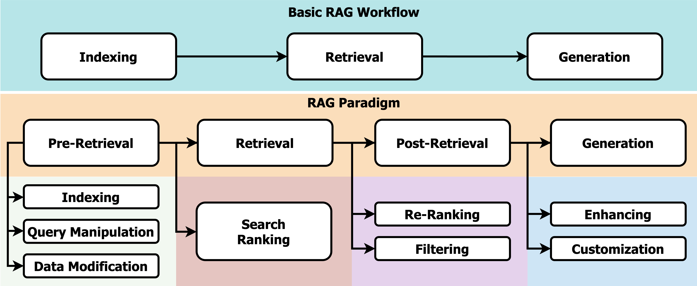

# 一篇关于为大型语言模型增强检索文本生成的研究综述

发布时间：2024年04月16日

`分类：RAG` `文本生成` `信息检索`

> A Survey on Retrieval-Augmented Text Generation for Large Language Models

# 摘要

> 检索增强生成（RAG）技术通过融合检索技术与深度学习的最新进展，突破了大型语言模型（LLMs）的静态限制，实现了对最新外部信息的动态整合。这一方法专注于文本领域，有效提升了LLMs生成的回应的准确性与可靠性，避免了生成似是而非的错误信息。本文将RAG的框架细分为检索前处理、检索阶段、检索后处理和生成四个部分，从检索的角度深入剖析。文章追溯了RAG的发展脉络，并通过分析关键研究，探讨了该领域的发展趋势。同时，提出了RAG的评估方法，面对挑战，展望了未来的研究方向。本研究旨在系统化RAG的研究，明晰其技术原理，并突显其在扩展LLMs的适用性和应用范围方面的潜力。

> Retrieval-Augmented Generation (RAG) merges retrieval methods with deep learning advancements to address the static limitations of large language models (LLMs) by enabling the dynamic integration of up-to-date external information. This methodology, focusing primarily on the text domain, provides a cost-effective solution to the generation of plausible but incorrect responses by LLMs, thereby enhancing the accuracy and reliability of their outputs through the use of real-world data. As RAG grows in complexity and incorporates multiple concepts that can influence its performance, this paper organizes the RAG paradigm into four categories: pre-retrieval, retrieval, post-retrieval, and generation, offering a detailed perspective from the retrieval viewpoint. It outlines RAG's evolution and discusses the field's progression through the analysis of significant studies. Additionally, the paper introduces evaluation methods for RAG, addressing the challenges faced and proposing future research directions. By offering an organized framework and categorization, the study aims to consolidate existing research on RAG, clarify its technological underpinnings, and highlight its potential to broaden the adaptability and applications of LLMs.

[Arxiv](https://arxiv.org/abs/2404.10981)