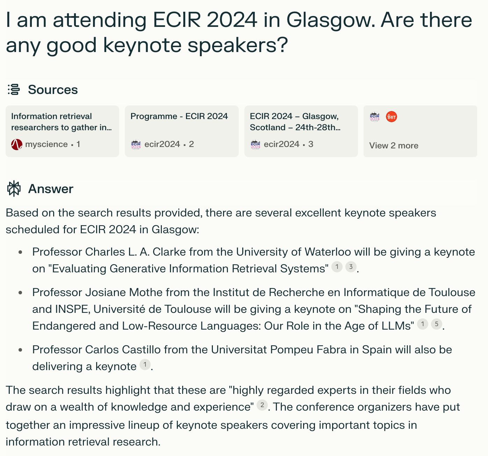
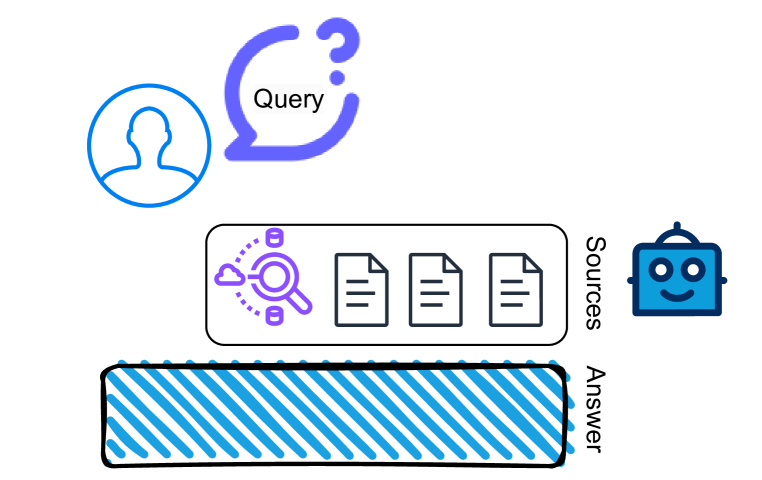
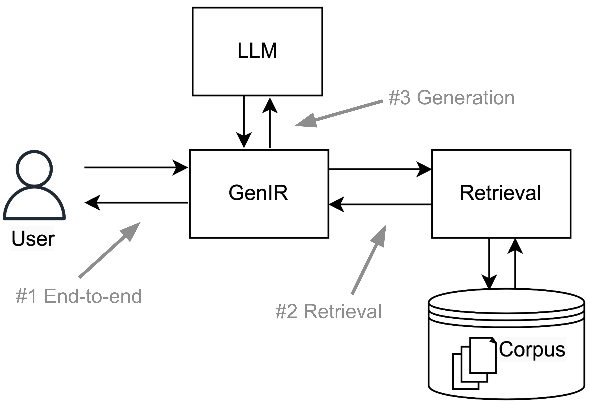

# 创造性信息检索评估

发布时间：2024年04月16日

`LLM应用` `信息检索` `人工智能`

> Generative Information Retrieval Evaluation

# 摘要

> 本章草稿将收录于即将出版的《生成式信息检索》一书，该书由 Chirag Shah 和 Ryen White 联合编辑。本章从两大视角探讨了生成式信息检索的评估问题：一是大型语言模型（LLMs）作为评估工具的兴起，研究显示它们在基础相关性判断任务上可能超越了众包工作者及其他付费评估者。我们梳理了相关研究的过去和现状，并对未来共享任务如TREC的发展趋势进行了展望，同时讨论了人类评估的必要性。二是对基于LLM的新兴生成式信息检索（GenIR）系统，包括检索增强生成（RAG）系统的评估方法进行了探讨。我们既关注了GenIR系统的整体评估，也关注了RAG系统中检索组件的评估。展望未来，GenIR系统的评估预计将部分依赖于LLM评估，这似乎形成了一种系统自我评估的循环性。我们通过两种方法来解决这一问题：首先，将LLM评估视作一种“慢速搜索”，利用较慢的IR系统来评估和训练更快的生产IR系统；其次，认识到即便人类评估的特性需要变化，基于人类评估的评估方法仍然是必要的。

> This paper is a draft of a chapter intended to appear in a forthcoming book on generative information retrieval, co-edited by Chirag Shah and Ryen White. In this chapter, we consider generative information retrieval evaluation from two distinct but interrelated perspectives. First, large language models (LLMs) themselves are rapidly becoming tools for evaluation, with current research indicating that LLMs may be superior to crowdsource workers and other paid assessors on basic relevance judgement tasks. We review past and ongoing related research, including speculation on the future of shared task initiatives, such as TREC, and a discussion on the continuing need for human assessments. Second, we consider the evaluation of emerging LLM-based generative information retrieval (GenIR) systems, including retrieval augmented generation (RAG) systems. We consider approaches that focus both on the end-to-end evaluation of GenIR systems and on the evaluation of a retrieval component as an element in a RAG system. Going forward, we expect the evaluation of GenIR systems to be at least partially based on LLM-based assessment, creating an apparent circularity, with a system seemingly evaluating its own output. We resolve this apparent circularity in two ways: 1) by viewing LLM-based assessment as a form of "slow search", where a slower IR system is used for evaluation and training of a faster production IR system; and 2) by recognizing a continuing need to ground evaluation in human assessment, even if the characteristics of that human assessment must change.

[Arxiv](https://arxiv.org/abs/2404.08137)