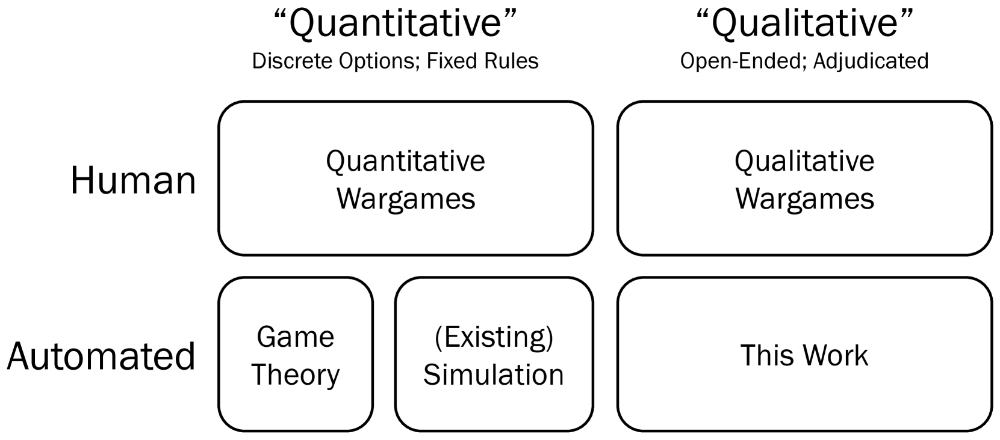

# 大型语言模型在开放式战争游戏中的运用

发布时间：2024年04月17日

`分类：Agent` `军事模拟` `人工智能`

> Open-Ended Wargames with Large Language Models

# 摘要

> 兵棋推演作为一种强有力的工具，能够帮助我们深入理解和模拟现实世界的决策过程。通过人工智能的加持，兵棋推演的自动化不仅拓宽了人类游戏的边界，还能通过重复游戏来探索各种可能的结果。兵棋推演通常分为定量型和定性型两种，前者以明确的移动方式为特点，后者则更注重开放式的互动。虽然以往的自动化研究多聚焦于定量型兵棋推演，但随着大型语言模型（LLMs）的出现，定性型兵棋推演的自动化也变得可行。本文介绍了“Snow Globe”，这是一个由LLM驱动的多智能体系统，专为定性兵棋推演设计。在Snow Globe的辅助下，从情景设定到战后分析，每一步都可选择由人工智能、人类或两者协作完成。我们不仅在概念上阐述了其软件架构，还发布了相应的开源实现。通过模拟AI应急响应的桌面练习和地缘政治危机的政治兵棋推演，我们展示了该系统的潜力，并探讨了它在整个兵棋推演生态系统中的定位和应用前景。

> Wargames are a powerful tool for understanding and rehearsing real-world decision making. Automated play of wargames using artificial intelligence (AI) enables possibilities beyond those of human-conducted games, such as playing the game many times over to see a range of possible outcomes. There are two categories of wargames: quantitative games, with discrete types of moves, and qualitative games, which revolve around open-ended responses. Historically, automation efforts have focused on quantitative games, but large language models (LLMs) make it possible to automate qualitative wargames. We introduce "Snow Globe," an LLM-powered multi-agent system for playing qualitative wargames. With Snow Globe, every stage of a text-based qualitative wargame from scenario preparation to post-game analysis can be optionally carried out by AI, humans, or a combination thereof. We describe its software architecture conceptually and release an open-source implementation alongside this publication. As case studies, we simulate a tabletop exercise about an AI incident response and a political wargame about a geopolitical crisis. We discuss potential applications of the approach and how it fits into the broader wargaming ecosystem.

[Arxiv](https://arxiv.org/abs/2404.11446)