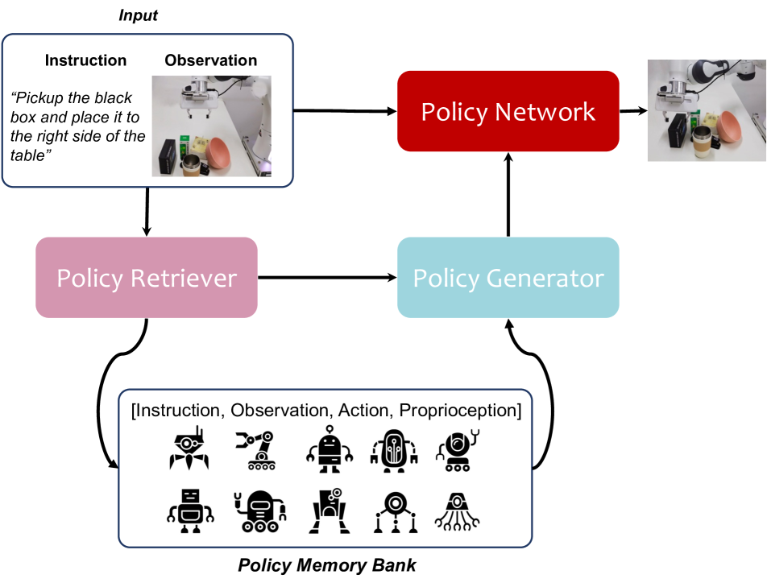

# 增强检索的具身智能代理

发布时间：2024年04月17日

`Agent` `机器人技术` `人工智能`

> Retrieval-Augmented Embodied Agents

# 摘要

> 在复杂多变的环境中运作的具身智能体面临重重挑战。尽管某些高级智能体能熟练掌握复杂操作任务，但它们的成就往往建立在海量训练数据之上。相较之下，人类更倾向于借助回忆过往经历和类似情境来应对新问题。为了在机器人领域复刻人类的这种解决问题的方式，我们提出了检索增强型具身智能体（RAEA）。这一创新系统赋予机器人共享记忆的能力，显著提升了它们的性能。我们的方案整合了一个策略检索模块，使机器人能够基于多模态输入，从一个外部策略库中检索相关策略。同时，策略生成器的引入使得这些策略得以融入学习过程，帮助机器人对各种任务做出有效响应。RAEA在模拟环境和现实世界中的广泛测试表明，其性能超越了传统方法，标志着机器人技术的一大飞跃。

> Embodied agents operating in complex and uncertain environments face considerable challenges. While some advanced agents handle complex manipulation tasks with proficiency, their success often hinges on extensive training data to develop their capabilities. In contrast, humans typically rely on recalling past experiences and analogous situations to solve new problems. Aiming to emulate this human approach in robotics, we introduce the Retrieval-Augmented Embodied Agent (RAEA). This innovative system equips robots with a form of shared memory, significantly enhancing their performance. Our approach integrates a policy retriever, allowing robots to access relevant strategies from an external policy memory bank based on multi-modal inputs. Additionally, a policy generator is employed to assimilate these strategies into the learning process, enabling robots to formulate effective responses to tasks. Extensive testing of RAEA in both simulated and real-world scenarios demonstrates its superior performance over traditional methods, representing a major leap forward in robotic technology.

[Arxiv](https://arxiv.org/abs/2404.11699)