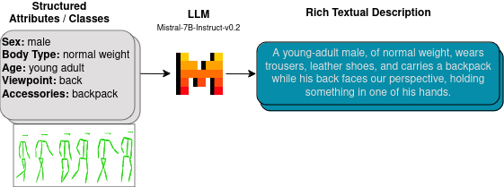
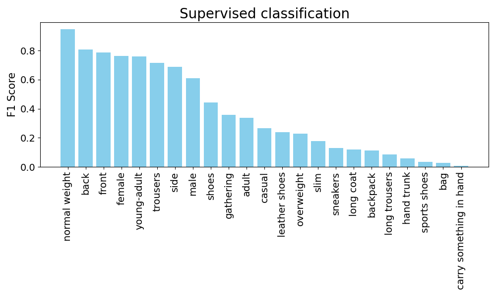
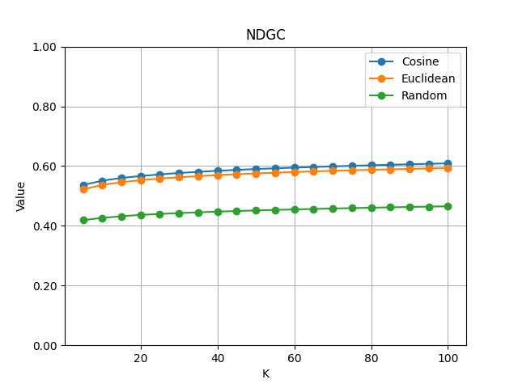
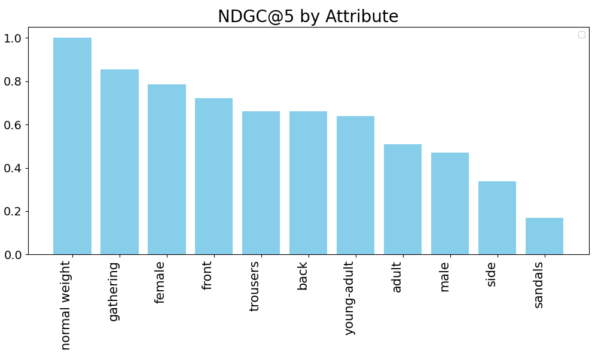

# 将行动和行走与大型语言模型生成的文本描述相匹配。

发布时间：2024年04月18日

`LLM应用` `动作识别` `步态分析`

> Aligning Actions and Walking to LLM-Generated Textual Descriptions

# 摘要

> 大型语言模型（LLMs）在众多领域展现了其卓越性能，尤其是在数据扩充和合成数据创建方面。本研究着眼于利用LLMs为动作序列生成详尽的文本描述，覆盖了动作本身和行走模式。我们发挥LLMs的表达潜力，将动作特征与高级语言提示相结合，针对两大任务：动作识别和基于外观特征的行走序列检索。在动作识别方面，我们利用LLMs为BABEL-60数据集中的动作生成文本描述，以实现动作序列与语言描述的精准匹配。在步态分析领域，我们通过LLMs分析DenseGait数据集中的动作序列，探讨外观特征如衣着和鞋履对行走模式的影响。这些描述捕捉了行走风格中的微妙差异。我们的研究展示了LLMs在丰富结构化动作特征和整合多模态表示方面的潜力，为全面提升动作理解开辟了新路径，并为动作分析中的多模态对齐和数据扩充提供了新的应用场景。相关代码已在 https://github.com/Radu1999/WalkAndText 上公开。

> Large Language Models (LLMs) have demonstrated remarkable capabilities in various domains, including data augmentation and synthetic data generation. This work explores the use of LLMs to generate rich textual descriptions for motion sequences, encompassing both actions and walking patterns. We leverage the expressive power of LLMs to align motion representations with high-level linguistic cues, addressing two distinct tasks: action recognition and retrieval of walking sequences based on appearance attributes. For action recognition, we employ LLMs to generate textual descriptions of actions in the BABEL-60 dataset, facilitating the alignment of motion sequences with linguistic representations. In the domain of gait analysis, we investigate the impact of appearance attributes on walking patterns by generating textual descriptions of motion sequences from the DenseGait dataset using LLMs. These descriptions capture subtle variations in walking styles influenced by factors such as clothing choices and footwear. Our approach demonstrates the potential of LLMs in augmenting structured motion attributes and aligning multi-modal representations. The findings contribute to the advancement of comprehensive motion understanding and open up new avenues for leveraging LLMs in multi-modal alignment and data augmentation for motion analysis. We make the code publicly available at https://github.com/Radu1999/WalkAndText

[Arxiv](https://arxiv.org/abs/2404.12192)