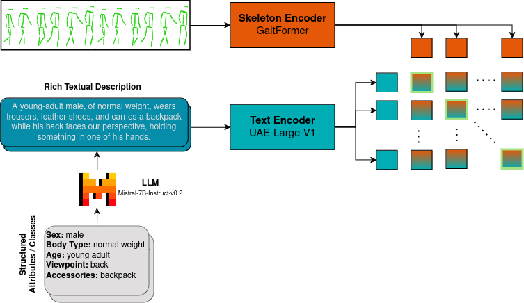

# 将行动与步行同步至由大型语言模型生成的文本描述

发布时间：2024年04月18日

`LLM应用` `计算机视觉` `人工智能`

> Aligning Actions and Walking to LLM-Generated Textual Descriptions

# 摘要

> 大型语言模型（LLMs）在多个领域展现出卓越才能，无论是数据增强还是合成数据的创造。本项研究致力于利用LLMs为动作序列创造详尽的文本描述，涉及动作本身及行走模式。通过发挥LLMs的表达力，我们将动作特征与高层次的语言信号相结合，以应对两个独立任务：动作识别和基于外观特征的行走序列检索。在动作识别方面，我们利用LLMs为BABEL-60数据集中的动作生成文本描述，以实现动作序列与语言描述的精准匹配。在步态分析领域，我们探讨了外观特征如衣着和鞋履对行走模式的影响，通过LLMs对DenseGait数据集中的动作序列进行文本描述，捕捉行走风格中的微妙差异。我们的研究方法证明了LLMs在增强结构化动作特征和实现多模态表示对齐方面的潜力。这些发现不仅推动了对动作全面理解的进步，也为LLMs在多模态对齐和数据增强方面的应用开辟了新的道路。相关代码已在 https://github.com/Radu1999/WalkAndText 上公开。

> Large Language Models (LLMs) have demonstrated remarkable capabilities in various domains, including data augmentation and synthetic data generation. This work explores the use of LLMs to generate rich textual descriptions for motion sequences, encompassing both actions and walking patterns. We leverage the expressive power of LLMs to align motion representations with high-level linguistic cues, addressing two distinct tasks: action recognition and retrieval of walking sequences based on appearance attributes. For action recognition, we employ LLMs to generate textual descriptions of actions in the BABEL-60 dataset, facilitating the alignment of motion sequences with linguistic representations. In the domain of gait analysis, we investigate the impact of appearance attributes on walking patterns by generating textual descriptions of motion sequences from the DenseGait dataset using LLMs. These descriptions capture subtle variations in walking styles influenced by factors such as clothing choices and footwear. Our approach demonstrates the potential of LLMs in augmenting structured motion attributes and aligning multi-modal representations. The findings contribute to the advancement of comprehensive motion understanding and open up new avenues for leveraging LLMs in multi-modal alignment and data augmentation for motion analysis. We make the code publicly available at https://github.com/Radu1999/WalkAndText

[Arxiv](https://arxiv.org/abs/2404.12192)