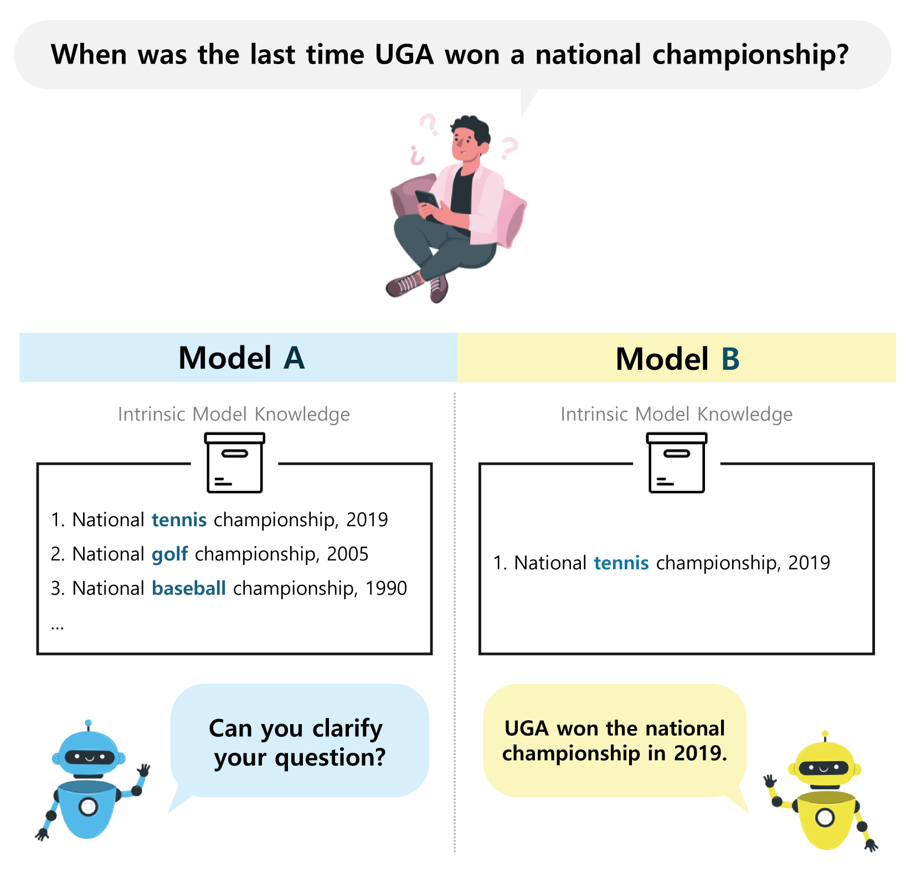

# 调整语言模型以明确应对歧义

发布时间：2024年04月18日

`LLM应用` `对话系统`

> Aligning Language Models to Explicitly Handle Ambiguity

# 摘要

> 在日常对话中，为了沟通高效，人们常常故意使用不完整或含糊的表达方式。这自然会导致对同一话语的不同理解，理解的差异取决于对话双方对上下文的不同假设。在这样的情境下，要实现用户与模型之间的可靠互动，关键在于模型能否巧妙地处理语句中的歧义。然而，即便是基于最新大型语言模型（LLMs）构建的对话系统，也常常在处理含糊不清的输入时遇到困难，主要原因有两个：一是LLMs并未被直接训练来应对那些过于模糊、难以妥善处理的输入；二是输入的模糊性会随着模型内在知识的多寡而变化，这一点很难被探究。为了应对这些挑战，本文提出了一种新方法，旨在让LLMs能够明确地处理模糊输入。具体而言，我们设计了一个代理任务，激励LLMs运用其内在的知识库来自我澄清给定的模糊输入。我们通过量化消歧过程中的信息增益，来衡量模型对输入模糊性的感知程度。这一衡量标准被用作筛选模型视角下认为模糊的样本的依据，这些样本随后被用于模型的进一步训练。通过多个问答数据集的实验结果证明，采用我们方法进行微调的LLMs不仅能够有效处理模糊输入，而且在处理明确问题时的表现也毫不逊色。

> In spoken languages, utterances are often shaped to be incomplete or vague for efficiency. This can lead to varying interpretations of the same input, based on different assumptions about the context. To ensure reliable user-model interactions in such scenarios, it is crucial for models to adeptly handle the inherent ambiguity in user queries. However, conversational agents built upon even the most recent large language models (LLMs) face challenges in processing ambiguous inputs, primarily due to the following two hurdles: (1) LLMs are not directly trained to handle inputs that are too ambiguous to be properly managed; (2) the degree of ambiguity in an input can vary according to the intrinsic knowledge of the LLMs, which is difficult to investigate. To address these issues, this paper proposes a method to align LLMs to explicitly handle ambiguous inputs. Specifically, we introduce a proxy task that guides LLMs to utilize their intrinsic knowledge to self-disambiguate a given input. We quantify the information gain from the disambiguation procedure as a measure of the extent to which the models perceive their inputs as ambiguous. This measure serves as a cue for selecting samples deemed ambiguous from the models' perspectives, which are then utilized for alignment. Experimental results from several question-answering datasets demonstrate that the LLMs fine-tuned with our approach are capable of handling ambiguous inputs while still performing competitively on clear questions within the task.

[Arxiv](https://arxiv.org/abs/2404.11972)