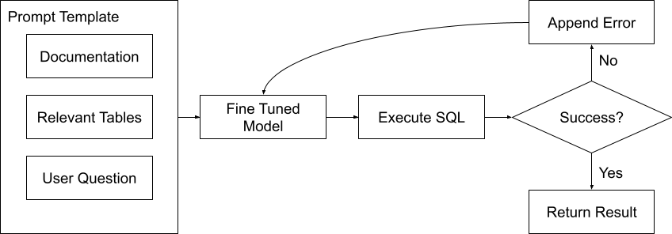
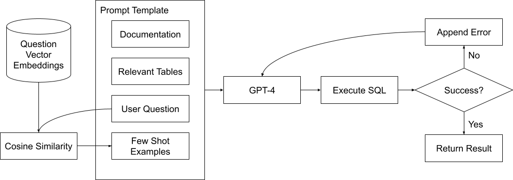
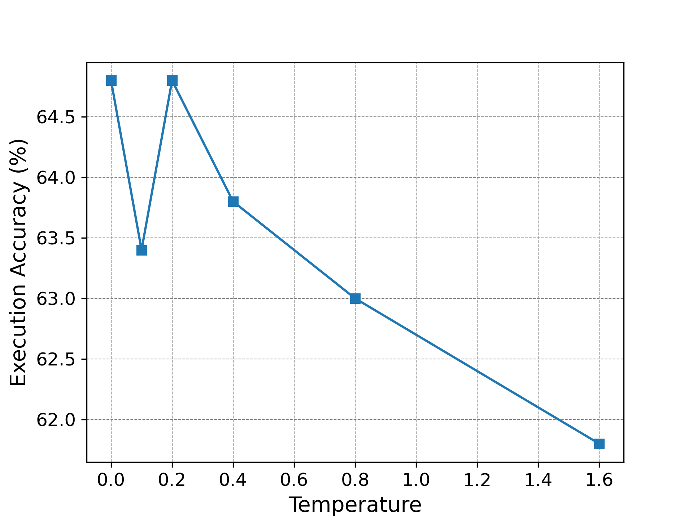

# Dubo-SQL：为文本到SQL任务，引入多样化的检索增强生成技术与精细调优方法。

发布时间：2024年04月18日

`分类：RAG` `数据库管理`

> Dubo-SQL: Diverse Retrieval-Augmented Generation and Fine Tuning for Text-to-SQL

# 摘要

> 尽管自动化文本到SQL技术不断进步，但与人类专家相比，其执行准确性仍有较大差距。为了提升性能，同时降低成本和加快速度，我们采用了低成本微调、创新的多样化检索增强生成技术（RAG）以及优化的输入输出格式，以助力大型语言模型（LLMs）在BIRD-SQL基准测试中获得更高的执行准确性。我们推出了两种创新方法：Dubo-SQL v1和v2。Dubo-SQL v1在BIRD-SQL的保留测试集中创下了新纪录，而Dubo-SQL v2在开发集上的表现更为出色。Dubo-SQL v1采用了OpenAI的LLMs，并通过使用成本效益高的GPT-3.5 Turbo，超越了使用更昂贵GPT-4的下一个最佳模型。Dubo-SQL v1的性能比使用GPT-3.5的前最佳模型提高了20%以上。Dubo-SQL v2则采用GPT-4 Turbo和RAG技术，取代了传统的微调方法，进一步提升了执行准确性。

> The current state-of-the-art (SOTA) for automated text-to-SQL still falls well short of expert human performance as measured by execution accuracy (EX) on the BIRD-SQL benchmark. The most accurate methods are also slow and expensive. To advance the SOTA for text-to-SQL while reducing cost and improving speed, we explore the combination of low-cost fine tuning, novel methods for diverse retrieval-augmented generation (RAG) and new input and output formats that help large language models (LLMs) achieve higher EX. We introduce two new methods, Dubo-SQL v1 and v2. Dubo-SQL v1 sets a new record for EX on the holdout test set of BIRD-SQL. Dubo-SQL v2 achieves even higher performance on the BIRD-SQL dev set. Dubo-SQL v1 relies on LLMs from OpenAI, but uses the low-cost GPT-3.5 Turbo while exceeding the performance of the next-best model using OpenAI, which instead uses the more expensive GPT-4. Dubo-SQL v1 exceeds the performance of the next-best model using GPT-3.5 by over 20%. Dubo-SQL v2 uses GPT-4 Turbo and RAG in place of fine tuning to push EX higher.

[Arxiv](https://arxiv.org/abs/2404.12560)