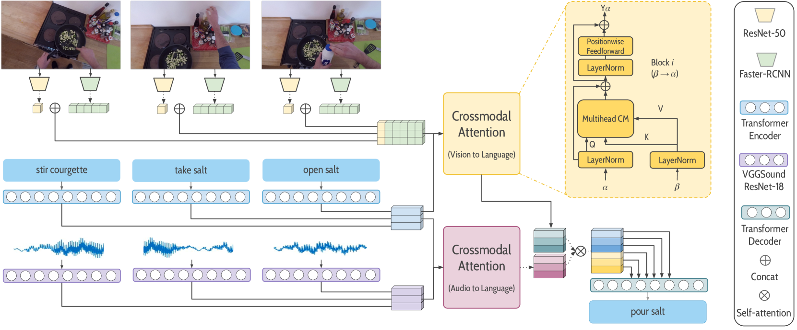
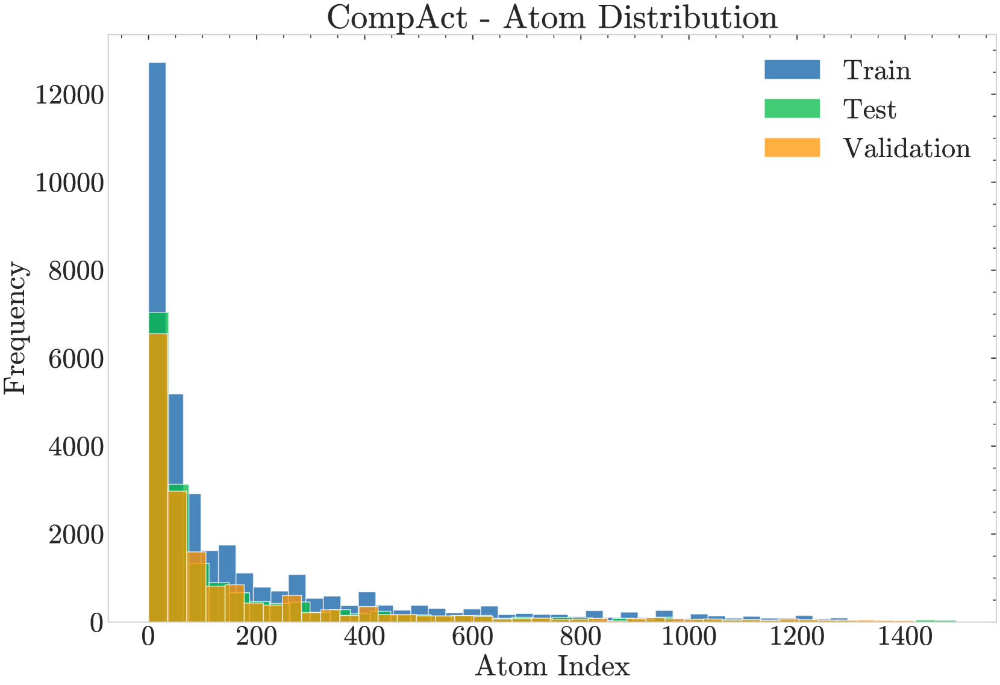
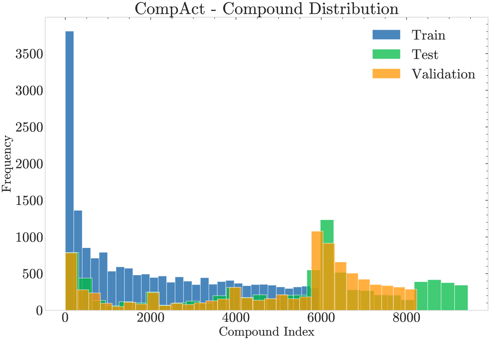
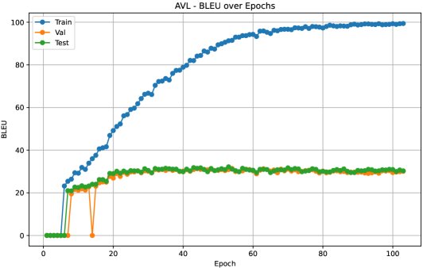

# 多模态模型中的顺序组合性泛化

发布时间：2024年04月18日

`分类：LLM应用

这篇论文探讨了大规模多模态模型在生成建模和推理方面的进步，并分析了这些模型在更高级泛化能力上的真实表现。通过使用一个精心构建的数据集，研究了顺序组合泛化问题，并对比了单模态和多模态模型的性能。这篇论文的重点是评估和改进多模态模型在特定任务上的应用，因此它属于LLM应用类别。` `计算机视觉` `人工智能`

> Sequential Compositional Generalization in Multimodal Models

# 摘要

> 大规模多模态模型的发展为生成建模和推理带来了革命性的进步，推动了复杂任务的创新应用。但一个关键问题尚未充分探讨：这些模型在更高级泛化能力上的真实表现如何。本研究通过分析 \textsc{CompAct} 数据集——一个在自我中心厨房活动视频背景下精心构建、感知基础的数据集——来探讨顺序组合泛化问题。该数据集的每个案例都结合了原始视频、自然声音和众包的分步描述。我们的实验设计确保了训练集和测试集中概念的一致性，同时在测试集中引入了新颖的组合。我们对单模态和多模态模型进行了深入评估，发现双模态和三模态模型在性能上明显超越了纯文本模型。这一发现不仅凸显了多模态输入的重要性，也为未来研究方向提供了新的思路。

> The rise of large-scale multimodal models has paved the pathway for groundbreaking advances in generative modeling and reasoning, unlocking transformative applications in a variety of complex tasks. However, a pressing question that remains is their genuine capability for stronger forms of generalization, which has been largely underexplored in the multimodal setting. Our study aims to address this by examining sequential compositional generalization using \textsc{CompAct} (\underline{Comp}ositional \underline{Act}ivities)\footnote{Project Page: \url{http://cyberiada.github.io/CompAct}}, a carefully constructed, perceptually grounded dataset set within a rich backdrop of egocentric kitchen activity videos. Each instance in our dataset is represented with a combination of raw video footage, naturally occurring sound, and crowd-sourced step-by-step descriptions. More importantly, our setup ensures that the individual concepts are consistently distributed across training and evaluation sets, while their compositions are novel in the evaluation set. We conduct a comprehensive assessment of several unimodal and multimodal models. Our findings reveal that bi-modal and tri-modal models exhibit a clear edge over their text-only counterparts. This highlights the importance of multimodality while charting a trajectory for future research in this domain.

[Arxiv](https://arxiv.org/abs/2404.12013)