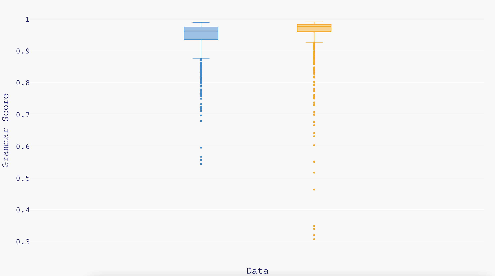

# V2Xum-LLM：利用时间提示指令优化的跨模态视频摘要技术

发布时间：2024年04月18日

`LLM应用` `视频摘要` `多模态学习`

> V2Xum-LLM: Cross-Modal Video Summarization with Temporal Prompt Instruction Tuning

# 摘要

> 视频摘要致力于提炼出长视频的精华，制作出精炼、准确、通顺的短片。尽管众多视频摘要数据集相继问世，但它们普遍存在的短板是源视频数量不足，这限制了高端大型视觉-语言模型（VLMs）的精准优化。而且，目前大多数数据集仅针对视频到视频的摘要任务设计，忽略了对多模态视频内容摘要的迫切需求。近期，研究者们开始尝试从单一模态向多模态视频摘要转变，将摘要任务细分为三种子类型：视频到视频（V2V）、视频到文本（V2T）以及视频和文本结合摘要（V2VT）。但是，现有多模态数据集中的文本摘要质量仍有待提高。为应对这些挑战，我们推出了Instruct-V2Xum，这是一个跨界视频摘要数据集，涵盖了从YouTube精选的3万段多样化视频，时长大范围分布在40至940秒之间，平均摘要率为16.39%。Instruct-V2Xum的每个视频摘要都配有一个文本摘要，精确引用了特定帧的索引，这有助于制作出同步的视频和文本摘要。此外，我们还提出了一个创新的视频摘要框架——V2Xum-LLM。在本研究中，特别采用了V2Xum-LLaMA，这是首个将多种视频摘要任务集成到单一大型语言模型（LLM）的文本解码器中，并利用时间提示和任务指令实现任务可控的视频摘要。实验结果表明，V2Xum-LLaMA在多项视频摘要任务中均优于现有的强基线模型。进一步地，我们还提出了一种改进的评估指标，专门用于V2V和V2VT摘要任务的评估。

> Video summarization aims to create short, accurate, and cohesive summaries of longer videos. Despite the existence of various video summarization datasets, a notable limitation is their limited amount of source videos, which hampers the effective fine-tuning of advanced large vision-language models (VLMs). Additionally, most existing datasets are created for video-to-video summarization, overlooking the contemporary need for multimodal video content summarization. Recent efforts have been made to expand from unimodal to multimodal video summarization, categorizing the task into three sub-tasks based on the summary's modality: video-to-video (V2V), video-to-text (V2T), and a combination of video and text summarization (V2VT). However, the textual summaries in previous multimodal datasets are inadequate. To address these issues, we introduce Instruct-V2Xum, a cross-modal video summarization dataset featuring 30,000 diverse videos sourced from YouTube, with lengths ranging from 40 to 940 seconds and an average summarization ratio of 16.39\%. Each video summary in Instruct-V2Xum is paired with a textual summary that references specific frame indexes, facilitating the generation of aligned video and textual summaries. In addition, we propose a new video summarization framework named V2Xum-LLM. V2Xum-LLM, specifically V2Xum-LLaMA in this study, is the first framework that unifies different video summarization tasks into one large language model's (LLM) text decoder and achieves task-controllable video summarization with temporal prompts and task instructions. Experiments show that V2Xum-LLaMA outperforms strong baseline models on multiple video summarization tasks. Furthermore, we propose an enhanced evaluation metric for V2V and V2VT summarization tasks.

[Arxiv](https://arxiv.org/abs/2404.12353)