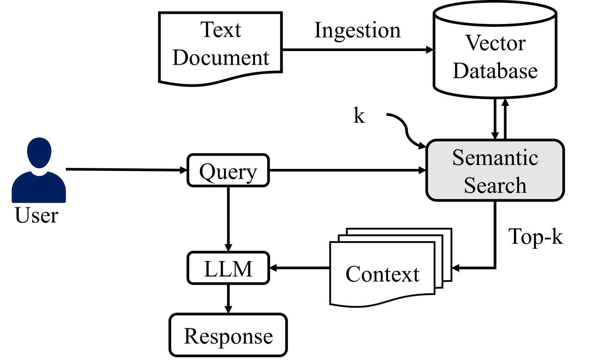
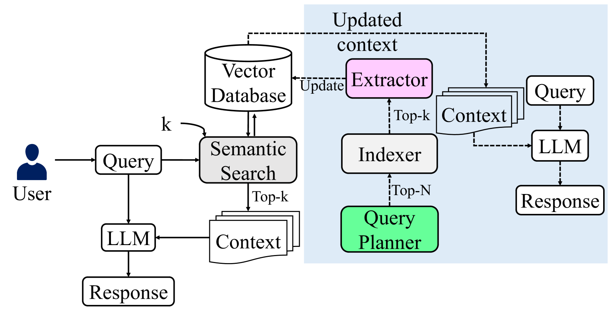
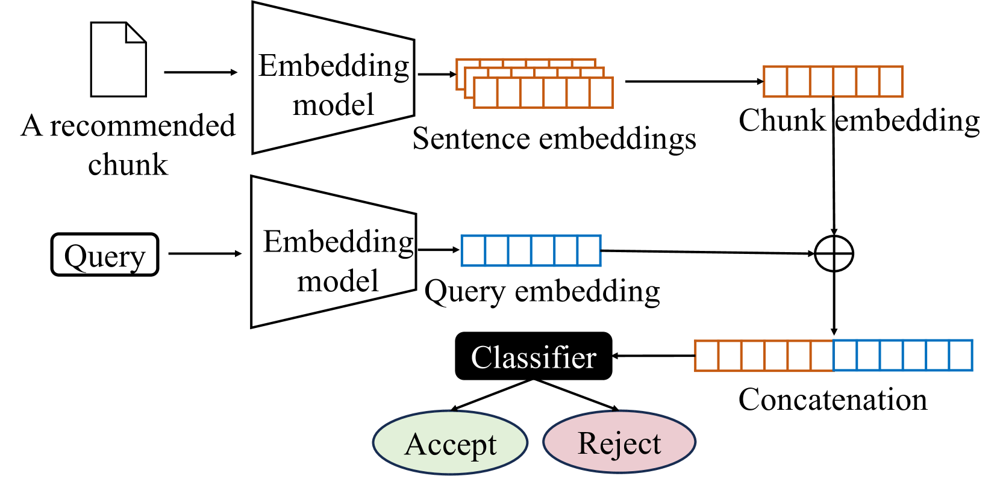
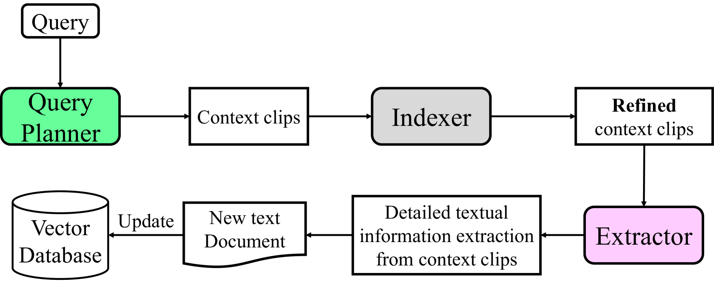
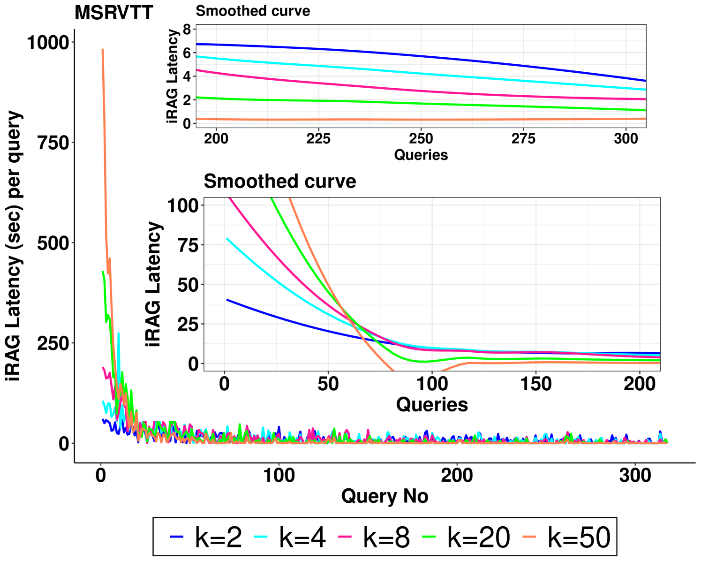
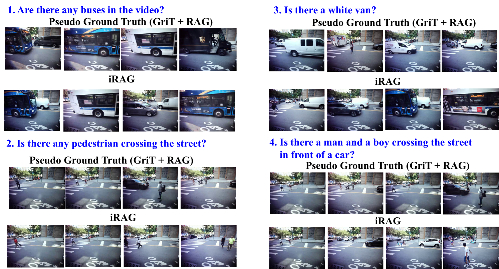
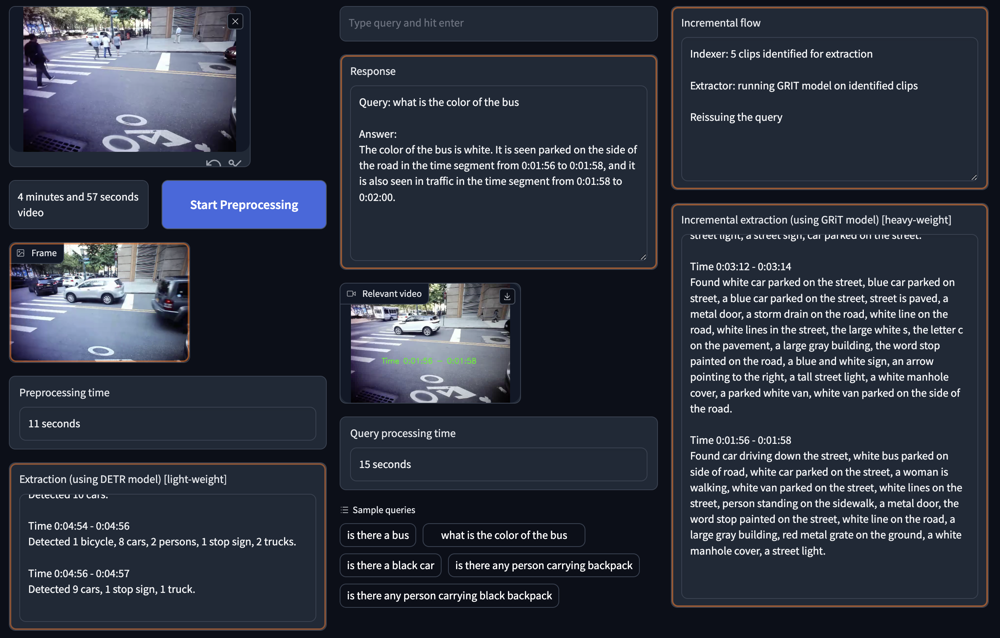

# iRAG：一种视频领域的增量式检索增强生成系统

发布时间：2024年04月18日

`RAG` `聊天机器人` `多模态数据处理`

> iRAG: An Incremental Retrieval Augmented Generation System for Videos

# 摘要

> 检索增强生成（RAG）系统融合了语言生成与信息检索的长处，广泛应用于聊天机器人等实际应用中。尽管利用 RAG 来综合解析文本、图像和视频等多模态数据颇具吸引力，但存在两大挑战：一是将大量多模态数据一次性转换为文本描述需要较长的处理时间；二是多模态数据中的信息并不总是完全包含在文本描述中。鉴于用户查询无法预先得知，构建一个能够实现多模态到文本转换并进行多模态数据交互查询的系统颇为困难。为克服这些挑战，我们提出了 iRAG，这是一种新型的增量式工作流程，它增强了 RAG 系统，使其能够交互式地查询大规模的多模态数据集。与传统 RAG 不同，iRAG 能够迅速建立大型多模态数据库的索引，并在增量式工作流程中，利用索引从多模态数据的选定部分提取更多细节，以响应用户的交互式查询。这种工作流程不仅避免了长时间的多模态到文本的转换，而且通过按需提取多模态数据中的细节来解决信息丢失问题，并确保了对用户查询的响应质量。据我们所知，iRAG 是首个采用增量式工作流程增强 RAG 系统，以支持大规模现实世界多模态数据的高效交互式查询的系统。在现实世界长视频上的实验结果显示，视频到文本的转换速度提升了 23 到 25 倍，同时保证了对交互式用户查询的响应质量与传统 RAG 系统相媲美，后者在任何查询之前都将所有视频数据转换为文本。

> Retrieval augmented generation (RAG) systems combine the strengths of language generation and information retrieval to power many real-world applications like chatbots. Use of RAG for combined understanding of multimodal data such as text, images and videos is appealing but two critical limitations exist: one-time, upfront capture of all content in large multimodal data as text descriptions entails high processing times, and not all information in the rich multimodal data is typically in the text descriptions. Since the user queries are not known apriori, developing a system for multimodal to text conversion and interactive querying of multimodal data is challenging.
  To address these limitations, we propose iRAG, which augments RAG with a novel incremental workflow to enable interactive querying of large corpus of multimodal data. Unlike traditional RAG, iRAG quickly indexes large repositories of multimodal data, and in the incremental workflow, it uses the index to opportunistically extract more details from select portions of the multimodal data to retrieve context relevant to an interactive user query. Such an incremental workflow avoids long multimodal to text conversion times, overcomes information loss issues by doing on-demand query-specific extraction of details in multimodal data, and ensures high quality of responses to interactive user queries that are often not known apriori. To the best of our knowledge, iRAG is the first system to augment RAG with an incremental workflow to support efficient interactive querying of large, real-world multimodal data. Experimental results on real-world long videos demonstrate 23x to 25x faster video to text ingestion, while ensuring that quality of responses to interactive user queries is comparable to responses from a traditional RAG where all video data is converted to text upfront before any querying.

[Arxiv](https://arxiv.org/abs/2404.12309)