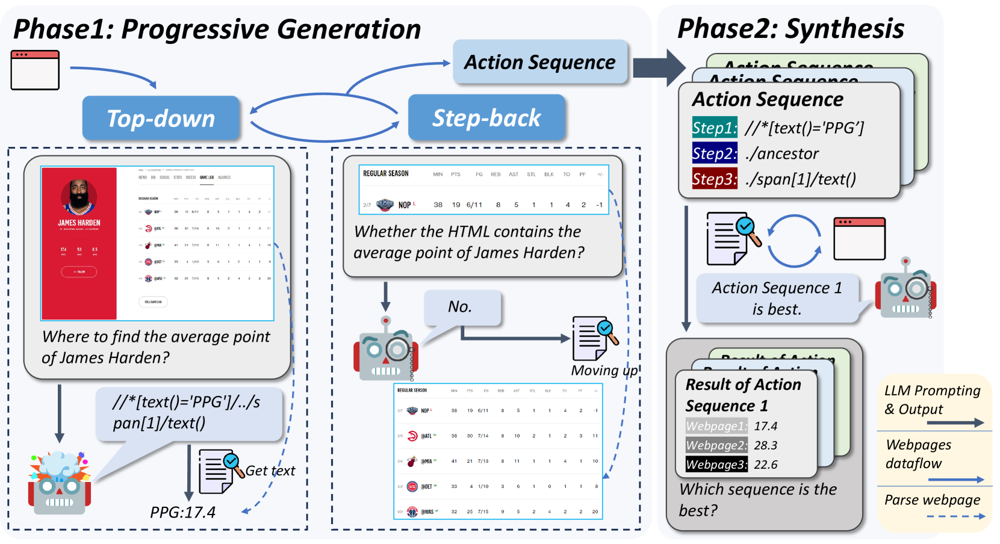

# AutoCrawler：一种渐进式理解的网络代理，专为网络爬虫生成而设计。

发布时间：2024年04月19日

`Agent` `网页自动化` `信息爬取`

> AutoCrawler: A Progressive Understanding Web Agent for Web Crawler Generation

# 摘要

> 网页自动化技术通过模拟常规的网页交互，实现了复杂任务的自动化，从而提升了工作效率并减少了人工操作。面对新网站，传统包装器方法因适应性与扩展性不足而受限。与此同时，由大型语言模型（LLMs）驱动的生成式代理在开放环境下的效能和复用性亦不尽人意。本研究提出了一种针对垂直信息网页的爬虫生成任务，并引入了结合LLMs与爬虫的新范式，以增强爬虫对多变网页环境的适应能力。我们开发了AutoCrawler，这是一个分两阶段的框架，它利用HTML的层级结构实现逐步理解。通过自顶向下和回溯操作，AutoCrawler能够从错误中学习，并持续优化HTML以提升操作生成的质量。我们对多种LLMs进行了广泛的测试，验证了框架的有效性。本文的相关资源可在 \url{https://github.com/EZ-hwh/AutoCrawler} 获取。

> Web automation is a significant technique that accomplishes complicated web tasks by automating common web actions, enhancing operational efficiency, and reducing the need for manual intervention. Traditional methods, such as wrappers, suffer from limited adaptability and scalability when faced with a new website. On the other hand, generative agents empowered by large language models (LLMs) exhibit poor performance and reusability in open-world scenarios. In this work, we introduce a crawler generation task for vertical information web pages and the paradigm of combining LLMs with crawlers, which helps crawlers handle diverse and changing web environments more efficiently. We propose AutoCrawler, a two-stage framework that leverages the hierarchical structure of HTML for progressive understanding. Through top-down and step-back operations, AutoCrawler can learn from erroneous actions and continuously prune HTML for better action generation. We conduct comprehensive experiments with multiple LLMs and demonstrate the effectiveness of our framework. Resources of this paper can be found at \url{https://github.com/EZ-hwh/AutoCrawler}

[Arxiv](https://arxiv.org/abs/2404.12753)