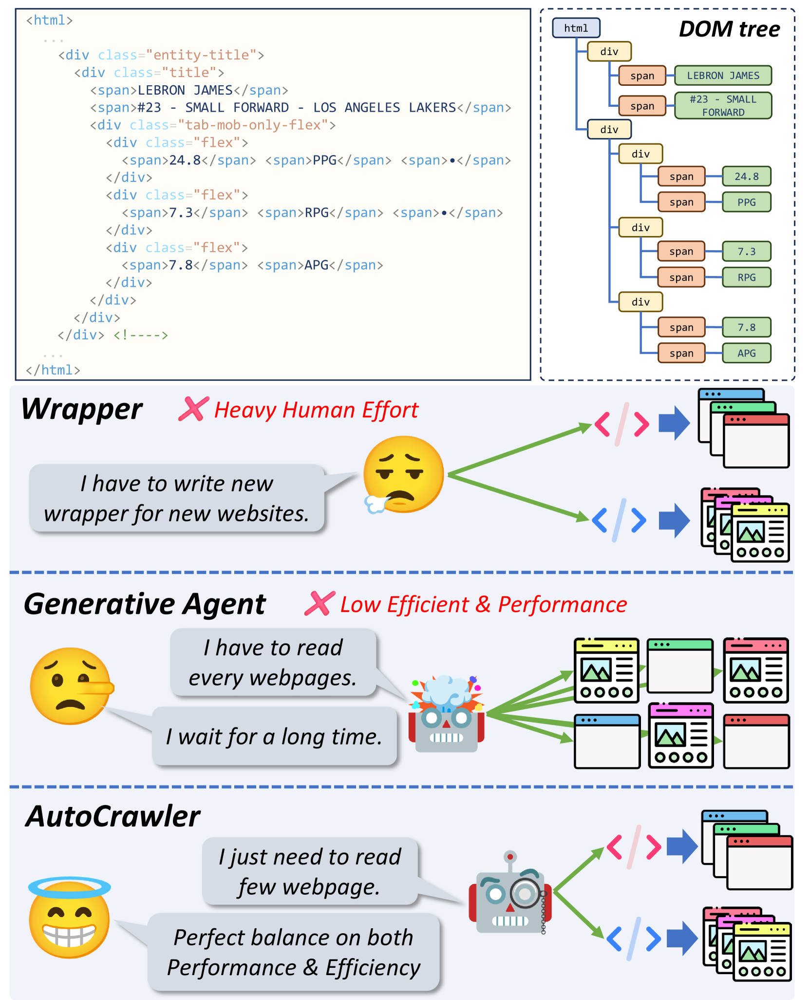

# AutoCrawler：一种用于生成网络爬虫的渐进式理解网络代理。

发布时间：2024年04月19日

`分类：Agent` `网络自动化` `网页爬虫`

> AutoCrawler: A Progressive Understanding Web Agent for Web Crawler Generation

# 摘要

> 网络自动化技术通过自动化常规网络行为来执行复杂的网络任务，从而提升工作效率并减少人工干预。传统方法如包装器在新网站上的适应性和扩展性受限。而由大型语言模型（LLMs）支持的生成代理在开放环境下的性能和可复用性也不尽人意。本研究提出了一种针对垂直信息网页的爬虫生成任务，以及将LLMs与爬虫结合的新范式，以提高爬虫在多样化和动态网络环境中的适应性。我们设计了AutoCrawler，这是一个分两阶段的框架，它利用HTML的层级结构进行逐步理解。通过自上而下和回溯策略，AutoCrawler能够从错误中学习并不断优化HTML，以提升操作生成的效率。我们对多个LLMs进行了广泛测试，验证了框架的有效性。本论文的资源可在 \url{https://github.com/EZ-hwh/AutoCrawler} 获取。

> Web automation is a significant technique that accomplishes complicated web tasks by automating common web actions, enhancing operational efficiency, and reducing the need for manual intervention. Traditional methods, such as wrappers, suffer from limited adaptability and scalability when faced with a new website. On the other hand, generative agents empowered by large language models (LLMs) exhibit poor performance and reusability in open-world scenarios. In this work, we introduce a crawler generation task for vertical information web pages and the paradigm of combining LLMs with crawlers, which helps crawlers handle diverse and changing web environments more efficiently. We propose AutoCrawler, a two-stage framework that leverages the hierarchical structure of HTML for progressive understanding. Through top-down and step-back operations, AutoCrawler can learn from erroneous actions and continuously prune HTML for better action generation. We conduct comprehensive experiments with multiple LLMs and demonstrate the effectiveness of our framework. Resources of this paper can be found at \url{https://github.com/EZ-hwh/AutoCrawler}

[Arxiv](https://arxiv.org/abs/2404.12753)