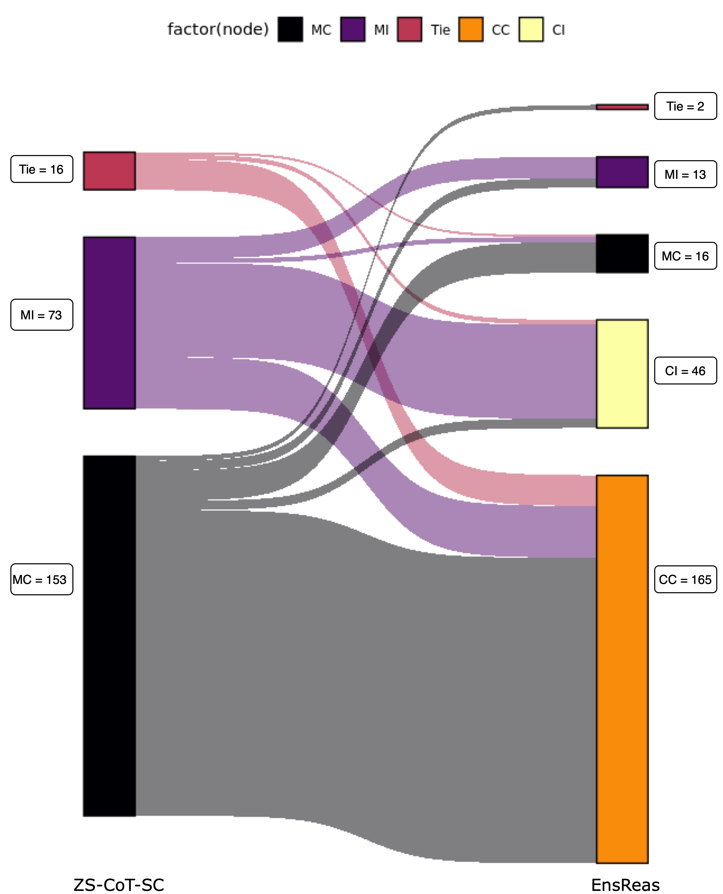

# 超越单一自洽：通过集成推理，我们提升了大型语言模型在癌症分期任务中的一致性和准确度。

发布时间：2024年04月19日

`LLM应用`

> Beyond Self-Consistency: Ensemble Reasoning Boosts Consistency and Accuracy of LLMs in Cancer Staging

# 摘要

> 大型语言模型（LLM）的进展推动了其在医疗领域的应用，尤其是在处理非结构化临床笔记中的关键信息时。例如，临床报告中虽有癌症分期信息，但需借助自然语言处理技术提取。随着临床专用LLM的发展，我们有望无需复杂的算法训练即可提取这些信息。通过预训练LLM的提示策略，例如思维链，可以激发模型的推理过程，从而提升生成结果的可信度。此外，自洽性的应用虽提升了模型效能，却也可能导致多路径推理中的生成结果不一致。本研究提出了一种集成推理方法，以增强模型生成的一致性。利用一个开放获取的临床LLM，从真实的病理报告中确定病理癌症分期，我们证实了集成推理方法不仅提高了LLM在癌症分期判定中的一致性和性能，也展示了这些模型在临床或其他对可靠性和信任度要求高的领域中的实用潜力。

> Advances in large language models (LLMs) have encouraged their adoption in the healthcare domain where vital clinical information is often contained in unstructured notes. Cancer staging status is available in clinical reports, but it requires natural language processing to extract the status from the unstructured text. With the advance in clinical-oriented LLMs, it is promising to extract such status without extensive efforts in training the algorithms. Prompting approaches of the pre-trained LLMs that elicit a model's reasoning process, such as chain-of-thought, may help to improve the trustworthiness of the generated responses. Using self-consistency further improves model performance, but often results in inconsistent generations across the multiple reasoning paths. In this study, we propose an ensemble reasoning approach with the aim of improving the consistency of the model generations. Using an open access clinical large language model to determine the pathologic cancer stage from real-world pathology reports, we show that the ensemble reasoning approach is able to improve both the consistency and performance of the LLM in determining cancer stage, thereby demonstrating the potential to use these models in clinical or other domains where reliability and trustworthiness are critical.

[Arxiv](https://arxiv.org/abs/2404.13149)