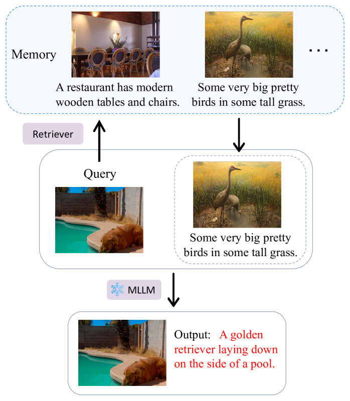
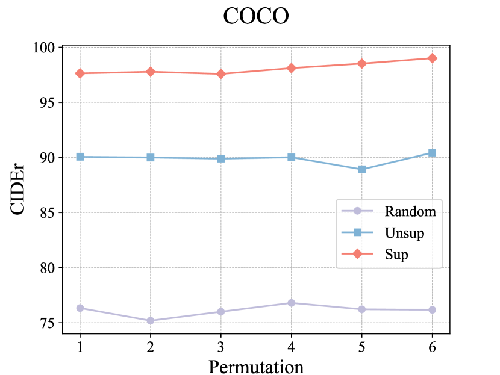

# 文本内容如何作用于多模态情境学习中的信息检索过程？

发布时间：2024年04月19日

`分类：LLM应用

这篇论文主要研究了多模态大型语言模型（MLLMs）在上下文学习方面的潜力，特别是在不更新预训练参数的情况下提升任务执行能力。论文提出了一种创新的监督MLLM-检索器MSIER，该检索器利用神经网络挑选出能够提升多模态上下文学习效率的示例。这篇论文的研究内容和方法都与LLM应用紧密相关，因此将其归类为LLM应用。` `人工智能` `多模态学习`

> How Does the Textual Information Affect the Retrieval of Multimodal In-Context Learning?

# 摘要

> 随着多模态大型语言模型（MLLMs）参数量的扩大，它们在上下文学习方面展现出了显著的潜力，尤其是在不更新预训练参数的情况下提升任务执行能力。然而，这种提升高度依赖于对上下文示例的正确选择，而当前的选择过程存在偏差，倾向于视觉数据而忽略了文本信息。对于优化上下文示例选择至关重要的监督检索器领域，在MLLMs中的应用尚未得到充分研究。本研究深入探讨了文本信息在多模态上下文示例无监督选择中的影响，并发现检索器性能对所采用的模态极为敏感。为此，我们提出了一种创新的监督MLLM-检索器MSIER，该检索器利用神经网络挑选出能够提升多模态上下文学习效率的示例。通过在三项不同任务上的广泛测试，我们验证了这一方法的有效性。同时，我们还深入分析了模态对我们监督检索方法训练的影响，并识别出了推动模型成功的关键因素。这一发现为未来的进步奠定了基础，预示着通过策略性地运用多模态数据，MLLMs的上下文学习能力有望得到进一步的提升。

> The increase in parameter size of multimodal large language models (MLLMs) introduces significant capabilities, particularly in-context learning, where MLLMs enhance task performance without updating pre-trained parameters. This effectiveness, however, hinges on the appropriate selection of in-context examples, a process that is currently biased towards visual data, overlooking textual information. Furthermore, the area of supervised retrievers for MLLMs, crucial for optimal in-context example selection, continues to be uninvestigated. Our study offers an in-depth evaluation of the impact of textual information on the unsupervised selection of in-context examples in multimodal contexts, uncovering a notable sensitivity of retriever performance to the employed modalities. Responding to this, we introduce a novel supervised MLLM-retriever MSIER that employs a neural network to select examples that enhance multimodal in-context learning efficiency. This approach is validated through extensive testing across three distinct tasks, demonstrating the method's effectiveness. Additionally, we investigate the influence of modalities on our supervised retrieval method's training and pinpoint factors contributing to our model's success. This exploration paves the way for future advancements, highlighting the potential for refined in-context learning in MLLMs through the strategic use of multimodal data.

[Arxiv](https://arxiv.org/abs/2404.12866)