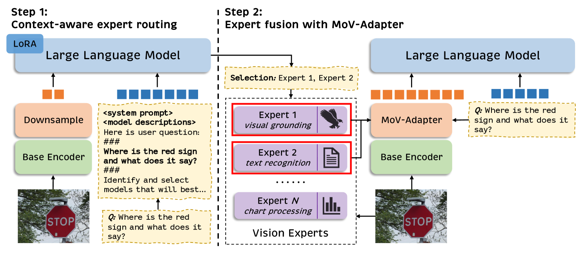
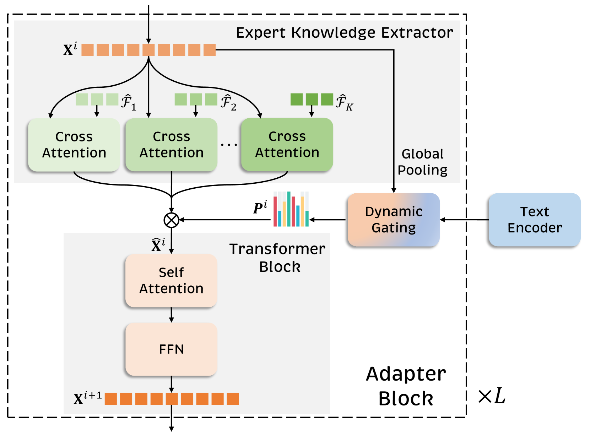

# MoVA：将视觉专家的混合应用于多模态环境的适应性研究

发布时间：2024年04月19日

`LLM应用` `计算机视觉`

> MoVA: Adapting Mixture of Vision Experts to Multimodal Context

# 摘要

> 在多模态大型语言模型（MLLMs）中，视觉编码器扮演着核心角色，其性能直接影响模型对丰富图像内容的解析能力。尽管像CLIP和DINOv2这样的大规模预训练视觉编码器已经展现出不俗的表现，但目前尚未有单一编码器能在各类图像内容理解上都占据优势，例如CLIP在常规图像理解上表现出色，却在文档或图表类内容上不尽人意。为了克服CLIP视觉编码器的局限性，我们首先剖析了不同预训练视觉编码器的内在特性，并据此提出了MoVA——一种创新的MLLM，它能够通过由粗到细的机制，灵活地引导和整合特定任务的视觉专家。在粗粒度层面，我们开发了一种基于上下文的专家路由策略，能够根据用户的指令、输入图像以及视觉专家的专长，动态地选择最合适的视觉专家。这一策略得益于我们的大型语言模型（LLM）所具备的强大功能理解能力，以及专家路由低秩适应（LoRA）技术的加持。在细粒度层面，我们精心打造了混合视觉专家适配器（MoV-Adapter），用于从众多专家中提炼并融合任务相关的知识。这种由粗到细的处理模式，充分利用了多模态上下文和模型专长，有效提升了模型的泛化性能。我们通过大量实验验证了本方法的有效性，MoVA在无需额外修饰的情况下，便能在众多复杂的多模态基准测试中取得显著的性能提升。相关代码和模型将在 https://github.com/TempleX98/MoVA 提供。

> As the key component in multimodal large language models (MLLMs), the ability of the visual encoder greatly affects MLLM's understanding on diverse image content. Although some large-scale pretrained vision encoders such as vision encoders in CLIP and DINOv2 have brought promising performance, we found that there is still no single vision encoder that can dominate various image content understanding, e.g., the CLIP vision encoder leads to outstanding results on general image understanding but poor performance on document or chart content. To alleviate the bias of CLIP vision encoder, we first delve into the inherent behavior of different pre-trained vision encoders and then propose the MoVA, a powerful and novel MLLM, adaptively routing and fusing task-specific vision experts with a coarse-to-fine mechanism. In the coarse-grained stage, we design a context-aware expert routing strategy to dynamically select the most suitable vision experts according to the user instruction, input image, and expertise of vision experts. This benefits from the powerful model function understanding ability of the large language model (LLM) equipped with expert-routing low-rank adaptation (LoRA). In the fine-grained stage, we elaborately conduct the mixture-of-vision-expert adapter (MoV-Adapter) to extract and fuse task-specific knowledge from various experts. This coarse-to-fine paradigm effectively leverages representations from experts based on multimodal context and model expertise, further enhancing the generalization ability. We conduct extensive experiments to evaluate the effectiveness of the proposed approach. Without any bells and whistles, MoVA can achieve significant performance gains over current state-of-the-art methods in a wide range of challenging multimodal benchmarks. Codes and models will be available at https://github.com/TempleX98/MoVA.

[Arxiv](https://arxiv.org/abs/2404.13046)