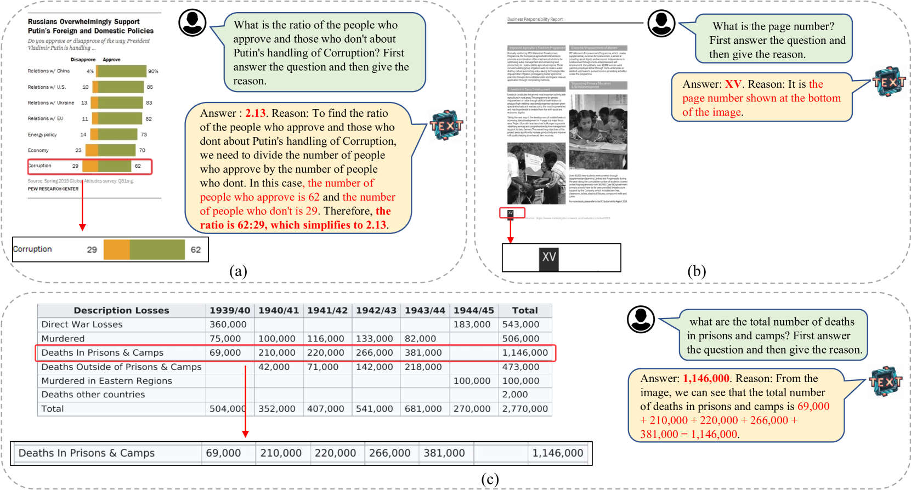

# TextSquare：提升文本导向视觉指令调优的规模

发布时间：2024年04月19日

`LLM应用` `视觉问答`

> TextSquare: Scaling up Text-Centric Visual Instruction Tuning

# 摘要

> 随着多模态大型语言模型（MLLMs）的兴起，文本中心视觉问答（VQA）领域取得了显著进展。然而，与 GPT4V 和 Gemini 等行业领头羊相比，开源模型仍有差距，这在一定程度上归咎于缺少大量的、高品质的指令调优数据。为了解决这一问题，我们提出了一种创新的方法，用于构建一个庞大且高品质的指令调优数据集 Square-10M，该数据集利用闭源 MLLMs 来生成。整个数据构建流程，即 Square 流程，分为四个阶段：自我提问、作答、推理和评估。通过 Square-10M 的实验，我们得出了三个主要发现：首先，我们的模型 TextSquare 显著超越了现有的开源文本中心 MLLMs，在 OCRBench 上达到了 62.2% 的准确率，刷新了行业标准。其次，它在 10 个文本中心基准测试中的 6 个上超越了 GPT4V 和 Gemini 等顶尖模型。其次，我们证明了 VQA 推理数据在提供具体问题全面上下文洞察中的关键性，这不仅提升了准确率，还显著减少了误判现象。具体来说，TextSquare 在四个通用 VQA 和幻觉评估数据集上的平均准确率达到了 75.1%，超越了先前的行业标杆。最后，我们在扩展文本中心 VQA 数据集时发现了一个明显的趋势：指令调优数据量的指数级增长与模型性能的提升成正比，这进一步证实了 Square-10M 数据集规模和质量的重要性。

> Text-centric visual question answering (VQA) has made great strides with the development of Multimodal Large Language Models (MLLMs), yet open-source models still fall short of leading models like GPT4V and Gemini, partly due to a lack of extensive, high-quality instruction tuning data. To this end, we introduce a new approach for creating a massive, high-quality instruction-tuning dataset, Square-10M, which is generated using closed-source MLLMs. The data construction process, termed Square, consists of four steps: Self-Questioning, Answering, Reasoning, and Evaluation. Our experiments with Square-10M led to three key findings: 1) Our model, TextSquare, considerably surpasses open-source previous state-of-the-art Text-centric MLLMs and sets a new standard on OCRBench(62.2%). It even outperforms top-tier models like GPT4V and Gemini in 6 of 10 text-centric benchmarks. 2) Additionally, we demonstrate the critical role of VQA reasoning data in offering comprehensive contextual insights for specific questions. This not only improves accuracy but also significantly mitigates hallucinations. Specifically, TextSquare scores an average of 75.1% across four general VQA and hallucination evaluation datasets, outperforming previous state-of-the-art models. 3) Notably, the phenomenon observed in scaling text-centric VQA datasets reveals a vivid pattern: the exponential increase of instruction tuning data volume is directly proportional to the improvement in model performance, thereby validating the necessity of the dataset scale and the high quality of Square-10M.

[Arxiv](https://arxiv.org/abs/2404.12803)