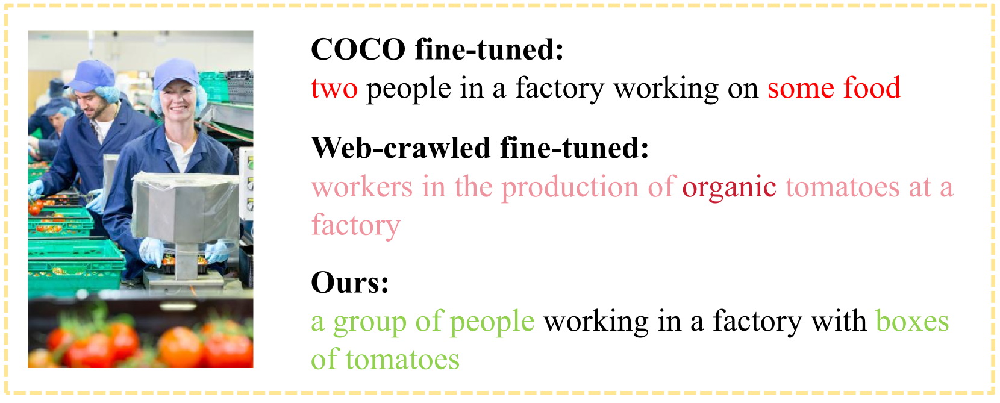

# CVPR2024 NICE图像标题挑战的解决之道

发布时间：2024年04月19日

`分类：LLM应用` `图像处理`

> The Solution for the CVPR2024 NICE Image Captioning Challenge

# 摘要

> 本报告提出了一种针对2024年NICE竞赛题目1——零样本图像字幕生成的创新解决方案。与2023年NICE数据集相比，新挑战包含了人类标注者在字幕风格和内容上的显著差异。我们通过检索增强和字幕评分技术，有效提升了图像字幕的质量。在数据处理上，我们采用图像字幕模型生成的优质字幕作为训练素材，以弥补文本风格的差异。在模型应用上，我们采用了OFA（一种基于手工模板的大规模视觉-语言预训练模型）来执行图像字幕生成任务。进一步地，我们为这些优质字幕数据制定了字幕级策略，并将其与检索增强策略相结合，嵌入模板中，激励模型产出更优质、更贴合、语义更丰富的字幕。我们的方案在排行榜上荣获首位，CIDEr得分达到234.11，并在其他所有评价指标中均领跑。

> This report introduces a solution to the Topic 1 Zero-shot Image Captioning of 2024 NICE : New frontiers for zero-shot Image Captioning Evaluation. In contrast to NICE 2023 datasets, this challenge involves new annotations by humans with significant differences in caption style and content. Therefore, we enhance image captions effectively through retrieval augmentation and caption grading methods. At the data level, we utilize high-quality captions generated by image caption models as training data to address the gap in text styles. At the model level, we employ OFA (a large-scale visual-language pre-training model based on handcrafted templates) to perform the image captioning task. Subsequently, we propose caption-level strategy for the high-quality caption data generated by the image caption models and integrate them with retrieval augmentation strategy into the template to compel the model to generate higher quality, more matching, and semantically enriched captions based on the retrieval augmentation prompts. Our approach ranks first on the leaderboard, achieving a CIDEr score of 234.11 and 1st in all other metrics.

[Arxiv](https://arxiv.org/abs/2404.12739)