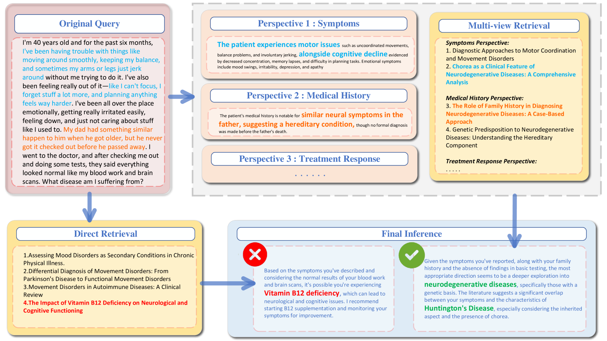

# 揭示知识密集型检索增强生成中的多视角洞察力

发布时间：2024年04月19日

`分类：RAG`

> Unlocking Multi-View Insights in Knowledge-Dense Retrieval-Augmented Generation

# 摘要

> 检索增强生成（RAG）对于大型语言模型（LLMs）的应用至关重要，但在法律和医学等知识密集型领域，现有检索方法因缺少多视角分析而受限，这恰恰是提升模型解释力和可靠性的关键。过往研究多聚焦于查询的语义多样性，却忽略了领域专业知识视角的重要性。本文提出了一种创新的多视角RAG框架——MVRAG，专为知识密集型领域设计，通过整合多个领域视角下的意图感知查询重写技术，显著提升了检索的精准度，进而增强了最终推理的效果。在法律和医学案例检索的实验中，我们的框架实现了召回率和精确率的显著提升。这种多视角检索策略充分发挥了多视图信息在RAG任务中的作用，为LLMs在知识密集型行业的深入应用提供了加速度。

> While Retrieval-Augmented Generation (RAG) plays a crucial role in the application of Large Language Models (LLMs), existing retrieval methods in knowledge-dense domains like law and medicine still suffer from a lack of multi-perspective views, which are essential for improving interpretability and reliability. Previous research on multi-view retrieval often focused solely on different semantic forms of queries, neglecting the expression of specific domain knowledge perspectives. This paper introduces a novel multi-view RAG framework, MVRAG, tailored for knowledge-dense domains that utilizes intention-aware query rewriting from multiple domain viewpoints to enhance retrieval precision, thereby improving the effectiveness of the final inference. Experiments conducted on legal and medical case retrieval demonstrate significant improvements in recall and precision rates with our framework. Our multi-perspective retrieval approach unleashes the potential of multi-view information enhancing RAG tasks, accelerating the further application of LLMs in knowledge-intensive fields.

[Arxiv](https://arxiv.org/abs/2404.12879)