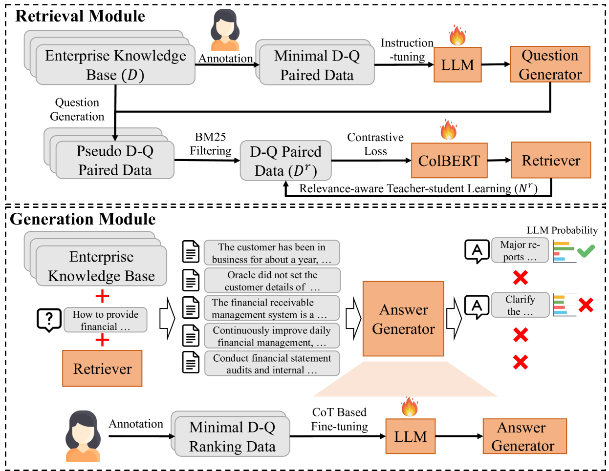

# 利用大型语言模型提升企业知识库的问答能力

发布时间：2024年04月20日

`LLM应用` `企业知识管理`

> Enhancing Question Answering for Enterprise Knowledge Bases using Large Language Models

# 摘要

> 高效知识管理对于提升企业和组织的运营效率及创新力至关重要。通过知识向量化索引，催生了多种知识检索技术，极大提升了知识管理系统的效能。随着生成性自然语言处理技术的突飞猛进，现在能够从用户定制的文档中检索并生成精确而连贯的答案。但对于企业知识库而言，由于私人数据的隐私和安全政策，从头构建广泛的训练数据集以进行知识检索和生成，不仅挑战重重，而且成本高昂。为解决这一难题，本文提出了EKRG，一种新颖的基于大型语言模型（LLMs）的检索-生成框架，旨在以较低的注释成本实现企业知识库的问答功能。具体而言，在检索阶段，我们首先采用LLM进行指令调优，生成足够的文档-问题对，以训练知识检索器。该方法能够高效地为企业知识库生成多样化的问题，涵盖事实型和解决方案型知识。此外，我们还开发了一种基于相关性感知的师生学习策略，以提高训练效率。在生成阶段，我们提出了一种创新的思维链（CoT）微调方法，使基于LLM的生成器能够灵活地利用检索到的文档回应用户询问。最终，我们在真实世界数据集上的广泛实验验证了我们框架的有效性。

> Efficient knowledge management plays a pivotal role in augmenting both the operational efficiency and the innovative capacity of businesses and organizations. By indexing knowledge through vectorization, a variety of knowledge retrieval methods have emerged, significantly enhancing the efficacy of knowledge management systems. Recently, the rapid advancements in generative natural language processing technologies paved the way for generating precise and coherent answers after retrieving relevant documents tailored to user queries. However, for enterprise knowledge bases, assembling extensive training data from scratch for knowledge retrieval and generation is a formidable challenge due to the privacy and security policies of private data, frequently entailing substantial costs. To address the challenge above, in this paper, we propose EKRG, a novel Retrieval-Generation framework based on large language models (LLMs), expertly designed to enable question-answering for Enterprise Knowledge bases with limited annotation costs. Specifically, for the retrieval process, we first introduce an instruction-tuning method using an LLM to generate sufficient document-question pairs for training a knowledge retriever. This method, through carefully designed instructions, efficiently generates diverse questions for enterprise knowledge bases, encompassing both fact-oriented and solution-oriented knowledge. Additionally, we develop a relevance-aware teacher-student learning strategy to further enhance the efficiency of the training process. For the generation process, we propose a novel chain of thought (CoT) based fine-tuning method to empower the LLM-based generator to adeptly respond to user questions using retrieved documents. Finally, extensive experiments on real-world datasets have demonstrated the effectiveness of our proposed framework.

[Arxiv](https://arxiv.org/abs/2404.08695)